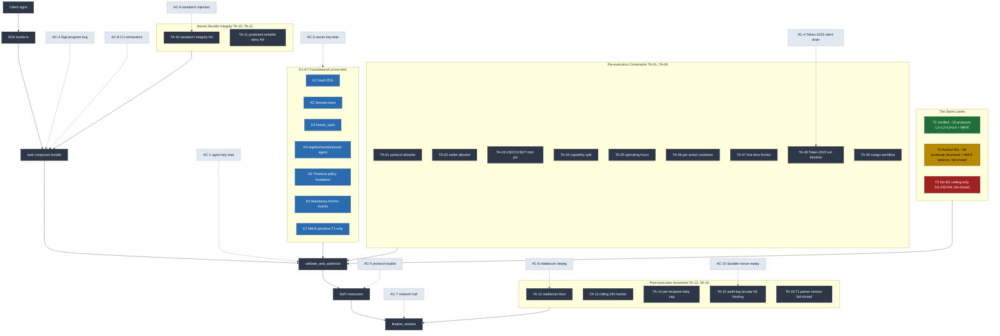

# ACCEPTANCE_V2.md — Sigil v2 Mainnet Acceptance Criteria

**Status:** Living document — binary mainnet acceptance gates + funding plan.
**Last updated:** 2026-05-17
**Branch:** `revamp/v2-2026-05`
**Companion docs:** [REVAMP_PLAN.md](./REVAMP_PLAN.md), [THREAT_MODEL_V2.md](./THREAT_MODEL_V2.md), [INTERFACES_V2.md](./INTERFACES_V2.md)
**Architecture diagram:** [tier-model.mmd](./tier-model.mmd) (canonical) + embedded in §7 below.

This document is the answer to "what must be true before Sigil v2 ships to mainnet?"

---

## 1. Methodology

Each acceptance gate has:
- **Trigger condition** — what must be true for the gate to be "ready to evaluate."
- **Evidence required** — concrete artifact that proves the gate.
- **Pass criterion** — binary, measurable.
- **Blocker** — what happens if missing (e.g., no mainnet deploy, no SDK release, etc.).
- **§4 Funding** dependency — explicit if the gate requires the funding plan to be signed.

### 1.1 Cross-doc anchors

This document cites canonical IDs (K-N, TA-NN, AC-N, D-NN) defined in [INTERFACES_V2.md](./INTERFACES_V2.md). Drift = §RP CRITICAL.

### 1.2 §RP applies

All artifacts produced under this document go through the §RP Review Protocol per [REVAMP_PLAN.md §12](./REVAMP_PLAN.md#12-rp-review-protocol).

---

## 2. Testnet vs Mainnet Acceptance

**Testnet (V1 GA — devnet program ID `4ZeVCqnj...`, no audit, no mainnet):**
- All on-chain primitives implemented and tested per Stage 1-5 acceptance gates.
- LiteSVM + Surfpool tests passing.
- Adversarial §RP review fan complete (silent-failure-hunter + code-reviewer + comment-analyzer + reverify).
- Dashboard wired through.
- No external audit required.
- No bug bounty required.
- §4 Funding plan exists but unsigned.

**Mainnet (this document's primary scope):**
- All testnet criteria, PLUS the 8 gates below.
- §4 Funding plan SIGNED by Kaleb.
- New program ID generated; deployment under Squads V4 upgrade authority.

---

## 3. Mainnet Acceptance Gates

### 3.1 — External audit complete

**Trigger condition:** Sigil V2 program code is feature-complete and frozen (no logic changes for ≥2 weeks). `stage-5-baseline` tag exists.

**Evidence required:**
- Audit engagement letter signed.
- Audit report published.
- All CRITICAL and HIGH findings remediated and verified by the auditor in a re-review.
- MEDIUM findings either fixed or accepted-with-rationale in a public response document.

**Vendor short-list:**
- **OtterSec** — Solana-native, fastest engagement window, strongest pattern recognition on PDA/CPI bugs.
- **Neodyme** — Strongest manual-review depth on Anchor + low-level SVM; track record on Squads V4, Marginfi, Drift.
- **Trail of Bits** — Strongest CPS background, formal-methods-curious.
- **Certora** — Formal verification (paired with manual audit from OtterSec or Neodyme). Squads V4 was the first formally verified Solana contract; Sigil should follow.
- **Sec3 (X-Ray)** — Secondary review + automated security tooling. ~$30K-$50K. Used as Stage 6B complement.

**Recommended engagement:** Two firms in parallel — **OtterSec or Neodyme** (manual) + **Certora** (formal verification of the 3 critical invariants from §3.5). This pattern matches Squads V4's audit strategy.

**Pass criterion:** Zero open CRITICAL or HIGH findings at mainnet-cut-tag. MEDIUM count ≤ 5, each with rationale committed to `agent-middleware/docs/audits/<vendor>_<YYYY-MM-DD>.md` and linked from the repo README.

**Blocker:** No mainnet deploy until evidence is in repo at `agent-middleware/docs/audits/`.

**Funding dependency:** YES — §4 Funding plan must be signed (audit firm engagement cost is $50K-$150K).

### 3.2 — Squads V4 multisig as upgrade authority (D-05)

**Trigger condition:** Sigil program is deployed under its mainnet program ID.

**Evidence required:**
- Solana RPC `getAccountInfo` on the program data account showing `upgrade_authority` is a Squads V4 multisig PDA.
- The multisig is verifiable via Squads V4 explorer.
- Multisig configuration matches recommended settings (below).

**Recommended Squads V4 configuration (per Drift April 2026 precedent):**

| Setting | Recommended | Rationale |
|---|---|---|
| Program ID | `SQDS4ep65T869zMMBKyuUq6aD6EgTu8psMjkvj52pCf` | V4 (current, verified via context7 + GeminiResearcher 2026-05-17). NOT `SMPLecH534NA9acpos4G6x7uf3LWbCAwZQE9e8ZekMu` (V3, still in V3 bug bounty scope). Squads also publishes a Smart Account Program (SAP) for programmable wallets; V1 Sigil recommends V4 Multisig because of its mature audit history (OtterSec×3 + Neodyme×3 + Trail of Bits + Certora formal verification). |
| Threshold | **3-of-5** | Solo-founder bus factor (DEEP-10) + Drift 2-of-5 negative precedent. |
| `config_authority` | `Pubkey::default()` (autonomous) | If non-default, member/threshold changes are instant with no timelock. CRITICAL footgun. |
| `time_lock` (seconds) | **172800** (48 h) minimum, **259200** (72 h) preferred | Argent precedent + Drift social-engineering window. Squads docs suggest 10-15 min for upgrades — Sigil OVERRIDES to 24-72 hr. |
| Hardware diversification | Ledger + Trezor + Keystone (3 separate hardware brands across signers) | Defense against single-hardware-vendor compromise. |
| Durable nonce audit | Pre-op, signers' nonce accounts inspected | Drift precedent — DPRK pre-signed durable nonces and replayed during compromise. |

**Pass criterion:** Multisig PDA confirmed on-chain as upgrade authority. Configuration matches all 6 recommendations. **Verification script at `agent-middleware/scripts/verify-multisig.ts`** queries the multisig PDA and asserts all 6 settings (program ID, threshold ≥ 3 with N ≥ 5, `config_authority == Pubkey::default()`, `time_lock >= 172_800`, hardware-vendor list, durable-nonce pre-op audit complete). Output committed to `docs/audits/multisig_verification_<commit-sha>.txt` for mainnet-cut review.

**Blocker:** No mainnet deploy. Single-key program upgrade authority is forbidden — this closes DEEP-9 + DEEP-10 findings.

**Funding dependency:** NO — multisig setup is operational, not paid.

### 3.3 — Bug bounty live (D-04)

**Trigger condition:** Mainnet program deployed.

**Evidence required:**
- Bug bounty published on Immunefi (or equivalent — Sec3, HackenProof).
- Scope document specifies in-scope contracts (Sigil program ID, SDK), out-of-scope (front-end UI, third-party dependencies).
- Reward table specifies CRITICAL → $50K+ USDC reserve.
- Disclosure window: 30 days from first report to public.

**Reserve sizing rationale:**
- $50K minimum is the **floor** to attract serious researcher attention. Squads V4 uses $300K for fund-theft severity.
- For a vault-managing program targeting institutional flows, $50K is the lower bound. Recommend $100K for fund-theft if budget allows.
- Reserve must be **locked** in a Squads-controlled multisig, not just promised.

**Pass criterion:** Bounty live, reserve locked, scope public.

**Blocker:** No mainnet announcement / customer onboarding until live. Pre-launch is acceptable; pre-announcement is not.

**Funding dependency:** YES — §4 Funding plan must commit $50K-$150K bounty reserve.

### 3.4 — Incident response runbook + drill on devnet

**Trigger condition:** Mainnet candidate build exists.

**Evidence required:**
- IR runbook at `agent-middleware/docs/runbooks/INCIDENT_RESPONSE.md` covering:
  - Detection (Sentry alerts, on-chain anomaly detection, community reports).
  - Triage (severity scoring, who-pages-whom, on-call rotation if any).
  - Containment (`freeze_all_vaults` admin instruction if implemented; per-vault `freeze`).
  - Communication (Twitter + status page + customer email).
  - Recovery (SDK patch deployment, dashboard banner, post-mortem timeline).
  - Roles (solo founder owns all roles in V1; document this honestly).
- **Class-specific responses per [THREAT_MODEL_V2.md §16](./THREAT_MODEL_V2.md#16-incident-response-by-attacker-class)**: AC-1..AC-10 + T-21 + T-DoS-1/2 each have a documented response flow.
- **Drill on devnet:** simulate a compromise (e.g., scripted agent-key leak), execute the runbook against devnet Sigil deployment.

**Pass criterion (5-criterion checklist, ALL must pass):**
1. Detection signal triggers ≤ 5 minutes from compromise injection (Sentry alert or anomaly detector fires).
2. Freeze instruction lands on devnet ≤ 15 minutes after detection (`vault.status` transitions to `Frozen`).
3. Customer communication draft (Twitter + status page + email) reviewed by founder ≤ 30 minutes after detection.
4. SDK patch built and signed against a planted-bug scenario ≤ 4 hours from detection (compiled, tested, ready to release — actual NPM publish not required for drill).
5. Post-mortem document completed using `docs/runbooks/POSTMORTEM_TEMPLATE.md` and committed to `docs/runbooks/drills/<YYYY-MM-DD>_drill_retro.md` within 7 days of drill.

All 5 criteria must be met; partial completion (e.g., freeze in 12 min but no post-mortem) is NOT a pass. Drill executed within 30 days of mainnet cut.

**Blocker:** No mainnet deploy until drill is in repo.

**Funding dependency:** NO — drill is operational.

### 3.5 — Formal verification of 3 critical invariants

**Trigger condition:** Program code feature-complete (stage-5-baseline).

**Evidence required:**
- Certora (or equivalent) verifies the following invariants:

**Invariant 1 (Freeze-respecting, scoped to Sigil instructions):**
```
For all Sigil instructions I and vaults V:
  if V.status == VaultStatus::Frozen at any point during I,
  then I returns error with code ErrVaultFrozen.
Property (monotonic freeze): within a single atomic bundle,
  freeze cannot be reversed — once V.status == Frozen is observed,
  the bundle reverts.
```
Closes the prior DEEP-2 escrow freeze-bypass bug-class (escrow itself was removed in V2 per [REVAMP_PLAN.md §2.1](./REVAMP_PLAN.md#21-escrow-escrowdeposit-account-settle_escrow-instruction); this invariant locks the freeze semantics for all V2 paths).

**Invariant 2 (Session-nonce monotonicity, K2 + AC-10):**
```
For all successful seal() bundles consuming session S
  ending at instruction finalize_session F:
  S.nonce at F.end = S.nonce at F.start + 1.
And: for all entry-guard instructions I targeting session S:
  if I.expected_nonce != S.nonce, I returns ErrSessionNonceMismatch.
```
Closes AC-10 durable nonce replay. `S.nonce` is V2-new (Stage 1 work).

**Invariant 3 (Stablecoin floor preservation, scoped to finalize_session moment):**
```
For all successful seal() bundles on vault V with PolicyConfig P
  ending at instruction finalize_session F:
  V.usdc_balance + V.usdt_balance at F.end ≥ P.stable_balance_floor.
```
Closes the load-bearing TA-12 post-execution invariant.

**Optional Stage 5 stretch invariant (Inv-K6 per Architect 2026-05-17):**
```
For all successful Sigil instruction handlers, exactly one
emit!() call executes before Ok(()).
```
Closes T-K6-1 silent-emit hazard. Stretch goal; may slip to v1.1.

**Pass criterion:** All 3 primary invariants proven; counterexample-free. Proof artifact in `agent-middleware/docs/verification/`.

**Blocker:** No mainnet deploy. Formal verification is a non-negotiable mainnet gate.

**Funding dependency:** YES — Certora engagement is paid ($30K-$80K depending on scope). Package together with audit (§3.1) for funding planning.

### 3.6 — Test coverage

**Trigger condition:** Pre-mainnet branch frozen.

**Evidence required:** Four tiers of test results, all passing on CI for the mainnet-cut commit.

| Tier | Tool | Required Count | Time Budget |
|---|---|---|---|
| Unit | LiteSVM (in-process VM) | ≥ 500 tests, ≥95% branch coverage on Tier A handlers | < 60s total |
| Integration | Surfpool | ≥ 50 scenarios covering each TA primitive in isolation + 5 multi-TA chains | < 120s total |
| Adversarial | protocol-scalability-tests | ≥ 100 attack vectors mapped to AC-1..AC-10, ALL passing (passing = program rejects attack); MUST cover all CRIT and HIGH classes from `docs/review/ADVERSARIAL_REVIEW_*.md`; committed inventory at `protocol-scalability-tests/INVENTORY.md`; new CRIT findings require new vectors before mainnet cut | < 600s total |
| Cluster rehearsal | Surfpool mainnet-fork (USDT supported) + devnet (USDC), seal() flows: Jupiter NM-E end-to-end + 9 structural-only T1-candidate protocols (Kamino, Drift, Marginfi, Flash Trade, Sanctum, Orca, Raydium, Meteora, Lulo). NM-E coverage for the 9 non-Jupiter T1 candidates is **explicitly tested at T2-guarantee level (structural + vault-balance NM-E only)**; per-instruction NM-E expansion is v1.1 (Def-5 in REVAMP_PLAN.md §6.1) | ≥ 20 scenarios | < 1800s total |

**Pass criterion:** All four tiers green on CI for the mainnet-cut commit. Test count thresholds met. Per-tier coverage report in `agent-middleware/docs/testing/COVERAGE_REPORT.md`. Adversarial inventory linked from coverage report.

**Load-bearing 5 explicit gates** (per Architect 2026-05-17 + [REVAMP_PLAN.md §16](./REVAMP_PLAN.md#16-coverage-test-plan-stage-0-acceptance)):
- K1 vault PDA invariants — formal verification gate (Stage 5 §3.5).
- K6 event emission — CI static check (every `pub fn` calls `emit!()` at least once).
- K7 NM-E primitive — T1-only feature gate at compile time.
- TA-10 sandwich integrity — comprehensive instruction-injection test suite.
- TA-16 parser version fail-closed — per-parser version-mismatch test fixtures.

**Blocker:** No mainnet deploy until CI artifact committed.

**Funding dependency:** NO — tests are owned by Sigil core team.

### 3.7 — Documented unit-of-account (D-03)

**Trigger condition:** Pre-mainnet code freeze.

**Evidence required:** Explicit statement in [REVAMP_PLAN.md §4.3 TA-12](./REVAMP_PLAN.md#43-post-execution-invariants-exit-guard-ta-12ta-16) and in dashboard onboarding:

> Sigil's unit-of-account is **USDC face value** at 6 decimals. `daily_cap_usdc_face` of `500_000_000` means 500 USDC by face value, regardless of USD spot price. Sigil does NOT price-protect against depeg or against price moves of non-stable assets. Users requiring USD-denominated guarantees must monitor depeg externally (dashboard surfaces deviation but does not enforce).

**Pass criterion:** Statement present in both REVAMP_PLAN.md and dashboard onboarding flow.

**Blocker:** No mainnet announcement. The unit-of-account ambiguity is a user-expectation footgun.

**Funding dependency:** NO — documentation.

### 3.8 — pnpm changeset for v0.16.0 SDK published

**Trigger condition:** SDK code feature-complete for V2 (Stage 4a work + Stage 1-3 SDK changes).

**Evidence required:**
- `pnpm changeset` entry in `.changeset/` for `@usesigil/kit` v0.16.0.
- Entry describes the V2 breaking changes (removed escrow, removed strict_mode, NM-E Jupiter-only, Squads V4 detection helper, preview→approve→execute envelope, etc.).
- Migration guide at `agent-middleware/docs/MIGRATION_V0.15_TO_V0.16.md`.
- Changesets published to NPM with `pnpm changeset publish` after merge.

**Pass criterion:** v0.16.0 visible on npmjs.com under `@usesigil/kit`. Migration guide in repo.

**Blocker:** Cannot announce mainnet without SDK ready for customers to integrate.

**Funding dependency:** NO — owned by Sigil core team.

---

## 4. Funding Plan

Mainnet acceptance (gates §3.1, §3.3, §3.5) requires paid services totaling **$100K-$350K** depending on scope. This section enumerates sources and the signed-commitment block.

### 4.1 Cost breakdown

| Item | Min | Max | Source recommendation |
|------|-----|-----|----------------------|
| External audit (OtterSec or Neodyme manual) | $50K | $150K | Solana Foundation grant or investor |
| Certora formal verification (3 invariants) | $30K | $80K | Bundled with audit firm package |
| Bug bounty reserve (locked in Squads multisig) | $50K | $150K | Treasury or scope-reduce |
| Squads V4 + hardware wallet diversification | $1K | $5K | Treasury (operational) |
| **Core total** | **$131K** | **$385K** | (4 line items above; required for any mainnet path) |
| Sec3 secondary review + automated tooling | $30K | $50K | OPTIONAL — Premium scenario only |
| Audit re-review + remediation iteration | $10K | $20K | OPTIONAL — bundled with original engagement |
| **Premium total (all 6 items)** | **$171K** | **$455K** | (only Premium path) |
| **Stated range (per /goal):** | **$100K-$350K** | | Maps to Scope-reduce ($100K) and Standard ($350K). Core minimum is $131K, slightly above $100K floor; if treasury-tight, drop Certora to make $100K floor reachable. |

### 4.2 Source enumeration

**Source 1: Solana Foundation Grant (Q3 2026)**
- Target: $100K-$150K via Solana Foundation Grant program.
- Apply for in Q3 2026 once Stage 4 SDK is in design partner hands (demonstrable usage).
- Solo founder + open-source middleware = strong fit for SF grant criteria.

**Source 2: Investor (seed or strategic)**
- Target: $200K-$500K SAFE or priced round.
- Use of funds: full $171K-$455K audit + bounty + 6-month runway.
- Requires investor materials (deck, demo, traction data); deferred until V1 testnet has ≥10 design partners.

**Source 3: Sigil treasury**
- Status: Solo founder with no current treasury per memory `feedback_no_paid_services_no_audit.md` (amends with v2 briefing 2026-05-16: external audit now NON-NEGOTIABLE).
- Bootstrap from owner's personal capital — feasible for the low end ($171K) over 6-month timeline.

**Source 4: Scope-reduce to $50K Sec3-only audit**
- Sec3 X-Ray (~$30K) + minimal manual review (~$20K) = $50K total audit cost.
- Skip Certora formal verification (defer to v1.1).
- Skip OtterSec/Neodyme premium engagement.
- This is the fallback if Sources 1-3 don't materialize before mainnet target window.
- **Risk:** lower audit assurance — should pair with extended bug bounty period (6 months) before public mainnet announcement.

### 4.3 Stage 6E gating

Per [REVAMP_PLAN.md §14 Stage 6](./REVAMP_PLAN.md#14-stage-sequencing), the Stage 6E sub-deliverable (bug bounty live) is **explicitly funding-gated**. Stage 6A-6D can proceed under treasury budget; 6E requires Source 1, 2, or treasury reserve dedicated for the bounty.

### 4.4 Funding decision matrix

| Scenario | Audit firm | Formal verify | Bounty reserve | Total (matches §4.1 line items) | Timeline |
|----------|-----------|---------------|----------------|-------|----------|
| **A — Premium (preferred)** | OtterSec or Neodyme ($50K-$150K) | Certora 3 invariants ($30K-$80K) | $100K Immunefi (locked) | **$181K-$335K** (= audit + Certora + bounty + Squads $1K-$5K hardware) | Q3-Q4 2026 |
| **B — Standard** | OtterSec OR Neodyme ($50K-$150K) | Certora optional ($0-$80K) | $50K Immunefi | **$101K-$285K** (= audit + optional Certora + bounty + Squads hardware) | Q3-Q4 2026 |
| **C — Scope-reduce** | Sec3 X-Ray + minimal manual ($30K-$50K) | Defer to v1.1 ($0) | $50K extended bounty | **$81K-$105K** (= Sec3 + bounty + Squads hardware) | Q4 2026 - Q1 2027 |
| **D — Cannot fund** | — | — | — | — | Mainnet blocked indefinitely |

Each scenario total reconciles to §4.1 line items: Audit + Certora + Bounty + Squads hardware ($1K-$5K) = Scenario total. (Sec3 secondary review and audit re-review iteration are NOT included in any scenario — those are Premium-only optional adders accounted for under §4.1 OPTIONAL rows.)

### 4.5 Decision: signed commitment

By signing below, Kaleb Rupe commits to executing one of Scenarios A, B, or C above. Scenario D ("Cannot fund") is the failure mode (not a path to sign for) — if no funding source materializes within 6 months of Stage 5 completion, the project defaults to Scenario D and mainnet is indefinitely blocked.

```
SIGNATURE BLOCK

Scenario selected: [SELECT — A Premium / B Standard / C Scope-reduce / D Cannot fund]

Source breakdown (commit to specific path):
- Audit firm: [PENDING — name + estimated cost]
- Formal verification: [PENDING — name + estimated cost]
- Bug bounty reserve: [PENDING — Immunefi / Sec3 / other + commit amount]

Signed: ____________________________     [SIGNATURE PENDING]
        Kaleb Rupe
Date:   ____________________________     [DATE PENDING — pre-Stage 6E]
```

**This signature gate blocks Stage 6E and mainnet announcement, NOT Stage 0/1/2/3/4/5 development.** Stage 0 ships with `[SIGNATURE PENDING]`; Kaleb commits externally before Stage 6E.

---

## 5. Sequence Diagram

```
testnet GA prep
   │
   ├──▶ §3.7 unit-of-account doc (zero-cost, lands at testnet)
   │
testnet GA (V1 stage-5-baseline)
   │
   ▼
revenue or capital event (audit budget unlocked via §4 SIGNED)
   │
   ▼
§3.1 audit + §3.5 formal verification  ──┐
§3.6 test coverage                       │
§3.8 SDK v0.16.0 published               ├──▶ all gates green
                                         │
§3.4 IR runbook + drill                  │
  (on mainnet-candidate build,           │
   AFTER §3.1 + §3.5 land)               │
                                      ────┘
   │
   ▼
§3.2 deploy mainnet under Squads V4 upgrade auth (Stage 6C)
   │
   ▼
§3.3 bug bounty live + public announcement (Stage 6E)
   │
   ▼
mainnet GA (Stage 7)
```

Sequence rationale:
- §3.7 (unit-of-account doc) is zero-cost and lands at testnet to set user expectations early.
- §3.4 (IR drill) MUST be on the mainnet-candidate build — i.e., after §3.1 + §3.5 (any audit-driven changes must be in the build being drilled).
- §3.3 (bug bounty) goes live the day of mainnet announcement; reserve locked before announcement.

---

## 6. Cross-doc Index

- **Tier A primitives** (definitions, PDA seeds, semantics): [INTERFACES_V2.md](./INTERFACES_V2.md).
- **Architecture diagram**: [REVAMP_PLAN.md §8](./REVAMP_PLAN.md#8-unified-architecture-diagram) + [tier-model.mmd](./tier-model.mmd).
- **Attacker classes + blast-radius**: [THREAT_MODEL_V2.md §2](./THREAT_MODEL_V2.md#2-attacker-classes--environmental-hazards).
- **Trust-assumption inversion (T-21)**: [THREAT_MODEL_V2.md §2 T-21](./THREAT_MODEL_V2.md#t-21--owner-policy-underspecification-load-bearing-trust-assumption).
- **§RP Review Protocol**: [REVAMP_PLAN.md §12](./REVAMP_PLAN.md#12-rp-review-protocol).
- **Council outputs (LOCKED dispositions)**: [REVAMP_PLAN.md §11](./REVAMP_PLAN.md#11-council-outputs-2026-05-17--locked-dispositions).

---

## 7. Unified Architecture Diagram



**Mapping to this document.** Every mainnet gate in §3 maps to one or more nodes in this diagram. §3.1 (audit) and §3.5 (formal verification) target the green/yellow/red TIERS lanes — the audit firm verifies that each tier's claimed guarantees actually hold. §3.2 (Squads V4 upgrade auth) protects the substrate (K1-K7 + the program ID itself). §3.3 (bug bounty) is a post-mainnet feedback loop covering everything in the diagram. §3.4 (IR runbook + drill) exercises the K3 freeze + K4 revoke paths under AC-1 / AC-2 attack simulations. §3.6 (test coverage) requires explicit coverage gates for the **load-bearing 5** nodes: K1, K6, K7, TA-10, TA-16 — these are highlighted in [REVAMP_PLAN.md §16](./REVAMP_PLAN.md#16-coverage-test-plan-stage-0-acceptance) per the Architect 2026-05-17 dependency audit. §3.7 (unit-of-account documentation) constrains how the AC-6 depeg input interacts with TA-12. §3.8 (SDK v0.16.0) is the CLIENT → SDK boundary in the diagram — owners install the new SDK to seal() transactions under the V2 enforcement set.

---

## 8. Acceptance Gate Summary Table

| Gate | Title | Pass criterion | Blocker if missing | Funding-gated |
|------|-------|----------------|--------------------|--------------|
| §3.1 | External audit | Zero open CRITICAL/HIGH | No mainnet | YES |
| §3.2 | Squads V4 upgrade auth | Multisig PDA + 3-of-5 + autonomous + 48-72h timelock | No mainnet | NO |
| §3.3 | Bug bounty live | Reserve locked, scope public | No customer announce | YES |
| §3.4 | IR runbook + drill | 5-criterion checklist all pass | No mainnet | NO |
| §3.5 | Formal verification | 3 invariants proven | No mainnet | YES |
| §3.6 | Test coverage | All 4 tiers green + load-bearing 5 gates | No mainnet | NO |
| §3.7 | Unit-of-account docs | Statement in REVAMP_PLAN + dashboard | No mainnet announce | NO |
| §3.8 | SDK v0.16.0 | NPM-published + migration guide | No mainnet announce | NO |

---

## 9. Open Questions

1. **Audit budget timing**: When is "revenue or capital event" expected to land? This dictates the gap between testnet GA and mainnet GA. Honest estimate: 6-12 weeks post-audit-signed per [REVAMP_PLAN.md §14 Stage 6](./REVAMP_PLAN.md#14-stage-sequencing).
2. **Bug bounty reserve sourcing**: $50K minimum. From Sigil capital, customer escrow, grant, or investor?
3. **Squads V4 signer cohort**: Who are the other 4 of the 3-of-5? Recommended: founder + 2 advisors with crypto-ops experience + 1 OTC liquidity partner + 1 board member or LP. Confirm before mainnet announce.
4. **Cluster rehearsal scope**: Devnet vs mainnet-fork via Surfpool? Devnet has lower trust (validators can misbehave); mainnet-fork has higher realism. Recommend mainnet-fork via Surfpool for §3.6 cluster tier.
5. **Multi-program upgrade authority migration**: Squads V4 supports multiple program upgrade authorities under a single multisig. If Sigil expands to multiple programs (e.g., dashboard backend program), should they all share one multisig or separate? Defer to v1.1.

---

## 10. Stage 0 Fix Log

Per [REVAMP_PLAN §12 §RP](./REVAMP_PLAN.md#12-rp-review-protocol), every CRITICAL or HIGH finding from §RP review passes is fixed in-doc with a recorded commit SHA + `RESOLVED:` annotation in the relevant transcript at `STAGE_0_REVIEW/{reviewer,hunter,reverify}.md`.

| # | Finding | Severity | Fix commit | Reviewer |
|---|---------|----------|------------|----------|
| (to be populated after Phase F-H) | | | | |

---

## 11. Coverage Verification (Stage 0 baseline)

For Stage 0 to be `complete` per [§RP §12.7 Vocabulary](./REVAMP_PLAN.md#127-vocabulary), this document must satisfy:

1. **All 8 mainnet gates defined with binary pass criteria.** Verified: §3.1-§3.8.
2. **§4 Funding plan present with [SIGNATURE PENDING] block.** Verified: §4.5.
3. **Sequence diagram captures Stage 6 dependencies.** Verified: §5.
4. **Architecture diagram embedded (matches tier-model.mmd canonical).** Verified: §7.
5. **Cross-doc index complete.** Verified: §6.
6. **Load-bearing 5 explicit acceptance gates.** Verified: §3.6.

---

## 12. Glossary

This glossary is the canonical reference for terms used in this document. For full term registry across all Stage 0 docs, see [REVAMP_PLAN.md §19](./REVAMP_PLAN.md#19-glossary).

- **§3.1..§3.8** — Mainnet acceptance gates per §3.
- **§4** — Funding plan + [SIGNATURE PENDING] block.
- **CRITICAL / HIGH / MEDIUM / LOW** — §RP severity classifications.
- **OtterSec / Neodyme / Trail of Bits / Certora / Sec3** — Audit firm names per §3.1.
- **Premium / Standard / Scope-reduce / Cannot fund** — Funding scenarios per §4.4.
- **D-03 (unit-of-account = USDC face)** — see [INTERFACES_V2.md](./INTERFACES_V2.md#d-03--unit-of-account).
- **D-04 (Funding gate)** — see [INTERFACES_V2.md](./INTERFACES_V2.md#d-04--funding-gate).
- **D-05 (Squads V4 upgrade auth)** — see [INTERFACES_V2.md](./INTERFACES_V2.md#d-05--squads-v4-upgrade-authority).
- **D-06 (TierRegistry asymmetric threshold)** — see [INTERFACES_V2.md](./INTERFACES_V2.md#d-06--tierregistry-asymmetric-threshold).
- **Stage 6A/B/C/D/E/F** — Stage 6 sub-deliverables per [REVAMP_PLAN §14](./REVAMP_PLAN.md#14-stage-sequencing).
- **stage-N-baseline** — git tag after Stage N §RP-clean + CI-green.

---

## 13. Stage 0 Sign-off

| Role | Name | Sign-off | Date |
|------|------|----------|------|
| Author | Claude (Opus 4.7) + Kaleb Rupe | (in commit `docs(stage-0): baseline`) | 2026-05-17 |
| §RP reviewer 1 | pr-review-toolkit:code-reviewer | (in `STAGE_0_REVIEW/reviewer.md`) | (post-§RP pass 1) |
| §RP reviewer 2 | pr-review-toolkit:silent-failure-hunter | (in `STAGE_0_REVIEW/hunter.md`) | (post-§RP pass 1) |
| §RP reverify | swapped reviewers | (in `STAGE_0_REVIEW/reverify.md`) | (post-§RP pass 2) |
| Funding signoff | Kaleb Rupe | §4.5 `[SIGNATURE PENDING]` block | (pre-Stage 6E) |

---

## 14. Audit Engagement Onboarding (Stage 6 handoff package)

When the Stage 6 audit firm is engaged, the following package is delivered to them:

### 14.1 Documentation
- This doc (ACCEPTANCE_V2.md) — gates + funding plan + sequence.
- [REVAMP_PLAN.md](./REVAMP_PLAN.md) — architecture, tier model, 16 TA primitives.
- [THREAT_MODEL_V2.md](./THREAT_MODEL_V2.md) — 10 AC classes + 16×10 mapping + concrete attack scenarios in §14.
- [INTERFACES_V2.md](./INTERFACES_V2.md) — canonical IDs.
- [STAGE_1_REMOVED.md](./STAGE_1_REMOVED.md) — what was deleted from V1 and why.
- All per-stage `STAGE_N_REVIEW/` directories showing §RP fix loops.
- Decision register D-01..D-09 + Council outputs (§11 in REVAMP_PLAN).

### 14.2 Code artifacts
- Sigil program source at `agent-middleware/programs/sigil/src/`.
- Committed IDL at `agent-middleware/target/idl/sigil.json`.
- Committed types at `agent-middleware/target/types/sigil.ts`.
- SDK source at `agent-middleware/sdk/kit/src/`.
- All test suites (LiteSVM unit + Surfpool integration + protocol-scalability-tests adversarial + cluster rehearsal).

### 14.3 Test artifacts
- Coverage report at `agent-middleware/docs/testing/COVERAGE_REPORT.md`.
- protocol-scalability-tests `INVENTORY.md` mapping each AC class to specific test fixtures.
- Cluster rehearsal results from Surfpool + devnet runs.

### 14.4 Operational artifacts
- IR runbook at `agent-middleware/docs/runbooks/INCIDENT_RESPONSE.md`.
- IR drill retros at `agent-middleware/docs/runbooks/drills/<YYYY-MM-DD>_drill_retro.md`.
- Squads V4 deploy playbook at `agent-middleware/docs/runbooks/SQUADS_V4_DEPLOY.md`.
- Multisig verification script at `agent-middleware/scripts/verify-multisig.ts`.

### 14.5 Auditor's scope-of-work expectations
- Verify TA-01..TA-16 enforce per [INTERFACES_V2.md](./INTERFACES_V2.md) semantics.
- Verify K1-K7 foundational substrate per [REVAMP_PLAN.md §3](./REVAMP_PLAN.md#3-kept-k1-k7-foundational-unchanged-from-prior-architecture).
- Verify load-bearing 5 (K1, K6, K7, TA-10, TA-16) per Architect 2026-05-17 dependency audit + [THREAT_MODEL §4.1](./THREAT_MODEL_V2.md#41-k1-k7-foundational-coverage).
- Verify §3.5 formal-verification invariants 1-3.
- Verify §3.6 test coverage tiers all pass.
- Stress-test all 10 AC class concrete scenarios from [THREAT_MODEL §14](./THREAT_MODEL_V2.md#14-concrete-attack-scenarios-per-ac-class).
- Stress-test T-21 workflow mitigations (M-T21-1..4) at SDK + dashboard layer.

### 14.6 Auditor's deliverables (expected)
- Audit report at `agent-middleware/docs/audits/<vendor>_<YYYY-MM-DD>.md`.
- Public response document at `agent-middleware/docs/audits/<vendor>_RESPONSE_<YYYY-MM-DD>.md` (Sigil's response to findings).
- Re-review confirmation that all CRITICAL + HIGH remediated.
- Sign-off from auditor on Sigil's MEDIUM-finding rationale (where applicable).

---

## 15. Mainnet Deployment Runbook (Stage 6C-6F)

Step-by-step mainnet deployment procedure. Each step has a checklist of verifications before proceeding.

### 15.1 Pre-deployment (Stage 6A-6B prerequisites)
- [ ] §3.1 audit complete — zero CRIT+HIGH.
- [ ] §3.5 formal verification complete — 3 invariants proven.
- [ ] §3.4 IR drill complete — 5-criterion checklist passed.
- [ ] §3.6 test coverage green on `stage-5-baseline` tag.
- [ ] §3.7 unit-of-account docs in REVAMP_PLAN + dashboard.
- [ ] §3.8 SDK v0.16.0 published to NPM.
- [ ] §4 Funding plan SIGNED by Kaleb.
- [ ] `stage-5-baseline` git tag exists on `revamp/v2-2026-05`.

### 15.2 Stage 6C — Squads V4 multisig deployment
- [ ] Create Squads V4 multisig PDA on mainnet via Squads UI or `multisig.rpc.multisigCreateV2()`.
- [ ] Verify multisig configuration: 3-of-5 threshold, `config_authority == Pubkey::default()`, `time_lock = 172800` (48h).
- [ ] Each of 5 signers has hardware wallet (Ledger / Trezor / Keystone — diversified).
- [ ] Audit each signer's durable nonce accounts (per Drift April 2026 precedent).
- [ ] Run `agent-middleware/scripts/verify-multisig.ts` against the new multisig PDA.
- [ ] Commit verification output to `agent-middleware/docs/audits/multisig_verification_<commit-sha>.txt`.

### 15.3 Stage 6D — TierRegistry deployment

**Stage 6C must complete first** (multisig PDA address is needed to bake into `constants.rs`). The mechanic is:
1. Stage 6C deploys the Squads V4 multisig and emits the vault PDA address.
2. The address is updated in `programs/sigil/src/constants.rs` as `SIGIL_SQUADS_VAULT` constant.
3. `anchor build --no-idl` produces the V2 binary with the multisig address baked in.
4. The Stage 6A/6B audit was on the source code **before** the constant was filled — auditors must verify that `SIGIL_SQUADS_VAULT` is the only address used and that the build process correctly substitutes the address (chicken-and-egg avoided by treating the constant as a verifiable build-time substitution, not a runtime trust).
5. Stage 6F final deployment uses this baked binary.

Deployment steps:
- [ ] Stage 6C complete (multisig PDA deployed, address known).
- [ ] Update `constants.rs` `SIGIL_SQUADS_VAULT` to the multisig vault PDA.
- [ ] `anchor build --no-idl` + IDL regen on the address-baked source.
- [ ] Deploy `TierRegistry` PDA at seeds `[b"tier_registry", b"v1", PROGRAM_ID.as_ref()]` via Squads multisig governance.
- [ ] Threshold for TierRegistry mutations = **4-of-5** (asymmetric per D-06; strictly greater than 3-of-5 program upgrade threshold).
- [ ] Initialize TierRegistry with V1 T1 short-list (Jupiter, Kamino, Drift, Marginfi, Flash Trade, Sanctum, Orca, Raydium, Meteora, Lulo).
- [ ] Pin `idl_sha256` + `bytecode_hash` for each T1 protocol.
- [ ] Verify all CRUD entry points reject any signer != hard-coded `SIGIL_SQUADS_VAULT`.

### 15.4 Stage 6F — Mainnet program deploy
- [ ] Generate new mainnet program ID (do NOT reuse devnet `4ZeVCqnj...` — would corrupt V1 PDAs).
- [ ] Build program: `anchor build --no-idl` on `stage-5-baseline` commit.
- [ ] Regenerate IDL: `RUSTUP_TOOLCHAIN=nightly anchor idl build`.
- [ ] Canonicalize IDL: `jq -S . target/idl/sigil.json > target/idl/sigil.canonical.json`.
- [ ] Verify IDL hash matches Stage 5 commit-time hash (no last-minute drift).
- [ ] Deploy program to mainnet under Solana CLI key (initial deploy authority).
- [ ] Verify on-chain bytecode hash matches local build (via `solana-verify`).
- [ ] Upload IDL to on-chain `IdlAccount` (under control of Squads vault).
- [ ] Transfer upgrade authority to Squads V4 multisig PDA via `bpf_loader_upgradeable::set_upgrade_authority`.
- [ ] Verify upgrade authority via `solana program show <program-id>` returns Squads vault PDA.
- [ ] Commit mainnet program ID + deployment artifacts to `agent-middleware/docs/deployments/MAINNET_<YYYY-MM-DD>.md`.

### 15.5 Stage 6E — Bug bounty live
- [ ] Lock $50K-$150K USDC in Squads-controlled multisig as bounty reserve.
- [ ] Publish Immunefi bounty page (or Sec3 / HackenProof equivalent).
- [ ] Scope document at `agent-middleware/docs/bounty/SCOPE.md`.
- [ ] Reward table:
  - CRITICAL (fund-theft, vault drain, signer-compromise): $50K-$150K
  - HIGH (data integrity, blast-radius expansion): $10K-$30K
  - MEDIUM (DoS, partial bypass): $2K-$8K
  - LOW (informational): $500-$1500
- [ ] Disclosure window: 30 days from first report to public.
- [ ] Bounty marked LIVE on Immunefi.

### 15.6 Stage 7 — Mainnet GA announcement
- [ ] Twitter + status page + customer email announcement.
- [ ] Public CHANGELOG.md entry.
- [ ] Onboarding docs updated to point at mainnet program ID.
- [ ] Stage 7 git tag `stage-7-mainnet-ga`.

---

## 16. Bug Bounty Scope Template (§3.3 detail)

### 16.1 In-scope
- Sigil mainnet program (program ID: TBD after Stage 6F).
- Sigil SDK (`@usesigil/kit` v0.16.0+).
- TierRegistry PDA + CRUD instructions.
- Squads V4 multisig configuration for Sigil program upgrade authority.

### 16.2 Out-of-scope
- Sigil dashboard frontend (separate engagement at Stage 4+).
- Third-party DeFi protocols (Jupiter, Kamino, etc. — their own bounties).
- Squads V4 program itself (their bounty: $300K cap).
- Solana runtime / validator bugs.
- Social engineering attacks against signers (operational, not technical).
- Front-running / MEV attacks outside seal() bundle.

### 16.3 Reward criteria
- **CRITICAL ($50K-$150K)**: Vault drain, signer key compromise via bug, AC-3 catastrophic-class bypass.
- **HIGH ($10K-$30K)**: Constraint bypass (any TA primitive failing to enforce), blast-radius expansion beyond designed limits, T-21 mitigation defeat.
- **MEDIUM ($2K-$8K)**: DoS, partial bypass (e.g., TA-13 cap evasion <20%), audit-log corruption (TA-15 + K6 failure).
- **LOW ($500-$1500)**: Informational disclosure, dashboard misrepresentation, edge cases in error handling.

### 16.4 Submission process
- Email: security@sigil.trade
- PGP key fingerprint published at `agent-middleware/docs/bounty/PGP_KEY.asc`.
- Initial acknowledgment within 48 hours.
- Severity classification within 7 days.
- Reward decision within 14 days.
- Public disclosure 30 days after fix lands (coordinated with researcher).

### 16.5 Hall of Fame
- Researchers consenting to public disclosure listed at `agent-middleware/docs/bounty/HALL_OF_FAME.md`.

---

## 17. Audit Firm Comparison Matrix

For §3.1 vendor selection. Updated as of 2026-05-17 per GeminiResearcher 2026-05-17 + memory `project_sigil_v2_revamp_briefing.md`.

| Firm | Solana-native? | Anchor 0.32 depth | Audit history | Estimated cost | Engagement lead time |
|------|---------------|-------------------|---------------|---------------|---------------------|
| **OtterSec** | YES (native) | High | Squads V4 (3 reports), Jupiter, Drift | $50K-$80K | 6-10 weeks |
| **Neodyme** | YES (native) | Very high (low-level SVM specialty) | Squads V4 (3 reports), Marginfi, Drift | $60K-$100K | 8-12 weeks |
| **Trail of Bits** | NO (CPS background) | Medium (Anchor learning curve) | Squads V4 (1 report), generic CPS work | $100K-$200K | 12-16 weeks |
| **Certora** | NO (formal methods specialty) | Medium (focused on math, not Anchor idioms) | Squads V4 (first formally verified Solana contract) | $30K-$80K (pair with manual auditor) | 8-12 weeks |
| **Sec3 (X-Ray)** | YES (Solana automated tooling) | High (automated tools) | Various Solana projects | $30K-$50K | 4-6 weeks |

**Recommended for Sigil V2:**
- **Primary:** OtterSec (Solana-native, fast engagement, strong Anchor pattern recognition).
- **Formal verification pair:** Certora (3 invariants per §3.5).
- **Optional secondary:** Sec3 X-Ray (automated tooling complement, low cost).
- **Total Premium scenario:** OtterSec ($60K) + Certora ($50K) + Sec3 ($30K) = $140K for audit phase.

---

## 18. Mainnet Announcement Checklist

Per §3.3 + §15.6, the mainnet announcement is gated on these items.

### 18.1 Technical readiness
- [ ] All §3.1-§3.8 gates green.
- [ ] CI on `stage-7-mainnet-ga` tag passes (anchor build + all test tiers).
- [ ] No open §RP CRIT+HIGH.
- [ ] Stage 6 sub-deliverables all complete.
- [ ] Bug bounty live with reserve locked.

### 18.2 Communication readiness
- [ ] Twitter thread drafted + reviewed.
- [ ] Status page mainnet URL configured.
- [ ] Customer email list segmented by tier (design partners vs general).
- [ ] Onboarding docs at app.sigil.trade updated for mainnet program ID.
- [ ] CHANGELOG.md entry committed.
- [ ] V1 vs V2 migration guide published.

### 18.3 Operational readiness
- [ ] On-call rotation defined (even if solo founder — explicit hours).
- [ ] IR runbook drilled within 30 days.
- [ ] Sentry / monitoring alerts wired.
- [ ] Dashboard analytics live (TA-15 audit log feed).
- [ ] Customer support channel staffed.

### 18.4 Legal / compliance readiness
- [ ] Terms of Service updated for mainnet.
- [ ] Privacy policy updated.
- [ ] Risk disclosure published (audit summary + bug bounty + known limitations).
- [ ] [If applicable] Tax/regulatory consultations completed.

### 18.5 Marketing readiness
- [ ] Demo video updated.
- [ ] Landing page sigil.trade reflects mainnet.
- [ ] Comparison vs competitors (Maestro, Trojan, etc.) — fair + accurate.
- [ ] Case studies from design partners (if consented).

---

## 19. Risk Acceptance Document

Risks explicitly accepted by Sigil v2 mainnet, even with all §3.1-§3.8 gates green. These are documented so users understand the risk surface.

### 19.1 Accepted: Stablecoin depeg (AC-6)
- **Rationale:** Per D-03, unit-of-account is USDC face value. Per Architect 2026-05-17 + REVAMP_PLAN §1.2, this matches Maestro's $24B-volume precedent.
- **Risk to user:** If USDC or USDT depegs significantly (>5%), vault expected balance loses face-value (denominated) protection.
- **Mitigation user must adopt:** Monitor depeg externally; dashboard surfaces 7-day deviation but does NOT enforce. v1.1 candidate Def-4 (REVAMP_PLAN §6.1) adds Pyth lazy fetch.

### 19.2 Accepted: Network halt (AC-7)
- **Rationale:** Solana mainnet halt frequency has decreased post-2024 reliability work, but is non-zero. Sigil cannot operate during halt.
- **Risk to user:** During halt, no Sigil instruction can land — pending policy updates, freezes, and revocations are delayed.
- **Mitigation user must adopt:** Maintain ability to issue freeze on resume. Document this in onboarding.

### 19.3 Accepted: Funds inside protocols (AC-5 residual)
- **Rationale:** Once funds are deposited into Kamino / Drift / Jupiter etc., Sigil does not custody them — the protocol does. A protocol exploit can drain Sigil-deposited funds even with Sigil intact.
- **Risk to user:** Diversify across protocols; do not hold all liquid capital in a single allowlisted protocol.
- **Mitigation:** TA-01 protocol allowlist + de-list workflow within 48h of known exploit.

### 19.4 Accepted: Solo founder bus factor (residual after D-05)
- **Rationale:** Even with Squads V4 3-of-5 multisig, the Sigil organization is a solo founder. If Kaleb is incapacitated for >30 days, no one is authorized to ship SDK patches or trigger TierRegistry updates.
- **Mitigation:** Long-term plan to onboard co-founder / first hire (out-of-scope V1).

### 19.5 Accepted: Owner Policy Underspecification (T-21)
- **Rationale:** Per GrokResearcher contrarian Argument 5, this is the load-bearing trust assumption. Workflow mitigations (M-T21-1..4) reduce but do not eliminate it.
- **Risk to user:** If policy is wrong, Sigil's enforcement matches the wrong policy. Loss is not Sigil's fault but the user's responsibility.
- **Mitigation user must adopt:** Use M-T21-1 learning mode + take onboarding wizard seriously + read tier-visibility tags.

---

## 20. Document Provenance

- **Created:** 2026-05-17 (Stage 0).
- **Authored by:** Claude (Opus 4.7) + Kaleb Rupe.
- **Reviewed by:** §RP reviewer fan + reverify swap pass.
- **Supersedes:** prior `agent-middleware/docs/ACCEPTANCE_V2.md` (292 lines, undersized for new bar; no §4 Funding section).
- **Baseline tag:** `stage-0-baseline` (after CI green + user consultation).
- **Funding signature:** [PENDING — KALEB RUPE — DATE — pre-Stage 6E]

---

---

## Appendix: Stage 6 Critical Path Summary

The Stage 6 critical path runs in this order: audit (§3.1) → formal verification (§3.5) → multisig deploy (§3.2/§15.2) → TierRegistry deploy (§15.3) → program deploy (§15.4) → bug bounty live (§3.3/§15.5) → mainnet announcement (§15.6). Any earlier-numbered gate failing blocks all later gates. Total estimated wall-clock: 8-16 weeks post-funding-signature.

**END OF ACCEPTANCE_V2.md V2.0 (Stage 0 baseline) — 2026-05-17**
