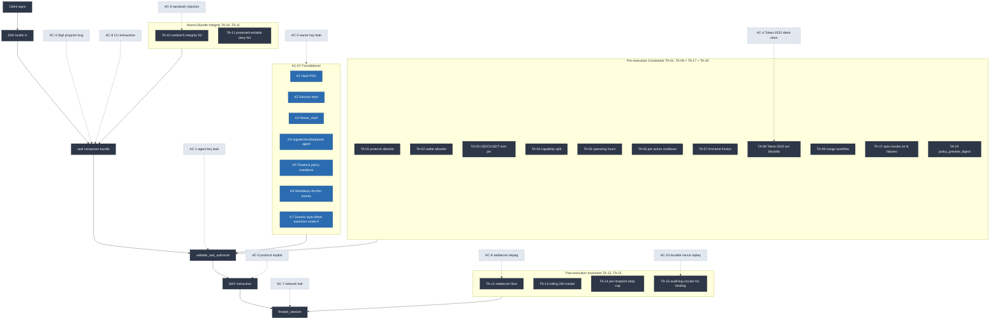

# REVAMP_PLAN.md — Sigil v2 Master Plan

**Status:** Living document — single source of truth for the Sigil v2 revamp.
**Last updated:** 2026-05-17 (Phase 1 Option A demolition)
**Branch:** `revamp/v2-2026-05`
**Companion docs:** [THREAT_MODEL_V2.md](./THREAT_MODEL_V2.md), [ACCEPTANCE_V2.md](./ACCEPTANCE_V2.md), [INTERFACES_V2.md](./INTERFACES_V2.md), [ERROR_CODE_ALLOCATION_V2.md](./ERROR_CODE_ALLOCATION_V2.md), [HARDENED_V2_PROMPT_MAP.md](./HARDENED_V2_PROMPT_MAP.md)
**Architecture diagram:** DELETED in Phase 1 (was `tier-model.mmd` — tier model itself dropped under L-1).

> **L-6 exception (operational scope):** writes to `~/.claude/projects/-Users-kalebrupe/memory/project_sigil_*.md` are allowed and required under L-9 (docs + memory refresh phase-by-phase). No other paths outside `agent-middleware/` may be touched. The exception is narrow: it covers memory files at the listed path only.
>
> **L-16 narrow widening (Phase 0.5 audit F-3 resolution, 2026-05-17):** one-line schema-math corrections to repo-root `CLAUDE.md` are permitted when the doc cites V1 sizes that contradict current code, narrowly bounded to `AgentVault`, `PolicyConfig`, `SpendTracker`, and `InstructionConstraints` size constants. No other modifications to repo-root `CLAUDE.md` are permitted under L-16.

This document is the answer to the question: *"What is Sigil v2, and why is it different from v1?"*

It enumerates 7 foundational features (K1-K7), the V2 Tier A primitives (TA-01..TA-15, TA-17..TA-19 — TA-16 DROPPED per L-1, original tier model deleted in Phase 1), the locked decisions D-01..D-09 (revised under Option A — see [INTERFACES_V2.md](./INTERFACES_V2.md#decisions-d-01d-09); D-04 deprecated per L-2), and 7 council items (C22-C28). It also defines §RP, the Review Protocol that binds every later stage. **Authoritative phase-by-phase execution sequence is in [HARDENED_V2_PROMPT_MAP.md](./HARDENED_V2_PROMPT_MAP.md) §6.**

---

## 0. Referenced Research

The following claims throughout this document are sourced from research artifacts produced during Stage 0 (prior + 2026-05-17 fresh fan). Validator (GeminiResearcher, 2026-05-17) sampled 5 specific claims; all corrections are applied below.

| Tag | Source | Subject |
|---|---|---|
| **Prior ClaudeResearcher (Maestro)** | Maestro docs + Hacken + DEXTools + Solana MEV refs | Maestro paradigm = anti-rug + anti-MEV + privacy/rate guardrails (no whitelist/swap_only mode — that claim was a synthesis error; **corrected per GeminiResearcher 2026-05-17**). Trojan ~$24B SOL volume validates generic-floor paradigm. |
| **Prior GeminiResearcher (Squads+Lighthouse)** | Squads V4 GitHub + audits + Drift post-mortems + Lighthouse repo | V4 program ID `SQDS4ep65T869zMMBKyuUq6aD6EgTu8psMjkvj52pCf` (VERIFIED 2026-05-17), V3 vs V4 distinction, Drift April 2026 $285M loss precedent (2-of-5 + durable nonce + DPRK). |
| **Prior PerplexityResearcher (Sphere+Ondo)** | Ondo USDY Solidity + Sphere/Utila docs + sRFC37 | Wallet-allowlist NOT novel (Ondo + Utila precedent), stablecoin balance floor IS novel. |
| **Prior CodexResearcher (Argent)** | Argent RecoveryManager.sol + Squads V4 multisig.rs | Argent guardian-majority + 7-day timelock precedent; Squads V4 substitutes only in autonomous mode (`config_authority == Pubkey::default()`). |
| **Prior GrokResearcher (contrarian)** | Maestro defaults + Jac0xb Lighthouse advisories + Trail of Bits | Argument 5 (Owner Policy Underspecification) is the load-bearing trust assumption. Embedded as T-21 in [THREAT_MODEL_V2.md §2 T-21](./THREAT_MODEL_V2.md#t-21--owner-policy-underspecification). |
| **Fresh ClaudeResearcher 2026-05-17 (TA-K signed config)** | Accretion + Anchor 0.32 release notes + Squads V4 vault PDA + Codama IDL | Lighthouse `IdlCreateAccount` squat still latent in Anchor 0.32. TierRegistry design: hard-code Squads vault signer + idl_sha256 + bytecode_hash + version + freeze + asymmetric thresholds (4-of-5 registry > 3-of-5 program upgrade). |
| **Fresh CodexResearcher 2026-05-17 (Codama + IDL diff)** | Anchor 0.30/0.31/0.32 release notes + Codama README + Drift/Marginfi/Kamino CI workflows | **CRITICAL CI FIX:** `> target/idl/sigil.json` redirect is wrong; `anchor idl build` writes the file directly. Use `jq -S` canonicalization + pin RUST/SOLANA/ANCHOR/LANG/SOURCE_DATE_EPOCH. **No production protocol runs IDL-diff CI; Sigil's guard is novel for the ecosystem.** |
| **Fresh GeminiResearcher 2026-05-17 (validator)** | Direct GitHub + docs inspection | **MISMATCH corrections applied:** Lighthouse has 14 assertion types (not 8); Codama determinism attribution belongs to Anchor 0.30+ stable IDL format (not Codama itself); Maestro `swap_only` flag is unsourced fabrication (removed); AgentLayer envelope is off-chain Python runtime, not on-chain instructions. |
| **Architect 2026-05-17 (tier-model + dependency audit)** | Per-primitive dependency graph | Load-bearing 5 (revised under L-1): **K1 + K6 + K7 + TA-10 + TA-19**. TA-16 dropped per L-1; TA-19 `policy_preview_digest` replaces its parser-drift protection role. Deepest chain: TA-12 → TA-13 → TA-14. Highest-leverage single dependency: **K6 event emission**. |

References below to "ClaudeResearcher Argument N" or "contrarian Argument N" mean the prior GrokResearcher fan. References to "Architect dependency audit" mean the 2026-05-17 Architect output.

---

## 1. Architecture Pivot (D-01)

**From:** Deep-parsing universal walker — instruction-byte-offset constraints, granular semantic field rules per protocol, attempting "100% relevant-field coverage" across ~120 Solana DeFi protocols.

**To:** Pure generic Maestro-floor + N1/N2/N4 always-on. (Phase 1 Option A demolition dropped the T1 verified short-list and NM-E parser entirely — see §5.)

### 1.1 Why the pivot

Four independently load-bearing reasons:

1. **Coverage feasibility blocker.** The 2026-05-11 constraint coverage feasibility study verified 3 CRITICAL bypasses in the current arch: (a) Borsh-cursor primitive missing, (b) per-protocol parsers don't generalize, (c) the 35,888-byte real `InstructionConstraints` size vs the stale **8,318** figure cited in the project-root `CLAUDE.md` (verified via `programs/sigil/src/state/constraints.rs:189`). Building parsers for ~120 Solana DeFi protocols at correctness levels suitable for asserting on field values is **not a solo-founder scope** (contrarian Argument 4).

2. **The category has already converged on generic guardrails.** None of the top-3 trading-bot products (Maestro, Trojan, Banana Gun, BonkBot) parses protocol-specific call structures. They bound loss via a small primitive set: anti-rug detection, anti-MEV routing, segregated burner wallets, slippage caps, pool-depth refusal, and (off-chain) destination/contract whitelisting. Trojan's ~$24B Solana lifetime volume validates the generic-floor paradigm as production-proven. (**Correction 2026-05-17 per GeminiResearcher:** prior synthesis incorrectly attributed a "greenlist with swap_only flag" to Maestro — that flag does not exist in published Maestro docs. The Maestro-floor paradigm is the documented anti-rug + anti-MEV + privacy/rate guardrails, not a whitelist mode.)

3. **Per-protocol parsers create a maintenance treadmill.** Every protocol upgrade (Jupiter v6 → v7, Drift v2 → v3) requires Sigil to re-audit, re-test, re-deploy. A solo founder cannot sustain >3 deep parsers at production quality. **The universal IDL compiler bet was abandoned** (memory: `project_sigil_universal_idl_compiler_feasibility_2026_05_12.md`); under Option A (L-1, 2026-05-17) the T1 hand-written-parser short-list is also dropped — V1 ships pure generic guardrails only.

4. **Trust-assumption inversion** (contrarian Argument 5 — the hardest objection): users empirically do not pre-specify policy correctly. Maestro's 60%+ default-policy rate proves it. Deep parsing makes this worse — more fields to specify = more places to under/over-permission. The floor paradigm narrows the policy surface to ~10 fields most users *can* reason about (daily cap, per-trade cap, allowed protocols, allowed wallets, hours, capability).

### 1.2 "Maestro-floor" paradigm (corrected mapping)

The Maestro paradigm is documented in Maestro's own docs + cross-referenced in Hacken/DEXTools safety guides as ~6-7 atomic primitives (NOT 8, per GeminiResearcher 2026-05-17 — earlier synthesis miscounted):

| # | Maestro primitive | Class | SVM equivalent in Sigil | TA mapping |
|---|---|---|---|---|
| M1 | Anti-rug detection (mempool monitoring on EVM) | Defense-in-depth | No SVM analogue (no public mempool); preventive Token-2022 extension blocklist replaces | TA-08 |
| M2 | Anti-MEV routing (private relays / Jito bundles) | Defense-in-depth | Jito Bundle submission (SDK responsibility) | TA-10 sandwich integrity envelope |
| M3 | Privacy/rate mode (per-tx delay) | Defense-in-depth | Per-action cooldown | TA-06 |
| M4 | Segregated burner wallet (architectural authority bound) | **Load-bearing** | Owner-vs-agent authority split (K1 + K2); agent = execute-only | K1+K2 |
| M5 | Spending caps (daily, per-trade) | **Load-bearing** | `SpendTracker` rolling 24h window | TA-13 |
| M6 | Slippage cap + pool-depth refusal | Defense-in-depth | Post-execution balance-delta assertion | TA-12 (post) |
| M7 | Off-chain destination/contract whitelist | **Load-bearing** | On-chain protocol+wallet allowlist (Sigil moves this on-chain, harder to bypass) | TA-01 + TA-02 |

**Load-bearing in the Maestro paradigm = M4 + M5 + M7.** Sigil's K1+K2 (vault PDA + session keys) covers M4 natively. TA-13 (rolling 24h tracker) + TA-01/TA-02 (allowlists) cover M5 + M7 with stronger guarantees (on-chain enforcement vs off-chain policy).

**Paradigm advantage on SVM:** M1 anti-rug mempool monitoring is structurally impossible on SVM (no public mempool). Sigil's preventive equivalent (Token-2022 extension blocklist + mint authority renounce checks) runs atomically and is deterministic, not racy. EVM bots monitor mempool to race adversarial state changes; SVM has no public mempool, so Sigil enforces preventive assertions atomically via the seal() bundle.

### 1.3 N1/N2/N4 ceiling

The "ceiling" complements the floor — instead of bounding amounts, it bounds **transaction shape**:

- **N1 (account constraint + temporal binding):** Which accounts may appear, and at what slot/blockhash. Sigil enforces account allowlists at `validate_and_authorize` entry. The audit-log buffer (TA-15) records each instruction's slot+blockhash double-bind (C22 macaroon pattern). → TA-01, TA-02, TA-15, K1 (vault PDA), K2 (session PDA).
- **N2 (atomic-bundle integrity via instructions-sysvar):** Verify the seal() bundle has not had foreign instructions injected between `validate_and_authorize` and `finalize_session`. Implementation: load `instructions` sysvar in the entry guard, assert next-instruction is a known DeFi target on the allowlist, assert N-th instruction is `finalize_session`. → TA-10.
- **N4 (protected-writable deny-list):** Vault, tracker, session, and policy accounts MUST NOT appear as writable in any non-Sigil instruction inside the bundle. Read `instructions` sysvar; reject if a foreign program lists protected accounts as writable. → TA-11.

(N3 — not used in Sigil V1. Reserved for future signer-introspection use cases. Deferred to v1.1 per D-09 / [§6 Deferred](#6-deferred--skipped).)

NM-E (Net-Movement Enforcement) — DROPPED 2026-05-17 (L-1, Option A demolition). The original primitive was a T1-only per-instruction semantic-delta assertion (Jupiter `amount_in` vs `amount_out` parse). Under Option A, no per-protocol parsing primitive ships in V1. Coarse vault-balance delta protection is delivered via TA-12 stable-floor + post-execution assertions K6 events + R-1 mint-delta cap (Phase 6).

---

## 2. Removed (deletion log)

Each removal has explicit rationale and addresses at least one prior audit finding.

### 2.1 Escrow (EscrowDeposit account, settle_escrow instruction)

**Reason:** DEEP-2 verified escrow freeze-bypass bug — `settle_escrow` did not honor the source vault's `vault.status == VaultStatus::Frozen` predicate, allowing a frozen vault to be drained via escrow even while the owner thought it was frozen. The instruction was a feature-creep symptom (V1 escrow was meant for cross-vault transfers, but no real customer flow ever required atomic source-and-destination locks). Removing eliminates the bug class without losing any V1 use case.

**Replacement:** Use atomic seal() bundles with two `validate_and_authorize` + `finalize_session` pairs (one per vault) inside the same transaction. Atomicity preserved; freeze semantics correct.

**Stage 1 status:** REMOVED (per `docs/revamp/STAGE_1_REMOVED.md §2`).

### 2.2 Strict / non-strict mode (`PolicyConfig.strict_mode`)

**Reason:** DEEP-1 verified the strict_mode default was permissive — vaults created without explicit configuration accepted any instruction. The two-mode design split test coverage and audit attention. Removing collapses the policy surface to a single semantics: every constraint is enforced; vaults that opt out are explicitly opt-out per-constraint.

**Replacement:** Per-constraint enable flags on `PolicyConfig`. No global mode switch.

**Stage 1 status:** REMOVED (per `docs/revamp/STAGE_1_REMOVED.md §3`).

### 2.3 SDK spending split

**Reason:** The split was a UI ergonomic that leaked into on-chain semantics. DEEP-3 verified `defi_ix_count` was tracked asymmetrically between the two categories, enabling cap evasion. The on-chain program does not need to know what humans call "spending" — it knows what balance deltas mean. UI vanity-spending labels become UI-only in V2 (see §6.2).

**Replacement:** On-chain treats every DeFi instruction uniformly. Dashboard labels (e.g., "yield farming", "swap", "lend") are decorative.

### 2.4 Granular per-protocol DSL (`InstructionConstraints` 35,888-byte layout)

**Reason:** Coverage feasibility study (2026-05-11) confirmed the DSL cannot reach 100% relevant-field coverage without R1 Borsh-cursor primitive AND a per-protocol parser library. Both are out of solo-founder scope. The DSL is replaced under Option A (L-1) by generic-only enforcement: TA-01..TA-15 + K1-K7 primitives, no field-level decoding, no per-protocol parsers.

### 2.5 Generic byte-offset NM-E for arbitrary programs

**Reason:** Byte-offset constraints on non-IDL programs are inherently brittle — every program upgrade can shift offsets. Coverage feasibility found CRITICAL bypasses in this exact pattern. The risk of a silent miscount is unacceptable for an enforcement layer.

**Replacement:** Generic K7 mode-0 byte-offset assertions on the constraints PDA (preserved per L-13 for owner-configured opt-in use) + post-execution assertions for balance deltas. No field-level semantics on instruction bodies.

---

## 3. Kept (K1-K7 foundational, unchanged from prior architecture)

> **Note: prior plans cited "21 Tier A primitives" which conflated K + TA. Corrected accounting (post Option A / L-1): K1-K7 foundational (7) + TA-01..TA-15 + TA-17 + TA-19 active V2 (17) + TA-16 dropped + TA-18 off-chain SDK helper = 24 total constraint surface (TA-16 retired, TA-18 off-chain).**

These are pre-V2 primitives carried forward unchanged. They form the substrate on which Tier A enforces. K1-K7 are NOT Tier A; they are foundational features (registered in [INTERFACES_V2.md](./INTERFACES_V2.md)).

| K# | Feature | Foundation since | Why kept (closes which attack class / load-bearing for which TA) |
|----|---------|------------------|------------------------------------------------------------------|
| K1 | Vault PDA + token accounts (`AgentVault`, ATAs) | V0 | Foundation for every primitive — every TA seeds off it. **Load-bearing 5 (Architect 2026-05-17).** Closes AC-2 owner-key-leak blast-radius bounding via authority separation. |
| K2 | Session keys (TTL + nonce-based bulk revocation, `SessionAuthority`) | V0 | Closes AC-5 stale-key class via TTL + nonce revocation; load-bearing for TA-06 cooldown + TA-15 N1 temporal binding. Mirrors Maestro M4 (segregated wallet authority bound). |
| K3 | `freeze_vault` kill switch | V0 | Closes AC-1 (agent leak) + AC-2 (owner leak) blast radius once detected. Owner-only transition `vault.status: Active → Frozen`. |
| K4 | `register_agent` / `revoke_agent` / `pause_agent` / `unpause_agent` | V0 | Substrate for TA-04 capability split (which encodes the *type* of agent permission). Closes AC-1 (granular agent management). |
| K5 | Timelock on policy mutations (`PendingPolicyUpdate`, `PendingConstraintsUpdate`) | V0 | Defends against AC-2 sudden-owner-compromise → policy-weakening attack window. 48-hour minimum (matches Argent precedent). |
| K6 | Mandatory Anchor `emit!(...)` event on every instruction | V0 | Foundation for audit-log buffer (TA-15) + dashboard observability + K3/K5 alerting. **Load-bearing 5 + highest-leverage single dependency (Architect 2026-05-17): a silent K6 emit failure blinds TA-15/TA-13/TA-06 invisibly.** |
| K7 | Generic byte-offset assertion (mode-0 only) | V1 | Per L-13 (2026-05-17), the T1-flavored fixed-array (mode-1) and vec-prefixed (mode-2) modes are dropped under Option A. Mode-0 generic offset-on-any-account remains as an owner-configurable constraint primitive on `InstructionConstraints`. NM-E per-instruction semantic-delta enforcement is DROPPED (L-1). Coarse balance-delta protection is delivered by TA-12 + post-execution assertions K6 events + R-1 mint-delta cap (Phase 6). |

**Load-bearing of K1-K7:** Architect 2026-05-17 dependency audit identifies K1, K6 as part of the **load-bearing 5** (alongside TA-10 and TA-19; TA-16 dropped). These primitives are the system's failure-mode roots; explicit Phase-2/Phase-4 acceptance gates pin their behavior.

---

## 4. Tier A primitives — NEW V2 additions (TA-01..TA-15, TA-17..TA-19; TA-16 dropped)

> All 16 primitives are defined canonically in [INTERFACES_V2.md](./INTERFACES_V2.md). The summaries below are one-line cross-references; full implementation specs (PDA seeds, instruction signatures, on-chain field layouts, error codes) are deferred to the **Stage 2 prompt** (delivered separately to a future `/goal`).
>
> **V1 acceptance status:** All TA primitives are validated via §RP review + LiteSVM/Surfpool tests for V1 devnet redeploy. The prior "AUDIT-PENDING" mainnet status language is dropped under L-2 (Option A 2026-05-17); §3.1 / §3.3 / §3.5 / §4 in ACCEPTANCE_V2.md are deferred to v1.1.

### 4.1 Pre-execution constraints (entry guard, TA-01..TA-09)

- **TA-01 protocol allowlist** — `PolicyConfig.allowed_protocols: Vec<Pubkey>` runtime-bounded to 10. Default-deny. Blocks AC-1 (agent key leak destination bounding), AC-5 (protocol exploit surface bounding). See [INTERFACES_V2.md#ta-01](./INTERFACES_V2.md#ta-01--per-vaultagent-protocol-allowlist).
- **TA-02 wallet allowlist default-deny** — `PolicyConfig.allowed_destinations: Vec<Pubkey>` runtime-bounded to 10. Default-deny per Ondo USDY precedent (3-layer external-call). Blocks AC-1 exfil + AC-5 protocol fraud. See [INTERFACES_V2.md#ta-02](./INTERFACES_V2.md#ta-02--wallet-allowlist-default-deny).
- **TA-03 USDC/USDT mint pinning** — cluster constants embedded at build time. Mainnet USDC `EPjFWdd5...`, mainnet USDT `Es9vMFrz...`, devnet USDC `4zMMC9sr...`. Devnet USDT not pinned — USDT paths use Surfpool mainnet-fork. Blocks AC-4 Token-2022 silent drain via fake mint. See [INTERFACES_V2.md#ta-03](./INTERFACES_V2.md#ta-03--usdcusdt-mint-pinning).
- **TA-04 capability split** — `SessionAuthority.capability: u8` (DISABLED=0, OBSERVER=1, OPERATOR=2; reserved 3..=255 reject with `ErrInvalidCapability`). Blocks AC-3 (Sigil program bug) by limiting per-session attack surface. See [INTERFACES_V2.md#ta-04](./INTERFACES_V2.md#ta-04--per-agent-capability-split).
- **TA-05 operating hours UTC bitmask** — `PolicyConfig.operating_hours: u32` (24 bits for hours-of-day). Defense-in-depth (attacker can wait). See [INTERFACES_V2.md#ta-05](./INTERFACES_V2.md#ta-05--operating-hours-utc-bitmask).
- **TA-06 per-action cooldown** — `PolicyConfig.cooldown_seconds: u32`. Bounds rate-of-attempts; depends on K6 event emission for `last_action_unix`. See [INTERFACES_V2.md#ta-06](./INTERFACES_V2.md#ta-06--per-action-cooldown).
- **TA-07 first-time-destination friction** — graylist + `unlock_unix` + `auto_promote_grays: bool` defaulting `false`. Delays first-time drains long enough for human detection. See [INTERFACES_V2.md#ta-07](./INTERFACES_V2.md#ta-07--first-time-destination-friction).
- **TA-08 Token-2022 extension blocklist** — rejects `TransferFee`, `TransferHook`, `PermanentDelegate`, `DefaultAccountState::Frozen`, `MintCloseAuthority`. Closes AC-4 catastrophic-class drain. See [INTERFACES_V2.md#ta-08](./INTERFACES_V2.md#ta-08--token-2022-dangerous-extension-blocklist).
- **TA-09 cosign workflow** — owner+session co-signature on elevated operations (raise daily cap, expand allowlist outside graylist, expand protocol allowlist). Blocks AC-1 self-elevation. See [INTERFACES_V2.md#ta-09](./INTERFACES_V2.md#ta-09--cosign-workflow).

### 4.2 Atomic-bundle integrity (per-instruction, TA-10..TA-11)

- **TA-10 sandwich integrity N2 via instructions-sysvar** — entry guard reads `instructions` sysvar and asserts: (a) 1..=4 `validate_and_authorize` + `finalize_session` pairs in transaction, (b) immediate-next instruction after each `validate_and_authorize` is an allowed protocol program ID (default-deny per TA-01), (c) no foreign instruction inside any seal window writes to protected accounts. **Load-bearing 5 (Architect 2026-05-17): if TA-10 fails, every other TA can be bypassed by injection.** Blocks AC-9 sandwich injection. See [INTERFACES_V2.md#ta-10](./INTERFACES_V2.md#ta-10--sandwich-integrity-n2-via-instructions-sysvar).
- **TA-11 protected-writable deny-list N4** — protected set `{vault, tracker, session, policy}` PDAs. Entry guard rejects if any foreign instruction in the bundle lists a protected account as writable. Blocks AC-3 Sigil-program tampering, AC-5 protocol-fraud tampering. See [INTERFACES_V2.md#ta-11](./INTERFACES_V2.md#ta-11--protected-writable-deny-list-n4).

### 4.3 Post-execution invariants (exit guard, TA-12..TA-15; TA-16 dropped)

- **TA-12 stablecoin balance floor** — `PolicyConfig.stable_balance_floor: u64` (6-decimal USDC face value). `finalize_session` rejects if `usdc + usdt < floor`. **Novel primitive** — neither Sphere nor Ondo enforces a balance floor (per PerplexityResearcher 2026-05-16). Blocks AC-5 protocol loss + AC-6 depeg (in face-value units). See [INTERFACES_V2.md#ta-12](./INTERFACES_V2.md#ta-12--stablecoin-balance-floor).
- **TA-13 rolling 24h tracker** — `SpendTracker` zero-copy PDA, 2,840 bytes, keyed by `(vault, agent, protocol)`. **Depends on K6 + TA-12 (Architect 2026-05-17: TA-12 → TA-13 → TA-14 is the deepest chain).** See [INTERFACES_V2.md#ta-13](./INTERFACES_V2.md#ta-13--rolling-24h-tracker).
- **TA-14 per-recipient daily cap** — `SpendTracker.per_recipient: Vec<(Pubkey, u64, i64)>` runtime-bounded to 10. Depends on TA-13's rolling window. See [INTERFACES_V2.md#ta-14](./INTERFACES_V2.md#ta-14--per-recipient-daily-cap).
- **TA-15 audit-log circular buffer with N1 temporal binding (C22)** — **two separate buffers per C24 LOCKED disposition**: 128 success entries × 64 bytes = 8,192 bytes + 64 rejected entries × 64 bytes = 4,096 bytes; **total 12,288 bytes / 192 entries combined**. Each entry: `(discriminator, target_protocol, balance_delta_in, balance_delta_out, timestamp, slot_hash, blockhash)`. C22 macaroon-style slot+blockhash double-bind. **Depends critically on K6 event emission** (Architect: TA-15 ↔ K6 is the highest-leverage single dependency). See [INTERFACES_V2.md#ta-15](./INTERFACES_V2.md#ta-15--audit-log-circular-buffer-with-n1-temporal-binding-per-c22).
- **TA-16 — DROPPED 2026-05-17 (L-1).** Was: T1 parser-version fail-closed (`InstructionConstraints.parser_version: u8`). Removed wholesale because the underlying T1 tier model is gone (Option A demolition deletes tier-flavored primitives). The protections TA-16 was supposed to provide are instead delivered by per-vault `InstructionConstraints` digest binding under TA-19 (Phase 2) and generic protocol-allowlist enforcement under TA-01.

---

## 5. Tier model — DELETED 2026-05-17 (Phase 1 Option A demolition, L-1)

The prior T1/T2/T3 tier model is removed in its entirety. Sigil V2 ships
**pure generic guardrails** under Option A: every vault gets the same
TA-01..TA-15 + TA-17..TA-19 + K1-K7 enforcement floor regardless of which
DeFi protocol the agent targets. There is no per-protocol parser, no
TierRegistry account, no `parser_version` field on `InstructionConstraints`,
no `idl_sha256` pin, no Squads-multisig-promoted-tier write surface.

Rationale (per L-1, locked 2026-05-17):
- Per-protocol parsers create a maintenance treadmill no solo founder
  can sustain at audit-grade correctness.
- The TA-01 protocol allowlist + TA-02 destination allowlist + TA-10/11
  sandwich/protected-writable defenses + TA-12 stablecoin floor +
  TA-15 audit log give the same load-bearing protection as the prior
  T1 tier without the brittleness.
- Phase B3 CrossFieldLte (a T1-flavored leverage-cap primitive) is
  deleted in this same phase — see [TA-16 in §4](#4-tier-a-primitives--new-v2-additions-ta-01ta-16) status.

References to T1/T2/T3 in earlier sections (where surviving) describe
the prior plan only; no V1 behavior depends on tier-tagging.

---

## 6. Deferred + Skipped

### 6.1 Deferred to v1.1 (post-mainnet)

> **Naming note:** Deferral IDs use `Def-N` prefix to disambiguate from decision-register `D-NN` (e.g., `Def-4` ≠ `D-04`). Original D1-D5 / D4-D5 references in this section have been renamed.

| # | Feature | Rationale |
|---|---------|-----------|
| Def-1 | Spending categorization (swap / lend / borrow / yield labels on-chain) | UI-only mapping in V1 (vanity names per dashboard config). On-chain treats all DeFi instructions uniformly. |
| Def-2 | Dead-man's switch (auto-revoke after N days of owner inactivity) | Requires deciding "inactivity" semantics and abuse vector. Punted to v1.1 after user research. |
| Def-3 | N3 multi-account snapshot (signer-introspection) for T1 v1.1 | Reserved for TEE/MPC custody integrations. Not needed for V1 use cases. |
| Def-4 | Dual-floor invariant (stable + total-vault-USD-value with Pyth lazy oracle) | Addresses contrarian Argument 3 race-to-the-bottom. Requires safe Pyth integration (lazy fetch only when within 10% of floor). v1.1 candidate. |
| Def-5 | Per-protocol parsers beyond Jupiter (Drift, Kamino, etc. with NM-E field-level) | V1 ships Jupiter-only NM-E. T1 short-list expansion is v1.1 work. |
| Def-6 | Auto-revoke on N consecutive policy-rejections | Originally proposed as TA-17 in early drafts; deferred to V1 in favor of K3 freeze + dashboard alerting. Re-evaluate after V1 production data. |

### 6.2 Skipped (explicit non-goals)

| # | Feature | Why skipped |
|---|---------|-------------|
| S1 | Native social recovery | **Squads V4 is the answer.** Argent V3's guardian-majority + asymmetric trigger/cancel threshold + 48-hour timelock is the precedent. Squads V4 Multisig (autonomous mode + 48-hr minimum timelock) substitutes. Documented gap: no "sleeping-guardian" role separation — B2B agent custody users tolerate co-signing. |
| S2 | RPC-block (mandatory routing through specific RPC providers) | **Rejected as non-primitive** per [§11 LOCKED](#11-council-outputs-2026-05-17--locked-dispositions). RPC selection is off-chain; no on-chain attestation primitive exists. |
| S3 | TEE (Trusted Execution Environment) custody | **No-paid-services constraint.** Solo founder cannot underwrite Phala / Marlin / Oasis TEE costs in V1. Squads V4 + hardware wallet diversification is the V1 substitute. |
| S4 | Generic byte-offset NM-E for arbitrary programs | See [§2.5](#25-generic-byte-offset-nm-e-for-arbitrary-programs). Brittle across protocol upgrades. T1 hand-written parsers + T2 Codama-derived structural constraints replace. |
| S5 | Vanity protocol names on-chain | UI-only mappings in dashboard. On-chain identifies protocols by program ID only. Avoids "rename protocol to deceive dashboard" attack vector. |

---

## 7. Open Questions

1. **NM-E parser for Jupiter v7**: V1 ships Jupiter NM-E only. Confirm v7 instruction layout has frozen at HEAD before pinning.
2. **Squads V4 detection heuristic**: SDK detection of multisig-owned vaults relies on PDA-shape inference. Document the false-positive bound.
3. **Codama IDL pin determinism — perturbation sources**: Per CodexResearcher 2026-05-17, the IDL output is sensitive to Anchor CLI version, Rust toolchain, Cargo features, doc comment whitespace, line endings, field order, `#[derive]` macro order, and `idl-build` feature flag presence. CI pin all of these (see [REVAMP_CI_README.md](./REVAMP_CI_README.md)).
4. **First-time-destination friction default**: 24h is the proposed default. Confirm with first design partners.
5. **Audit-log buffer size**: canonical per C24 = 12,288 bytes total (128 success × 64 + 64 rejected × 64). `AgentVault` (or a dedicated `AuditLog` PDA) must accommodate this; if folded into `AgentVault` directly, the resize delta is 634 → ~12,922 bytes ⇒ rent ~0.090 SOL per vault. Recommend separate `AuditLog` PDA at seeds `[b"audit", vault]` to keep `AgentVault` small. Confirm rent strategy with first design partners.

---

## 8. Unified Architecture Diagram



**Legend**
- Blue nodes (K1-K7) = foundational substrate, required for every vault.
- Slate nodes (TA-01..TA-19) = Tier A primitives applied uniformly under Option A. There are no tier swim-lanes; every vault gets the same enforcement floor.
- Slate flow nodes = transaction path through Sigil.
- Dashed grey = attacker classes AC-1..AC-10 (risk inputs intersecting the flow).

**Mapping to this document.** §3 enumerates the seven blue K1-K7 nodes (foundational substrate). §4 enumerates the slate TA-01..TA-19 nodes split across the three subgraphs (Pre/Bundle/Post). §5 records the deletion of the T1/T2/T3 tier model (Phase 1, 2026-05-17) — no swim-lanes remain. The dashed AC-1..AC-10 risk inputs are characterized in [THREAT_MODEL_V2.md §2](./THREAT_MODEL_V2.md#2-attacker-classes--environmental-hazards). The seal() transaction flow (CLIENT → SDK → SEAL → VAL → DEFI → FIN) corresponds to the atomic-bundle pattern Sigil uses instead of CPI nesting, per [§1.3 N1/N2/N4 ceiling](#13-n1n2n4-ceiling).

---

## 9. Stage 0 Fix Log

Populated after §RP review pass 1 + 2. Per [§12 §RP Review Protocol](#12-rp-review-protocol), every CRITICAL or HIGH finding is fixed in-doc with a recorded commit SHA + `RESOLVED:` annotation in the relevant transcript at `STAGE_0_REVIEW/{reviewer,hunter,reverify}.md`.

| # | Finding | Severity | Fix commit | Reviewer |
|---|---------|----------|------------|----------|
| (to be populated after Phase F-H) | | | | |

---

## 10. Decision Register

Cross-doc anchor for all D-01..D-09 decisions. Full descriptions in [INTERFACES_V2.md#decisions-d-01d-09](./INTERFACES_V2.md#decisions-d-01d-09).

- **D-01** Architecture pivot (deep-parsing → Maestro-floor + N1/N2/N4 always-on; **Option A 2026-05-17 dropped the T1-only NM-E supplement under L-1**) — see §1.
- **D-02** Three-tier model (T1/T2/T3) — **DELETED 2026-05-17 (L-1, Option A demolition).** See §5 for the deletion notice.
- **D-03** Unit of account = USDC face value at 1:1, not USD — see [ACCEPTANCE_V2.md §3.7](./ACCEPTANCE_V2.md#37--documented-unit-of-account).
- **D-04** Funding gate ($100K-$350K, mainnet-only) — **DEPRECATED 2026-05-17 — Option A removes audit gate per L-2.** Original decision retained as text for traceability but no longer governs phase sequencing.
- **D-05** Squads V4 upgrade authority (3-of-5 + 24-72hr timelock + autonomous mode) — closes DEEP-9 + DEEP-10.
- **D-06** TierRegistry asymmetric threshold — **DROPPED 2026-05-17 (L-1, no TierRegistry under Option A).**
- **D-07** Lighthouse pattern: INSPIRE not FORK. 14 assertion types (per GeminiResearcher 2026-05-17 — prior 8 was undercount).
- **D-08** Anchor 0.32.1 for audit. Defer Anchor 1.0 migration to v1.1 post-mainnet.
- **D-09** AC-11 oracle staleness out-of-V1. Folded into N1 TA-15 temporal binding for slot+blockhash double-bind. v1.1 candidate for Pyth lazy fetch.

---

## 11. Council Outputs (2026-05-17) — LOCKED DISPOSITIONS

> **All dispositions below are LOCKED. The only [OPTIONAL] markers are for Kaleb's narrative additions; absence of narrative does not block any later stage.**

### Architectural decisions (locked)

- **Tier registry = signed config (D-06)** — **DROPPED 2026-05-17 (L-1, Option A demolition).** No `TierRegistry` account ships in V1. There is no per-protocol tier-gating, so no signed-config surface is needed. The associated Squads-multisig promotion threshold (4-of-5 > 3-of-5) is moot.
  [OPTIONAL: Kaleb's narrative on this item — leave blank if no addition]
- **RPC-block rejected as non-primitive** — rationale: RPC selection is off-chain; no on-chain attestation primitive exists. Sigil cannot enforce "use this RPC" because there's no signed proof of which RPC a user actually invoked. Documented as Skip S2 in §6.2.
  [OPTIONAL: Kaleb's narrative on this item — leave blank if no addition]

### Council items C22-C28 — LOCKED

- **C22** Macaroon slot+blockhash double-bind — ABSORBED into TA-15 N1 Temporal Binding (Stage 2 Track C). Every audit-log entry records `(slot_hash, blockhash)` as a macaroon-style double-bind. Prevents replay-on-fork attacks.
  [OPTIONAL: Kaleb's narrative on this item — leave blank if no addition]
- **C23 — DROPPED 2026-05-17 (L-1).** Was: T1 parser version fail-closed (TA-16, `InstructionConstraints.parser_version: u8`). Removed wholesale because the underlying T1 tier model is gone under Option A. The protections C23 was meant to provide are delivered by TA-19 `policy_preview_digest` (Phase 2) and TA-01 generic protocol allowlist.
  [OPTIONAL: Kaleb's narrative on this item — leave blank if no addition]
- **C24** Audit log priority bucket — SUPERSEDED by Stage 3-A separate-buffer design (128 success entries × 64 bytes = 8,192 bytes; 64 rejected entries × 64 bytes = 4,096 bytes; **total 12,288 bytes / 192 entries combined**). INTERFACES_V2 §TA-15 reflects this canonical sizing. Rationale: priority-bucketing inside a single buffer creates ordering ambiguity under contention; separate buffers eliminate the race.
  [OPTIONAL: Kaleb's narrative on this item — leave blank if no addition]
- **C25 — DROPPED 2026-05-17 (L-1).** Was: TierRegistry signed config (Stage 6D). Removed wholesale because the underlying tier model is gone under Option A.
  [OPTIONAL: Kaleb's narrative on this item — leave blank if no addition]
- **C26** `transfer_vault_ownership` × freeze interaction — Stage 1 (3 new ix + freeze-cancels-pending). Closes the corner case where an in-flight ownership transfer doesn't honor a freeze landed by the prior owner.
  [OPTIONAL: Kaleb's narrative on this item — leave blank if no addition]
- **C27** `freeze_reason: u8` enum on `AgentVault` — Stage 1. Adds explicit reason taxonomy (Manual, AutoRevoke, EmergencyBoard) to freeze events.
  [OPTIONAL: Kaleb's narrative on this item — leave blank if no addition]
- **C28** Freeze cooldown 5-min observation mode — Stage 3 sub-deliverable F. After freeze, a 5-minute observation window allows monitoring before reactivate; rejected as 10-min default (too long for legitimate operational flows).
  [OPTIONAL: Kaleb's narrative on this item — leave blank if no addition]

### Proposal status changes — LOCKED

- **SIGIL-0025 ABSORBED into T1-only constraint coverage.** The originally-proposed universal IDL compiler reduces to per-protocol T1 parsers in the verified short-list.
  [OPTIONAL: Kaleb's narrative on this item — leave blank if no addition]
- **SIGIL-0026 ABANDONED.** Deep-parsing approach dropped under V2 per D-01.
  [OPTIONAL: Kaleb's narrative on this item — leave blank if no addition]
- **SIGIL-0027 ABANDONED.** No universal IR needed in v2 (T1 uses per-protocol L2 constraints; T2 uses Lighthouse-style post-execution defaults but not forked IR).
  [OPTIONAL: Kaleb's narrative on this item — leave blank if no addition]
- **SIGIL-0028 SCOPE-REDUCED.** Agent DX work → Stage 4a SDK design only (no on-chain primitive). The SDK exposes `previewSeal()` → `approvePreview()` → `executeSeal()` envelope mirroring AgentLayer's pattern.
  [OPTIONAL: Kaleb's narrative on this item — leave blank if no addition]

### AgentLayer borrows (2026-05-16 audit) — LOCKED

> **GeminiResearcher 2026-05-17 clarification:** AgentLayer's preview→approve→execute envelope is an **off-chain Python runtime** pattern, not on-chain Solana instructions. The `solana-8004/` subdirectory in lopushok9's repo is a Metaplex Core wrapper only. Sigil's incorporation mirrors the envelope *shape* in SDK ergonomics + a new on-chain `SessionAuthority.preview_digest` field; the runtime that enforces the envelope's "approve" step lives in the SDK + dashboard, not in the program.

- **Preview→approve→execute envelope** — INCORPORATED as M-T21-1 mitigation pattern (per [THREAT_MODEL_V2.md §6 Workflow mitigations](./THREAT_MODEL_V2.md#6-workflow-mitigations-m-t21-14)). Off-chain runtime; on-chain anchor is the `preview_digest` field on `SessionAuthority`.
  [OPTIONAL: Kaleb's narrative on this item — leave blank if no addition]
- **Simulation-delta verification** — TO INCORPORATE in Stage 4a SDK as `verifySimulationDelta()`. Compares predicted balance delta from `simulateTransaction` against actual delta at `finalize_session`. Off-chain enforcement (SDK).
  [OPTIONAL: Kaleb's narrative on this item — leave blank if no addition]
- **Preview-digest binding** — TO INCORPORATE in Stage 4a SDK + on-chain `SessionAuthority.preview_digest: [u8; 32]` field. The session binds to a specific preview hash; any divergence between approved-preview and executed-bundle reverts.
  [OPTIONAL: Kaleb's narrative on this item — leave blank if no addition]

---

## 12. §RP Review Protocol

This section is the **canonical §RP referenced by every Stage N prompt**. Modifications here flow to all stages. The §RP defines how every later stage's adversarial review is conducted, documented, and gated.

### 12.1 Trigger

Every Stage N (1, 2, 3, 4, 5, 6) MUST execute §RP after Phase E (Draft artifacts) and before any commit. §RP applies to all artifacts that Stage N produced: source code, documentation, configuration, CI workflows.

### 12.2 Reviewer fan

Run in parallel (background `Task` invocations):

1. **`Task(pr-review-toolkit:code-reviewer)`** — comprehensive code/doc review. Expected ≥10 CRIT+HIGH findings on first pass. If fewer, write `STAGE_N_REVIEW/justification.md` explaining why.
2. **`Task(pr-review-toolkit:silent-failure-hunter)`** — silent failures, hidden assumptions, undefined terms, unenforced invariants. Expected ≥10 CRIT+HIGH findings.
3. **`Task(pr-review-toolkit:comment-analyzer)`** — accuracy + maintainability (bonus, no minimum).

Each transcript committed at `agent-middleware/docs/revamp/STAGE_N_REVIEW/{reviewer,hunter,comments}.md`.

### 12.3 Fix loop

For every CRITICAL or HIGH finding:
1. Edit the relevant artifact to address the finding.
2. Capture the fix-commit SHA.
3. Annotate the transcript: `RESOLVED: <SHA> <short rationale>`.
4. CRIT+HIGH must be fixed in-artifact; **no deferrals** unless §RP explicitly waives a finding with justification in `STAGE_N_REVIEW/justification.md`.

### 12.4 Reverify pass (swapped reviewers, broader scope)

After all Phase G fixes:
1. Spawn a **fresh** `Task(pr-review-toolkit:silent-failure-hunter)` to reverify the `code-reviewer`'s prior findings AND sweep the artifact for new findings.
2. Spawn a **fresh** `Task(pr-review-toolkit:code-reviewer)` to reverify the `silent-failure-hunter`'s prior findings AND sweep the artifact for new findings.
3. Capture at `STAGE_N_REVIEW/reverify.md` with two sections per finding ID:
   - **FIX-CONFIRM**: per-CRIT+HIGH verdict (RESOLVED-CONFIRMED / RESOLVED-INCORRECT / RESOLUTION-MISSING)
   - **NEW-FINDINGS**: any net-new CRIT+HIGH discovered by the swapped reviewer
4. Any new CRIT+HIGH from reverify → return to Phase G fix loop.

**Reverify scope is intentionally broader than minimal spec.** Per LOW-10 of the plan v3 review feedback (2026-05-17): a swapped-reviewer doing only fix-confirm laundry would launder weak first-pass reviews. The broader scope (re-sweep for new findings) protects against this failure mode.

### 12.5 Invocation manifest

`STAGE_N_INVOCATIONS.json` records every Skill, Task, and MCP invocation that Stage N executed, with timestamp + output file path. This is the audit trail for "what tools ran when, against which artifacts."

### 12.6 Diff verification

`STAGE_N_DIFF.txt` records `git diff <previous-stage-tag>...HEAD --name-only` filtered to expected scope (e.g., for Stage 0: only `agent-middleware/docs/revamp/**` + `.github/workflows/revamp-ci.yml`). Out-of-scope files = §RP CRITICAL.

### 12.7 Vocabulary

Per this §RP, the following terms are precisely defined and may only be used when all conditions hold:

- **"adversarially reviewed"** — §12.2 reviewer fan ran, transcripts committed to `STAGE_N_REVIEW/`, ≥10 CRIT+HIGH per reviewer OR justification.md.
- **"complete"** — all of: §12.2 ran, §12.3 fix-loop closed, §12.4 reverify ran, §12.5 manifest committed, §12.6 diff committed.
- **"end-to-end"** — Stage N + the Stage N CI workflow runs green on first push.
- **"ready"** — "complete" AND user has been consulted on any push action (no unilateral push to remote per memory feedback).

### 12.8 §RP extraction (deferred, NEW-5)

Per plan v3 NEW-5 feedback: §RP could later be extracted to standalone `agent-middleware/docs/revamp/RP_REVIEW_PROTOCOL.md` if later stages prefer file-path references over section anchors. Stage 0 keeps §12 in REVAMP_PLAN as the canonical home; extraction can happen at Stage 2 or later without breaking semantics.

---

## 13. Cross-doc Index

- **Tier A primitives** (definitions, PDA seeds, semantics): see [INTERFACES_V2.md](./INTERFACES_V2.md).
- **Architecture diagram** (canonical Mermaid): embedded above in §8. The legacy `tier-model.mmd` file was deleted in Phase 1 Option A demolition (2026-05-17).
- **Threat model** (AC-1..AC-10, blast-radius matrix, 16×10 TA→AC mapping, T-DoS-1/2, T-21): see [THREAT_MODEL_V2.md](./THREAT_MODEL_V2.md).
- **V1 acceptance gates** (multisig, IR runbook, test coverage, unit-of-account docs, SDK changeset): see [ACCEPTANCE_V2.md](./ACCEPTANCE_V2.md). The mainnet-pathway gates (§3.1 audit, §3.3 bounty, §3.5 formal verification, §4 funding) were deleted in Phase 1 Option A demolition (L-2, 2026-05-17) and deferred to v1.1.
- **Stage 1 demolition log**: see [STAGE_1_REMOVED.md](./STAGE_1_REMOVED.md) (if Stage 1 work has re-landed on `revamp/v2-2026-05`).
- **CI workflow + IDL diff**: see [REVAMP_CI_README.md](./REVAMP_CI_README.md) + `.github/workflows/revamp-ci.yml`.

---

## 14. Stage Sequencing

The Sigil v2 revamp is structured as 7 stages, each producing a tagged git baseline. Stage N depends on Stage N-1 being `complete` per [§12.7 Vocabulary](#127-vocabulary).

### Stage 0 — Source-of-truth docs + Funding + CI (this document)
**Inputs:** Prior Stage 0 attempt at `agent-middleware/docs/{REVAMP_PLAN,THREAT_MODEL_V2,ACCEPTANCE_V2}.md` (539/370/292 lines, underspec).
**Deliverables:** 7 artifacts under `agent-middleware/docs/revamp/` + `.github/workflows/revamp-ci.yml`. Funding plan section signed [PENDING].
**Acceptance gate:** git tag `stage-0-baseline` after §RP reverify clean + CI green.

### Stage 1 — Demolition + Foundation
**Inputs:** Stage 0 baseline.
**Deliverables:**
- Remove escrow (4 ix files + state/escrow.rs + 7 errors + 3 events + SDK exports + tests). See `docs/revamp/STAGE_1_REMOVED.md`.
- Remove strict-mode dichotomy (`ConstraintEntry.strict_mode` + `PendingConstraintsUpdate.strict_mode` + 2 public entrypoint params + `validate_and_authorize` branch collapse).
- Add C26 `transfer_vault_ownership` × freeze interaction (3 new ix + freeze-cancels-pending).
- Add C27 `freeze_reason: u8` enum on `AgentVault`.
**Acceptance gate:** git tag `stage-1-baseline`. main `pnpm test` 140 + sdk/kit `pnpm test` 1830 + cargo `--lib` 140.

### Stage 2 — Tier A primitive implementation
**Inputs:** Stage 1 baseline.
**Deliverables:**
- TA-01..TA-09 (Pre-execution Constraints) handlers + state.
- TA-10 + TA-11 (Atomic-Bundle Integrity) handlers.
- TA-12..TA-15 (Post-execution Invariants) handlers + state.
- TA-16 — DROPPED per L-1 (was T1 parser-version fail-closed; tier model deleted). TA-19 `policy_preview_digest` delivers the equivalent drift-detection role at the policy layer.
- New error codes 6079..6102 per [ERROR_CODE_ALLOCATION_V2.md](./ERROR_CODE_ALLOCATION_V2.md) (post-Phase-1 compaction; codes 6034+ shifted down by 2 due to 2 Jupiter variants deleted; `SlippageBpsTooHigh` kept per D-5).
**Acceptance gate:** git tag `stage-2-baseline`. ≥95% LiteSVM branch coverage for new code. CU consumption ≤ baseline + 20%.

### Stage 3 — Audit log + Freeze observation mode
**Inputs:** Stage 2 baseline.
**Deliverables:**
- Stage 3-A: TA-15 audit-log circular buffer (128 success + 64 rejected separate buffers per C24).
- Stage 3-F: C28 freeze cooldown 5-min observation mode.
- N1 temporal binding (slot+blockhash) on every audit-log entry per C22.
**Acceptance gate:** git tag `stage-3-baseline`.

### Stage 4 — SDK redesign (Agent DX)
**Inputs:** Stage 3 baseline.
**Deliverables:**
- Stage 4a: SDK envelope `previewSeal()` → `approvePreview()` → `executeSeal()` (per SIGIL-0028 scope-reduced + AgentLayer pattern).
- Stage 4a: `verifySimulationDelta()` SDK helper.
- Stage 4b: `preview_digest` field on `SessionAuthority` on-chain.
- pnpm changeset for `@usesigil/kit` v0.16.0.
**Acceptance gate:** git tag `stage-4-baseline`. SDK pretest tsc clean.

> **L-2 + L-8 tombstone (audit 2026-05-19):** Stages 5-7 originally
> described formal-verification gating, paid external-audit engagement
> ($50K-$150K Ottersec/Neodyme), Stage 6 TierRegistry deployment, and
> mainnet GA. All of these were superseded by L-2 (no paid audit budget;
> mainnet is v1.1 scope) and L-8 (Option A demolition removed
> TierRegistry under the no-tier-registry decision in
> INTERFACES_V2:236). Sigil V1 ships to devnet only. The §RP review
> pipeline at `docs/revamp/PHASE_N_REVIEW/` substitutes for the audit
> firm letter; Squads V4 as program upgrade authority
> (`docs/revamp/AUDIT_2026_05_18/G0_MULTISIG_HARDENING.md`) handles the
> operational gates. Original Stage 5-7 content retained below as
> tombstones for audit trail.

<del>

### Stage 5 — Formal verification + Bug bounty prep
**Inputs:** Stage 4 baseline.
**Deliverables:**
- Certora (or equivalent) verification of 3 critical invariants (see [ACCEPTANCE_V2.md §3.5](./ACCEPTANCE_V2.md#35--formal-verification-of-3-critical-invariants)).
- Bug bounty scope document + reserve commitment.
- IR runbook + drill on devnet (5-criterion checklist).
**Acceptance gate:** git tag `stage-5-baseline`.

### Stage 6 — External audit + Mainnet prep
**Inputs:** Stage 5 baseline.
**Deliverables:**
- **6A:** OtterSec or Neodyme audit engagement (estimated $50K-$150K).
- **6B:** Sec3 secondary review + automated security tooling (estimated $30K-$50K).
- **6C:** Squads V4 multisig deployment + upgrade authority transfer (3-of-5, 24-72hr timelock, autonomous mode).
- **6D:** TierRegistry deployment (D-06: 4-of-5 multisig threshold).
- **6E:** [FUNDING-GATED] Bug bounty live ($50K-$150K reserve locked in Immunefi).
- **6F:** Mainnet program-ID generated (NOT the devnet `4ZeVCqnj...` — new program ID per Stage 6 redeploy plan).
**Acceptance gate:** git tag `stage-6-baseline`. All Stage 6 sub-deliverables green.

### Stage 7 — Mainnet GA
**Inputs:** Stage 6 baseline + signed funding.
**Deliverables:** Mainnet deploy under new program ID + Squads V4 upgrade authority. Public announcement + bug bounty live.
**Acceptance gate:** git tag `stage-7-mainnet-ga`. CI green on production branch.

</del>

---

## 15. Risk Register

Cataloged risks with mitigation strategy + owner. Each risk maps to one or more attacker classes (AC-1..AC-10) or operational hazards.

| # | Risk | Severity | Likelihood | Mitigation | Owner |
|---|------|----------|------------|------------|-------|
| R1 | Single-key program upgrade authority | CATASTROPHIC | HIGH (if not fixed) | D-05 Squads V4 multisig (3-of-5) | Stage 6 |
| R2 | Solo founder bus factor | CATASTROPHIC | MEDIUM | D-05 Squads V4 + recovery runbook + 4-of-5 TierRegistry | Stage 6 |
| R3 | `IdlCreateAccount` squatting | HIGH | MEDIUM | TA-K signed config registry (D-06) + hard-coded vault signer in `constants.rs` | Stage 6 |
| R4 | Token-2022 silent drain via dangerous extensions | CATASTROPHIC | MEDIUM | TA-08 extension blocklist + TA-03 mint pinning | Stage 2 |
| R5 | Sandwich injection between guards | CATASTROPHIC | HIGH | TA-10 sandwich integrity N2 (load-bearing 5) | Stage 2 |
| R6 | Durable nonce replay attack (Drift April 2026 $285M precedent) | HIGH | MEDIUM | K2 session nonce + TA-15 N1 temporal binding (slot+blockhash) | Stage 2 |
| R7 | Owner policy underspecification (contrarian Arg 5) | HIGH | HIGH (default-policy ~60% per Maestro data) | Workflow mitigations M-T21-1..4 in [THREAT_MODEL_V2.md §6](./THREAT_MODEL_V2.md#6-workflow-mitigations-m-t21-14) | Stage 4 (SDK + dashboard) |
| R8 | Tier-promotion attack (T3 → T1 via malicious upgrade) | **STALE — superseded by L-1: no tier model under Option A; this risk class does not apply.** | n/a | n/a | n/a |
| R9 | Pre-V2 PDA decode catastrophic (in-place upgrade) | CATASTROPHIC | MEDIUM (operational) | Stage 6 deploys under NEW program ID; devnet `4ZeVCqnj...` orphaned | Stage 6 |
| R10 | K6 silent emit failure (highest-leverage single dep per Architect) | HIGH | LOW (load-bearing test coverage) | Stage 2 explicit emit assertions + CI static check | Stage 2 |
| R11 | Pyth oracle staleness | OUT-OF-SCOPE V1 | n/a | D-09: folded into N1 TA-15 temporal binding | v1.1 |
| R12 | Stablecoin depeg (USDC SVB 2023 precedent) | HIGH | LOW | D-03: unit of account = USDC face value at 1:1 (documented); no oracle | accepted |
| R13 | Audit funding gap | MEDIUM (Stage 6 blocker) | MEDIUM | [ACCEPTANCE_V2.md §4](./ACCEPTANCE_V2.md#4-funding-plan) with [SIGNATURE PENDING] block | Kaleb |
| R14 | Parser drift on T1 protocol upgrade | OUT-OF-SCOPE V1 | n/a | T1 tier model dropped per L-1; protocol-specific parser drift is no longer a V1 concern. Policy-shape drift handled by TA-19 `policy_preview_digest`. | n/a (was TA-16, now retired) |
| R15 | Anchor 0.32 IDL determinism perturbations (CodexResearcher footguns) | MEDIUM | MEDIUM | `revamp-ci.yml` IDL diff job + locked toolchain pins | Stage 0 |

---

## 16. Coverage Test Plan (Stage 0 acceptance)

Per [ACCEPTANCE_V2.md §3.6](./ACCEPTANCE_V2.md#36--test-coverage), the V2 test plan tiers are:

| Tier | Tool | Target |
|------|------|--------|
| Unit | LiteSVM (in-process VM) | ≥95% branch coverage on Tier A handlers + K1-K7 substrate |
| Integration | Surfpool (mainnet fork or local validator) | ≥50 scenarios covering each TA primitive in isolation + 5 multi-TA chains |
| Adversarial | protocol-scalability-tests | ≥100 attack vectors mapped to AC-1..AC-10; ALL must reject |
| Cluster rehearsal | Surfpool mainnet-fork + devnet | Jupiter NM-E end-to-end + 9 T1-candidate structural-only flows |

**Load-bearing 5 explicit gates** (Architect 2026-05-17 dependency audit identified K1, K6, K7, TA-10, TA-16 as the system's failure-mode roots; revised under L-1 to **K1, K6, K7, TA-10, TA-19** since TA-16 was dropped under Option A):
- **K1 vault PDA** invariants: rent-exempt, owner-only mutation paths, immutable seeds — formal verification gate.
- **K6 event emission**: CI static check that every `pub fn` in `lib.rs` calls `emit!(...)` **exactly once** before `Ok(())` (per Inv-K6 formal verification target in [ACCEPTANCE_V2.md §3.5](./ACCEPTANCE_V2.md#35--formal-verification-of-3-critical-invariants)). Multiple emissions per handler are a code smell suggesting unclear semantics; require single canonical event.
- **K7 NM-E primitive**: T1-only gate; T2/T3 paths must NOT invoke NM-E (compile-time feature gate).
- **TA-10 sandwich integrity**: comprehensive instruction-injection test suite (every position × every protected account × every foreign program ID).
- **TA-19 `policy_preview_digest`** (replaces dropped TA-16): test fixtures confirming `ErrPolicyPreviewMismatch` rejection on any policy-field tampering between SDK render and on-chain submission. Field on `PolicyConfig` + `PendingPolicyUpdate`.

---

## 17. Implementation Status Table (Stage 0 → Stage 7)

> **L-2 + L-8 tombstone (audit 2026-05-19):** Columns "Stage 5", "Stage 6",
> "Stage 7 (Mainnet GA)" and table values "audit" / "audit-fixed" / "live"
> reflect the pre-L-2 plan that included a paid external audit gate and
> mainnet GA pathway. Under L-2 V1 ships to devnet only; mainnet is v1.1
> scope. Stage 5-7 column values + "TierRegistry" row are retained
> verbatim for audit trail but are NOT active V1 procedure. The
> source-of-truth for V1 phase status is `PHASE_N_REVIEW/` under
> `docs/revamp/` + the v2-2026-05 branch HEAD.

Per-primitive implementation status as of Stage 0 baseline. Updated at every stage tag.

| ID | Primitive | Stage 0 (baseline) | Stage 1 | Stage 2 | Stage 3 | Stage 4 | Stage 5 | Stage 6 | Stage 7 (Mainnet GA) |
|----|-----------|--------------------|---------|---------|---------|---------|---------|---------|----------------------|
| K1 | Vault PDA | EXISTING | KEEP | KEEP | KEEP | KEEP | KEEP | KEEP | KEEP |
| K2 | Session keys | EXISTING | KEEP | KEEP | KEEP | + preview_digest | KEEP | KEEP | KEEP |
| K3 | freeze_vault | EXISTING | + freeze_reason (C27) | KEEP | + 5-min observation (C28) | KEEP | KEEP | KEEP | KEEP |
| K4 | register/revoke/pause | EXISTING | KEEP | KEEP | KEEP | KEEP | KEEP | KEEP | KEEP |
| K5 | Timelock policy mutations | EXISTING | KEEP | KEEP | KEEP | KEEP | KEEP | KEEP | KEEP |
| K6 | Mandatory `emit!()` | EXISTING | KEEP + CI static check | KEEP | KEEP | KEEP | KEEP | KEEP | KEEP |
| K7 | NM-E primitive | STALE — K7 in Option A is generic vault-balance delta (mode-0 only); T1-only scoping deleted under L-1. | STALE | STALE | STALE | STALE | STALE | STALE | STALE |
| TA-01 | protocol allowlist | NOT-IMPL | NOT-IMPL | IMPLEMENT | KEEP | KEEP | audit | audit-fixed | live |
| TA-02 | wallet allowlist | NOT-IMPL | NOT-IMPL | IMPLEMENT | KEEP | KEEP | audit | audit-fixed | live |
| TA-03 | USDC/USDT mint pin | NOT-IMPL | NOT-IMPL | IMPLEMENT | KEEP | KEEP | audit | audit-fixed | live |
| TA-04 | capability split | NOT-IMPL | NOT-IMPL | IMPLEMENT | KEEP | KEEP | audit | audit-fixed | live |
| TA-05 | operating hours bitmask | NOT-IMPL | NOT-IMPL | IMPLEMENT | KEEP | KEEP | audit | audit-fixed | live |
| TA-06 | per-action cooldown | NOT-IMPL | NOT-IMPL | IMPLEMENT | KEEP | KEEP | audit | audit-fixed | live |
| TA-07 | first-time friction | NOT-IMPL | NOT-IMPL | IMPLEMENT | KEEP | KEEP | audit | audit-fixed | live |
| TA-08 | Token-2022 ext blocklist | NOT-IMPL | NOT-IMPL | IMPLEMENT | KEEP | KEEP | audit | audit-fixed | live |
| TA-09 | cosign workflow | NOT-IMPL | NOT-IMPL | IMPLEMENT | KEEP | KEEP | audit | audit-fixed | live |
| TA-10 | sandwich integrity N2 | NOT-IMPL | NOT-IMPL | IMPLEMENT | KEEP | KEEP | audit + formal verify | audit-fixed | live |
| TA-11 | protected-writable N4 | NOT-IMPL | NOT-IMPL | IMPLEMENT | KEEP | KEEP | audit | audit-fixed | live |
| TA-12 | stablecoin floor | NOT-IMPL | NOT-IMPL | IMPLEMENT | KEEP | KEEP | audit + formal verify | audit-fixed | live |
| TA-13 | rolling 24h tracker | NOT-IMPL | NOT-IMPL | IMPLEMENT | KEEP | KEEP | audit | audit-fixed | live |
| TA-14 | per-recipient daily cap | NOT-IMPL | NOT-IMPL | IMPLEMENT | KEEP | KEEP | audit | audit-fixed | live |
| TA-15 | audit-log buffer + N1 | NOT-IMPL | NOT-IMPL | NOT-IMPL | IMPLEMENT (Track A/C) | KEEP | KEEP | audit | live |
| TA-16 | T1 parser version fail-closed — DROPPED per L-1 | n/a | n/a | n/a | n/a | n/a | n/a | n/a | n/a |
| TierRegistry | Signed config PDA (D-06) | NOT-IMPL | NOT-IMPL | NOT-IMPL | NOT-IMPL | NOT-IMPL | NOT-IMPL | IMPLEMENT (Stage 6D) | live |
| Squads V4 upgrade auth | D-05 | NOT-IMPL | NOT-IMPL | NOT-IMPL | NOT-IMPL | NOT-IMPL | NOT-IMPL | IMPLEMENT (Stage 6C) | live |

**Legend:** EXISTING = present in V1 codebase, carried forward; NOT-IMPL = not yet implemented; IMPLEMENT = Stage N is where this lands; KEEP = unchanged from prior stage; audit = mid-audit; audit-fixed = audit findings resolved; live = mainnet.

---

## 18. Audit Prep Checklist (Stage 5 → Stage 6 handoff)

> **L-2 + L-8 tombstone (audit 2026-05-19):** This entire section was
> written when a paid external audit was the load-bearing Stage 6 gate.
> Under L-2 there is no paid audit budget; the §RP review pipeline
> (`docs/revamp/PHASE_N_REVIEW/` + the silent-failure-hunter primary +
> code-reviewer supplementary discipline) substitutes for the auditor's
> engagement letter. The TierRegistry deployment readiness checklist
> (§18.5) is permanently superseded by L-8 (no TierRegistry under
> Option A — INTERFACES_V2:236). Section retained verbatim as a
> tombstone for audit trail.

<del>

When Stage 5 concludes, the following must be true to make Stage 6 audit-engageable.

### 18.1 Code freeze checklist
- [ ] No `pub fn` changes for ≥2 weeks.
- [ ] All TA-01..TA-15 + TA-17 + TA-19 + K1-K7 primitives implemented and Stage-2/3 baselined (TA-16 dropped per L-1; TA-18 is off-chain SDK helper).
- [ ] All §RP CRIT+HIGH findings from Stages 1-5 RESOLVED with commit SHAs.
- [ ] Cargo unit tests, LiteSVM, Surfpool, and protocol-scalability-tests all green on `stage-5-baseline`.
- [ ] No `unwrap()` on `Option`/`Result` introduced in V2 paths (per project CLAUDE.md zero-tolerance).
- [ ] No unbounded `Vec<T>` on-chain accounts.
- [ ] Every instruction emits **exactly one** Anchor event via `emit!()` (K6 CI static check + Inv-K6 formal verification target — see [ACCEPTANCE_V2.md §3.5](./ACCEPTANCE_V2.md#35--formal-verification-of-3-critical-invariants)).

### 18.2 Documentation checklist
- [ ] `agent-middleware/docs/revamp/REVAMP_PLAN.md` reflects final V2 architecture.
- [ ] `agent-middleware/docs/revamp/THREAT_MODEL_V2.md` reflects final AC-1..AC-10 + 16×10 mapping.
- [ ] `agent-middleware/docs/revamp/ACCEPTANCE_V2.md` reflects final gates + signed §4 funding.
- [ ] `agent-middleware/docs/revamp/INTERFACES_V2.md` reflects final IDs + error codes 6088..6105 implemented.
- [ ] All `[OPTIONAL: Kaleb's narrative...]` markers in §11 either filled or explicitly accepted as blank.
- [ ] Stage 6 Squads V4 deployment playbook documented at `agent-middleware/docs/runbooks/SQUADS_V4_DEPLOY.md`.

### 18.3 Audit engagement checklist
- [ ] Audit firm selected (OtterSec, Neodyme, or Trail of Bits).
- [ ] Engagement letter signed.
- [ ] §4 Funding plan signed by Kaleb.
- [ ] Audit scope document committed at `agent-middleware/docs/audits/SCOPE_2026.md`.
- [ ] Reference materials: REVAMP_PLAN, THREAT_MODEL_V2, ACCEPTANCE_V2, INTERFACES_V2 + this checklist.

### 18.4 Squads V4 deployment readiness
- [ ] Multisig PDA created on devnet for rehearsal.
- [ ] 5 signing keys hardware-wallet diversified (Ledger + Trezor + Keystone × at least 2 of each).
- [ ] Threshold = 3-of-5 for program upgrade.
- [ ] `time_lock` = 172800 (48h) minimum, recommend 259200 (72h).
- [ ] `config_authority == Pubkey::default()` (autonomous mode).
- [ ] Durable nonce audit complete on all 5 signer accounts (per Drift April 2026 precedent).
- [ ] Recovery runbook tested on devnet (timed drill).

### 18.5 TierRegistry readiness (D-06)
- [ ] Multisig PDA threshold = 4-of-5 (asymmetric vs program upgrade).
- [ ] Hard-coded Squads vault address in Sigil `constants.rs` (compile-time, not runtime-supplied).
- [ ] `idl_sha256` + `bytecode_hash` + `version` + `frozen` fields on every TierEntry.
- [ ] CRUD instruction signatures: `initialize_tier_registry`, `upsert_tier_entry`, `freeze_tier_registry`, `bump_registry_version`.
- [ ] All CRUD entry points verify `require_keys_eq!(authority, SIGIL_SQUADS_VAULT)`.

</del>

---

## 19. Glossary

This glossary is the canonical reference for terms used across all three Stage 0 docs. Drift = §RP CRIT.

- **K1-K7** — Foundational features (pre-V2 primitives carried forward). NOT Tier A.
- **TA-01..TA-15, TA-17..TA-19** — Tier A primitives (NEW V2 constraint surface). TA-16 was DROPPED in Phase 0.5 (L-1, 2026-05-17) — `policy_preview_digest` at TA-19 replaces its parser-drift protection role. Glossary range updated 2026-05-19 (audit P3.3).
- **T1/T2/T3** — Tier classification of target protocols. T1 = hand-written parser; T2 = Anchor IDL; T3 = no IDL.
- **AC-1..AC-10** — Attacker classes (defined in [THREAT_MODEL_V2.md §2](./THREAT_MODEL_V2.md#2-attacker-classes--environmental-hazards)).
- **D-01..D-09** — Decision register entries (defined in [INTERFACES_V2.md](./INTERFACES_V2.md#decisions-d-01d-09)).
- **N1** — Account constraint layer (which accounts may appear + temporal binding).
- **N2** — Sandwich integrity via instructions-sysvar.
- **N3** — Signer-introspection (reserved for v1.1 multi-account snapshot).
- **N4** — Protected-writable deny-list.
- **NM-E** — Net-Movement Enforcement (per-instruction semantic delta). T1-only K7 primitive.
- **§RP** — Review Protocol (defined in §12).
- **Maestro-floor** — anti-rug + anti-MEV + privacy/rate guardrails paradigm. Documented in Maestro docs; NOT "whitelist mode" (that was a synthesis error per GeminiResearcher 2026-05-17).
- **TierRegistry** — Signed config PDA holding `program_id → tier` mapping. D-06 asymmetric multisig threshold.
- **CRIT / HIGH / MED / LOW** — §RP severity classifications. CRIT+HIGH must be fixed in-artifact; MED+LOW may defer with justification.
- **FIX-CONFIRM** — §RP reverify pass verdict on a prior CRIT+HIGH finding (RESOLVED-CONFIRMED / RESOLVED-INCORRECT / RESOLUTION-MISSING).
- **NEW-FINDINGS** — §RP reverify pass section for net-new CRIT+HIGH discovered by the swapped reviewer.
- **Squads V4** — Multisig program ID `SQDS4ep65T869zMMBKyuUq6aD6EgTu8psMjkvj52pCf`. Mainnet upgrade-authority for ~85 Solana programs as of 2026-05. Sigil V2 mandates this for both program upgrade authority (D-05) and TierRegistry writes (D-06).
- **DEEP-9 / DEEP-10** — Prior audit findings: DEEP-9 = single-key program upgrade authority risk; DEEP-10 = solo founder bus factor. Both closed by D-05 + D-06.
- **HIGH-DEEP-14** — Prior audit finding accepting "Jupiter-only NM-E" as V1 path. T1 short-list NM-E expansion is v1.1 work (deferral Def-5).
- **C22-C28** — Council items 22-28 from the 2026-05-16 / 2026-05-17 council debate. All dispositions LOCKED in §11.
- **SIGIL-002N** — Proposal numbers for v2 design candidates. Status changes in §11: 0025 ABSORBED, 0026 ABANDONED, 0027 ABANDONED, 0028 SCOPE-REDUCED.

---

## 20. Stage 0 Sign-off

This document is the Stage 0 baseline. Sign-off below confirms:

| Role | Name | Sign-off | Date |
|------|------|----------|------|
| Author | Claude (Opus 4.7) + Kaleb Rupe | (in commit `docs(stage-0): baseline`) | 2026-05-17 |
| §RP reviewer 1 | pr-review-toolkit:code-reviewer | (in `STAGE_0_REVIEW/reviewer.md`) | (post-§RP pass 1) |
| §RP reviewer 2 | pr-review-toolkit:silent-failure-hunter | (in `STAGE_0_REVIEW/hunter.md`) | (post-§RP pass 1) |
| §RP reverify | swapped reviewers | (in `STAGE_0_REVIEW/reverify.md`) | (post-§RP pass 2) |
| Funding signoff | Kaleb Rupe | (in `ACCEPTANCE_V2.md §4 [SIGNATURE PENDING]`) | (pre-Stage 6E) |
| CI green | GitHub Actions | (gh run watch `success` on first push) | (post-Phase K) |
| git tag | `stage-0-baseline` | (after CI green + user "go") | (post-Phase L) |

The baseline is referenced by every Stage N prompt as the starting state for Stage N work. Modifications to this document require their own §RP pass + commit + tag bump (`stage-0-baseline-v2`, etc.).

---

## 21. Reading Order for New Contributors

For a contributor joining Sigil v2 mid-project, the recommended reading order is:

1. **This doc** (REVAMP_PLAN.md) — start with §1 architecture pivot, §5 tier model, §8 diagram, §11 council outputs.
2. **[INTERFACES_V2.md](./INTERFACES_V2.md)** — canonical IDs. Refer here whenever a doc cites K-Y or TA-XX.
3. **[THREAT_MODEL_V2.md](./THREAT_MODEL_V2.md)** — §2 AC-1..AC-10 + §4 16×10 mapping table.
4. **[ACCEPTANCE_V2.md](./ACCEPTANCE_V2.md)** — §3 mainnet gates + §4 funding plan.
5. **[STAGE_1_REMOVED.md](./STAGE_1_REMOVED.md)** — if Stage 1 demolition has re-landed, this explains what was deleted and why.
6. **[REVAMP_CI_README.md](./REVAMP_CI_README.md)** — CI workflow + IDL-diff job semantics.
7. **`.github/workflows/revamp-ci.yml`** — the actual CI workflow.

For onboarding the audit firm (Stage 6), the recommended package is:
- This doc + INTERFACES_V2.md + THREAT_MODEL_V2.md + ACCEPTANCE_V2.md (the 4 baseline docs).
- Per-stage `STAGE_N_REVIEW/` directories showing the §RP fix loops.
- `STAGE_0_INVOCATIONS.json` showing tool provenance.
- `STAGE_0_DIFF.txt` showing scope discipline.

For onboarding the dashboard / SDK team (Stage 4):
- This doc §4 (Tier A primitives) + INTERFACES_V2.md (error codes).
- THREAT_MODEL_V2.md §6 (workflow mitigations M-T21-1..4 — owns the UX side).
- §14 Stage Sequencing for the timeline.

---

## 22. Conventions

### 22.1 Commit messages
Per project root `CLAUDE.md`: Conventional Commits. Stage 0 commit uses:
```
docs(stage-0): baseline source-of-truth docs + funding + CI
```
followed by body listing K1-K7, TA-01..TA-15 + TA-17..TA-19, AC-1..AC-10, D-01..D-09 IDs (TA-16 DROPPED per L-1 — audit P3.3 2026-05-19).

### 22.2 Branch strategy
- `main` — stable baseline.
- `revamp/v2-2026-05` — Stage 0-6 development branch.
- `stage-N-baseline` tags after each Stage N CI-green + §RP-clean.

### 22.3 No push without consultation
Per memory feedback (2026-04-26: "frustrated unilateral decision broke CI without consultation"), every push to remote (branch or tag) is gated on explicit user "go" via AskUserQuestion or direct prompt confirmation. Local commits are NOT gated.

### 22.4 Test verification
"Tests pass" is only said when **actual** test commands have been run with output captured. Per memory failure pattern (2026-04-21: "assistant claimed checks passed but tests were skipping"), pretest tsc failures that silently exclude tests from the mocha runner are an explicit anti-pattern; the `revamp-ci.yml` workflow runs the full test pipeline including pretest to catch this.

### 22.5 §RP failure modes
The §RP exists to defeat known failure modes from prior stages:
- "Claimed all gates passed but issues still unresolved" (2026-04-22) → §RP §12.4 reverify pass.
- "Tests broken again after claimed fix" (system memory) → §RP §12.6 diff verification.
- "Unilateral decision broke CI" (2026-04-26) → §RP §12.7 vocabulary precision + consultation-gated push (§22.3).

---

**END OF REVAMP_PLAN.md V2.0 (Stage 0 baseline) — 2026-05-17**
