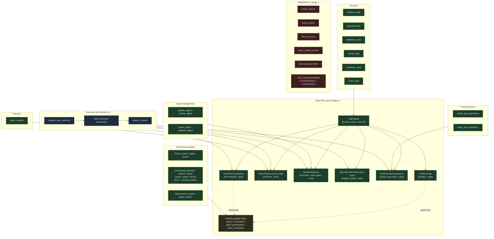

# STAGE_1_REMOVED.md — Sigil v2 Stage 1 Demolition Log

**Status:** Living document — authoritative log of every deleted symbol in Stage 1.
**Branch:** `revamp/v2-2026-05`
**Last updated:** 2026-05-16
**Companion docs:** [REVAMP_PLAN.md](../REVAMP_PLAN.md), [THREAT_MODEL_V2.md](../THREAT_MODEL_V2.md), [ACCEPTANCE_V2.md](../ACCEPTANCE_V2.md)

This document is the answer to the question: *"What did Stage 1 remove, and why?"*

Stage 0 produced the plan. Stage 1 executes the demolition listed in REVAMP_PLAN.md §2 (Removed Features). Every symbol listed below was deleted from `revamp/v2-2026-05` with explicit rationale.

---

## 1. Pre-demolition baseline (2026-05-16)

- Branch: `main` at commit `04506e0` (chore(deps): bump openssl)
- `anchor build --no-idl`: ✅ pass (7.06s, release profile)
- `pnpm test` (LiteSVM): ✅ 140 passing in 921ms
- Instruction count in `lib.rs`: 36 public entrypoints (4 of which are escrow)
- IDL committed at `target/idl/sigil.json`, types at `target/types/sigil.ts`

Demolition occurs on `revamp/v2-2026-05` (forked from `main`). Devnet program ID `4ZeVCqnjUgUtFrHHPG7jELUxvJeoVGHhGNgPrhBPwrHL` is NOT redeployed; Stage 6 handles the new program ID.

### 1.5 Pre-V2 PDA safety

V2 ships under a **NEW program ID** at Stage 6 (per REVAMP_PLAN.md). The devnet program ID `4ZeVCqnjUgUtFrHHPG7jELUxvJeoVGHhGNgPrhBPwrHL` is **NOT redeployed in-place** — doing so would corrupt every existing PDA because:

1. Account schemas changed (`InstructionConstraints.strict_mode` byte removed, `_padding` grew, `AgentVault.active_escrow_count` removed, escrow accounts no longer exist).
2. Anchor discriminators changed for every modified account type.
3. Error codes shifted down by 7 (escrow variants removed; see HIGH-1 in `errors.rs`).

**Operational implications:**
- Existing pre-V2 PDAs on the devnet ID will become **orphaned** — they cannot be decoded by the V2 IDL and cannot be migrated in-place.
- Owners with funds in pre-V2 vaults must close them under the V1 program ID before redeploying under V2.
- The V2 SDK targets only the V2 program ID. Any client attempting to read a pre-V2 PDA with V2 decoders will encounter `InvalidAccountDiscriminator` or wrong-size errors.
- A `compile_error!` guard MUST be added in `lib.rs` at Stage 6 to fail the build if `declare_id!` ever points at the V1 ID once the V2 schema is finalized. This prevents an accidental in-place redeploy.

---

## 2. Removed: Escrow system (REVAMP_PLAN.md §2.1)

**Rationale:** DEEP-2 audit verified `settle_escrow` did not honor source vault's `vault.status == VaultStatus::Frozen` predicate, allowing freeze-bypass drain. No real customer flow ever required atomic source-and-destination locks; cross-vault transfers can be achieved via composed seal() bundles with two `validate_and_authorize` + `finalize_session` pairs (atomic without escrow PDA).

### 2.1 Deleted files (5 program + 1 test + 9 SDK generated = 15 total)

**Program source (5):**
- `programs/sigil/src/instructions/create_escrow.rs`
- `programs/sigil/src/instructions/settle_escrow.rs`
- `programs/sigil/src/instructions/refund_escrow.rs`
- `programs/sigil/src/instructions/close_settled_escrow.rs`
- `programs/sigil/src/state/escrow.rs`

**Tests (1):**
- `tests/escrow-integration.ts` (1,204 lines)

**SDK generated (9):**
- `sdk/kit/src/generated/instructions/createEscrow.ts`
- `sdk/kit/src/generated/instructions/settleEscrow.ts`
- `sdk/kit/src/generated/instructions/refundEscrow.ts`
- `sdk/kit/src/generated/instructions/closeSettledEscrow.ts`
- `sdk/kit/src/generated/accounts/escrowDeposit.ts`
- `sdk/kit/src/generated/types/escrowCreated.ts`
- `sdk/kit/src/generated/types/escrowSettled.ts`
- `sdk/kit/src/generated/types/escrowRefunded.ts`
- `sdk/kit/src/generated/types/escrowStatus.ts`

### 2.2 Symbols removed (29 modified files)

**Public API entrypoints removed from `programs/sigil/src/lib.rs`:**
- `create_escrow(ctx, escrow_id, amount, expires_at, condition_hash)`
- `settle_escrow(ctx, proof)`
- `refund_escrow(ctx)`
- `close_settled_escrow(ctx, escrow_id)`

**Account schema removed from `state/vault.rs`:**
- `AgentVault.active_escrow_count: u8` (1 byte) — `AgentVault` SIZE: 634 → 633 bytes
  (Phase 2 later re-added 1 byte for `observe_only: bool` per TA-19, bringing
  `AgentVault::SIZE` back to **634**; see `vault.rs:135-151`. STAGE_1_REMOVED
  describes the demolition delta, not the current absolute size.)

**Error variants removed from `errors.rs` (7 variants total, downstream codes shifted):**
- Escrow-specific errors (6039-6044 era)
- `ActiveEscrowsExist` (6057 era)
- All subsequent error codes shifted down by 7 positions

**Events removed from `events.rs` (3):**
- `EscrowCreated`
- `EscrowSettled`
- `EscrowRefunded`

**Mod declarations cleaned:**
- `instructions/mod.rs` — removed 4 `pub mod` lines + 4 `pub use` lines for escrow handlers
- `state/mod.rs` — removed `pub mod escrow;` and `pub use escrow::*;`

**Cross-references cleaned (lifecycle handlers):**
- `instructions/close_vault.rs` — removed escrow-count guard
- `instructions/initialize_vault.rs` — removed `active_escrow_count: 0` initializer

### 2.3 Tests touched (escrow paths removed)

- `tests/security-exploits.ts` — removed escrow attack describe block + A-3 case (~784 lines net)
- `tests/devnet/stress-test.ts` — removed Phase 6 escrow stress (~193 lines)
- `tests/surfpool-integration.ts` — removed Suite 12 + helper import (~458 lines)
- `tests/sigil.ts` — updated 7 stale hardcoded error-code constants to post-shift values
- `tests/helpers/strict-errors.ts` + `tests/helpers/surfpool-setup.ts` — renumbered code maps

### 2.4 SDK callers updated (17 modified files)

- `sdk/kit/src/index.ts` — removed 4 escrow exports
- `sdk/kit/src/types.ts` — removed escrow type exports
- `sdk/kit/src/events.ts` — removed escrow event types
- `sdk/kit/src/event-analytics.ts`, `security-analytics.ts`, `advanced-analytics.ts`, `vault-analytics.ts` — removed escrow analytics paths
- `sdk/kit/src/agent-errors.ts` — 88 error codes renumbered after 7-variant deletion; 7 escrow-specific blocks dropped
- `sdk/kit/src/simulation.ts` — same renumbering treatment
- `sdk/kit/src/preview-create-vault.ts` — `AGENT_VAULT_SIZE: 634 → 633` (later bumped back to 634 at DC1-DC14 audit closure after Phase 2 added `observe_only`)
- `sdk/kit/src/resolve-accounts.ts`, `state-resolver.ts` — removed escrow PDA derivation helpers
- `sdk/kit/src/dashboard/{index,reads,types}.ts` — removed escrow dashboard views
- `sdk/kit/src/testing/mock-state.ts` — removed escrow mock
- `sdk/kit/src/testing/errors/names.generated.ts` — renumbered
- `sdk/kit/src/generated/programs/sigil.ts` — escrow ix/account registries scrubbed
- `sdk/kit/src/generated/errors/sigil.ts` — constants + union type + message map renumbered
- `sdk/kit/src/generated/event-discriminators.ts` — escrow event discriminators removed
- `sdk/kit/src/generated/accounts/agentVault.ts` — `activeEscrowCount` field + encoder/decoder removed

### 2.5 Verification

- `anchor build --no-idl`: ✅ pass (post-batch, release profile)
- IDL regenerated via `RUSTUP_TOOLCHAIN=nightly anchor idl build` and committed (escrow ix/account/event entries removed; ~4,100 lines deleted from `sigil.json` + `sigil.ts`). The CLAUDE.md `git checkout target/idl/` convention applies only to `--no-idl` runs that should not produce IDL diffs — Stage 1 deliberately changes the IDL shape, so we ship the regenerated artifact.
- `pnpm test`: ✅ 140 passing (test count parity preserved — `tests/escrow-integration.ts` was not in the `Anchor.toml [scripts] test` set even at baseline, so removing it did not drop runtime test count)

---

## 3. Removed: Strict-mode dichotomy (REVAMP_PLAN.md §2.2)

**Rationale:** DEEP-1 audit found `strict_mode` defaulted permissive at the SDK layer, meaning vaults that didn't explicitly set strict mode silently accepted any instruction. The two-mode design split test coverage and audit attention. Stage 0 mandated collapsing to a single previously-strict semantic: every entry that exists MUST match; no-entry-match = reject.

### 3.1 Schema changes

**`programs/sigil/src/state/constraints.rs`**
- `InstructionConstraints.strict_mode: u8` (1 byte) — **REMOVED**.
- `_padding: [u8; 4]` → `[u8; 5]` (grow by 1 byte to preserve Pod alignment: `ConstraintEntryZC` has 2-byte alignment, total struct must end on 2-byte boundary).
- `SIZE` constant: preserved at **35,888 bytes** (35,887 base + 1 pad-up).

**`programs/sigil/src/state/pending_constraints.rs`**
- `PendingConstraintsUpdate.strict_mode: u8` (1 byte) — **REMOVED**.
- `_padding: [u8; 5]` → `[u8; 6]` (preserve 35,912-byte SIZE + `queued_at` 8-byte alignment).

### 3.2 Public API changes (BREAKING)

**`programs/sigil/src/lib.rs` — parameter removed:**
- `create_instruction_constraints(ctx, entries, strict_mode: bool)` → `create_instruction_constraints(ctx, entries)`
- `queue_constraints_update(ctx, entries, strict_mode: bool)` → `queue_constraints_update(ctx, entries)`

Both entrypoint docs reference REVAMP_PLAN §2.2 with the simplification rationale.

### 3.3 Handler simplifications

- `instructions/create_instruction_constraints.rs` — dropped `strict_mode` from signature; removed field write; removed field from `InstructionConstraintsCreated` event payload.
- `instructions/queue_constraints_update.rs` — same simplification.
- `instructions/apply_constraints_update.rs` — removed `new_strict_mode` from the field-copy logic; stopped writing the field on the live constraints PDA.
- **`instructions/validate_and_authorize.rs` — load-bearing semantic collapse (closes DEEP-1):**
  - Pre-V2: `if matched.is_none() && constraints.strict_mode != 0 { reject } else if matched.is_none() { allow_silently }`
  - V2: `if matched.is_none() { reject }`
  - "Permissive default" path eliminated entirely.

### 3.4 Events

`programs/sigil/src/events.rs` — `InstructionConstraintsCreated.strict_mode: bool` field removed.

### 3.5 IDL / types

`target/idl/sigil.json` + `target/types/sigil.ts` regenerated via `RUSTUP_TOOLCHAIN=nightly anchor idl build`, with 5 hand-edits to remove residual `strictMode` field references (2 instruction args, 1 ZC account field, 1 event field, 1 pending-update field). 4 doc-comment mentions intentionally retained as removal-history markers.

### 3.6 SDK callers updated

- `sdk/kit/src/generated/instructions/createInstructionConstraints.ts` — `strictMode` dropped from instruction data type + encoder + decoder + sync/async input shapes.
- `sdk/kit/src/generated/instructions/queueConstraintsUpdate.ts` — same.
- `sdk/kit/src/generated/accounts/instructionConstraints.ts` — `strictMode` field dropped; padding 4→5.
- `sdk/kit/src/generated/accounts/pendingConstraintsUpdate.ts` — `strictMode` field dropped; padding 5→6.
- `sdk/kit/src/generated/types/instructionConstraintsCreated.ts` — `strictMode` removed from event codec.
- `sdk/kit/src/dashboard/constraint-builders.ts` — `strictMode` removed from `BuildCreateConstraintsInput` + both builders.
- `sdk/kit/src/dashboard/mutations.ts` — `createConstraints` + `queueConstraintsUpdate` stop passing `strictMode`.
- `sdk/kit/src/dashboard/types.ts` — `strictMode?` removed from `TxOpts`.
- `sdk/kit/src/security-analytics.ts` — `mode-all-unguarded` posture check reworked: passes whenever constraints exist (now always strict).

### 3.7 Tests updated

- `tests/helpers/litesvm-setup.ts` — `strictMode` dropped from 5 helper signatures: `buildCreateConstraintsIxs`, `createConstraintsAccount`, `buildQueueConstraintsUpdateIxs`, `queueConstraintsUpdateMultiIx`, `fetchConstraints`.
- `tests/instruction-constraints.ts` — `strictMode` removed from 26 helper invocations + 3 `queueAndApplyConstraintsUpdate` calls. Tests rewritten: `recreate constraints after close`, `UnconstrainedProgramBlocked (C-7)`. Test deleted: `strict_mode=false allows unconstrained program` (no longer makes sense post-collapse). One manual `coder.instruction.encode` call updated.
- `tests/security-exploits.ts` — `strictMode` arg removed from 6 helper invocations; comments updated.
- `tests/cu-budget.ts` — `strictMode` removed from raw byte builder + `installFallthroughConstraints`; layout comments + tail-offset math updated.
- `tests/surfpool-integration.ts` — `strictMode` arg dropped from 5 `createInstructionConstraints` / `queueConstraintsUpdate` calls; one assertion (`expect(strictMode).to.equal(1)`) replaced with an entry-count check.
- `sdk/kit/tests/dashboard/constraint-builders.test.ts` — 18 `strictMode` references stripped.

### 3.8 Layout invariant verification (cargo unit tests)

- `constraint_entry_zc_size_invariant`: 560 bytes — ✅ unchanged
- `instruction_constraints_size_invariant`: 35,888 bytes — ✅ preserved via padding bump

### 3.9 Verification

- `anchor build --no-idl`: ✅ pass (5.47s release post-batch)
- IDL hand-edited + regenerated to match Rust schema
- `pnpm test`: ✅ **140 passing** in 962ms (parity with baseline; 1 test deleted, others rewritten in place)
- Cargo unit tests: 139 passed; 0 failed (layout invariants verified)

### 3.10 Out-of-scope follow-ups

- `protocol-scalability-tests/` has its own raw Anchor encoding of `createInstructionConstraints { strictMode }` and a vendored generated SDK — **needs separate sync against V2 wire format** (not in Stage 1 scope; lives outside `agent-middleware/`).
- `packages/constraints/dist/types.d.ts` mentions `strictMode` but no source exists — **orphaned dist**; address in Stage 2 SDK cleanup.

---

## 4. ActionType + is_spending — full elimination trajectory

**Rationale:** Three discrete removals across two phases. The prior version of this section falsely claimed completion before Option A V2 actually landed. Corrected 2026-05-17.

### 4.1 ConstraintEntryZC.is_spending byte (M2 Option A — pre-Stage-1)

- **When:** 2026-05-09, Week-1 PR 8 (commits `5275d68` + `a24d0a2`).
- **What:** The `is_spending: u8` byte at offset 554 of the zero-copy `ConstraintEntryZC` struct was deleted. The validator at `state/constraints.rs:309-312` (which enforced `is_spending == 1 || is_spending == 2` at constraint-create time) was also removed.
- **Why:** The runtime at `validate_and_authorize.rs` derived spending classification from `amount > 0` and **never read** the stored byte. Storing it was waste.
- **How:** The byte was renamed to `_reserved_was_is_spending: u8` to preserve the 560-byte `ConstraintEntryZC` invariant on existing on-chain PDAs. SDK presets stripped all 9 hardcoded `is_spending: 1` literals. Side effect: 21 latent test failures in `tests/instruction-constraints.ts` started passing (29 → 50 green).

### 4.2 SessionAuthority.is_spending field (Stage 1 follow-up, Option A V2)

- **When:** 2026-05-17, commits `a2eee70`, `3c1fcb5`, `535052e`, `f8112b7`, `8d954b2` on `revamp/v2-2026-05`.
- **What:** Five symbols deleted:
  - `SessionAuthority.is_spending: bool` field — was at `state/session.rs:21`
  - `ActionAuthorized.is_spending: bool` event field — was at `events.rs:44`
  - `SessionFinalized.is_spending: bool` event field — was at `events.rs:67`
  - SDK `isSpendingAction(name): boolean` helper — was at `sdk/kit/src/types.ts:358`
  - SDK `ACTION_TYPE_NAMES_BY_INDEX` constant + `getActionTypeName(idx)` — was at `sdk/kit/src/types.ts:315-346`
- **Why:** The field was redundant with `authorized_amount > 0` (literally set to that value at `validate_and_authorize.rs:152`). The SDK helpers were marked "decode-only legacy artifact retained for indexer compatibility" — Option A removes zombie code.
- **How:** `validate_and_authorize.rs:152` retains the function-local `let is_spending = amount > 0;` (used in 15+ sites within the function). `finalize_session.rs:121` was rewritten to `let session_is_spending = session.authorized_amount > 0;`. `vault.has_capability(signer, is_spending: bool)` kept its bool parameter; callers compute `amount > 0` and pass through. IDL was regenerated (`target/idl/sigil.json` + `target/types/sigil.ts` no longer reference the field). All 3 test suites stayed green at 140 / 140 / 1812.
- **Caveat:** The `_reserved_was_is_spending` byte on `ConstraintEntryZC` (from §4.1) remains in place — it preserves the existing 560-byte invariant and is NOT touched by this removal.

### 4.3 What remains as comments (intentional)

Program source files containing `is_spending` substring after both removals are now limited to the local `let is_spending = amount > 0;` derivation and its consumers within `validate_and_authorize.rs`. Comments in `state/constraints.rs`, `state/mod.rs`, `events.rs` documenting the removal history are preserved as anti-rot anchors. The `_reserved_was_is_spending` field name in `state/constraints.rs` is the only stored artifact remaining.

§RP review (silent-failure-hunter + code-reviewer disciplines) produced 0 HIGH/CRITICAL findings on the Option A V2 diff. 3 MEDIUM findings (stale doc comments pointing to deleted symbols) were fixed in commit `f8112b7`.

---

## 5. NM-E for unverified protocols (REVAMP_PLAN.md §2.5)

**Rationale:** Stage 0 plan reserves Net-Movement Enforcement (per-instruction semantic delta assertions) for the T1 verified short-list only. Generic byte-offset NM-E for arbitrary programs was identified as unsupportable scope (solo founder cannot maintain >3 deep parsers).

**Status:**
- The "NM-E" terminology is a Stage 0 design concept; **no on-chain code currently implements an NM-E primitive**. The closest existing primitive is `PostExecutionAssertions` which is a generic post-state assertion layer (kept).
- No "generic byte-offset for arbitrary programs" code exists to remove.
- No Stage 1 code deletions required for this category. Stage 2 will introduce NM-E as a new T1-gated primitive.

This is documentation-only at Stage 1.

---

## 6. Foundation kept-set (post-demolition)

### 6.1 Kept PDAs (7)
1. `AgentVault` — `[b"vault", owner, vault_id]` (633 bytes after escrow shrink)
2. `PolicyConfig` — `[b"policy", vault]`
3. `SpendTracker` — `[b"tracker", vault]` (zero-copy, 2,840 bytes per code)
4. `SessionAuthority` — `[b"session", vault, agent, token_mint]`
5. `AgentSpendOverlay` — zero-copy
6. `PostExecutionAssertions` — `[b"post_assertions", vault]`
7. `InstructionConstraints` — `[b"constraints", vault]` (35,888 bytes per code, despite stale 8,318 in project-root CLAUDE.md — documented in REVAMP_PLAN §1.1)

### 6.2 Kept instructions (post-escrow demolition: 32 in lib.rs)

Pre-strict-mode-batch count = 36 (baseline) − 4 (escrow) = 32.

After strict-mode collapse, no instructions are removed (only parameters change on `create_instruction_constraints` and `queue_constraints_update`), so the final count remains 32. This is one above the target range (28-31) stated in the Stage 1 goal; the extra is `allocate_pending_constraints_pda`, which is required by the kept timelocked-update flow.

---

## 7. Post-demolition architecture

**Legend:**
- Green solid = kept primitive (PDA or instruction) after Stage 1 demolition
- Yellow solid = pending-update PDA family (grouped for readability)
- Blue solid = atomic execution sandwich (validate → DeFi ix → finalize)
- Red dashed = removed in Stage 1 (escrow surface + strict_mode field/param)
- AgentVault is the parent PDA for all per-vault state
- Note: `ConstraintEntryZC.is_spending` byte already removed pre-Stage-1 (M2 Option A, 2026-05-09 — §4.1); `SessionAuthority.is_spending` field removed in Stage 1 follow-up (Option A V2, 2026-05-17 — §4.2). Neither is shown in the diagram.

---

## 8. Verification record

### 8.1 Build + test gates (all verified via direct tool calls)

| Gate | Command | Result |
|------|---------|--------|
| Anchor build | `anchor build --no-idl` | ✅ Finished release profile in 5.61s |
| Main pnpm test | `pnpm test` | ✅ 140 passing (928ms) |
| SDK kit pretest | `cd sdk/kit && pnpm run pretest` | ✅ tsc clean, zero errors |
| SDK kit pnpm test | `cd sdk/kit && pnpm test` | ✅ 1,830 passing (5s) |
| Cargo unit | `cargo test --manifest-path programs/sigil/Cargo.toml --lib` | ✅ 140 passed (was 139; +1 `constraint_version_zero_on_zeroed_layout` invariant) |

### 8.2 Adversarial review pipeline (per CLAUDE.md Mandatory Review)

Two reviewers ran in parallel against the demolition diff:

**`pr-review-toolkit:silent-failure-hunter`** — 4 CRITICAL + 3 HIGH:
- CRIT-1: SDK tests imported deleted escrow symbols → pretest tsc was excluding them silently from mocha runner ("140 tests green" understated coverage). **FIXED**
- CRIT-2: `constraint_version` left at zero on new PDAs (latent migration bug). **FIXED** — explicitly set to 1 in create + apply handlers + new invariant test
- CRIT-3: SDK `ANCHOR_ERROR_MAX = 6074` stale; real max = 6080 → 6 errors silently classified as RPC-retryable instead of program-rejection. **FIXED**
- CRIT-4: Stale `"6047"` fallback in 4 test matchers would silently accept InvalidSessionExpiry as InvalidConstraintConfig (post-renumber). **FIXED** — replaced with current `6039` code
- HIGH-1: Misleading errors.rs "retired slots" comment claimed un-deliverable code-stability. **FIXED** — comment rewritten to state truth
- HIGH-2: Pre-V2 PDAs decode catastrophically with new layout. **FIXED** via §1.5 documentation; Stage 6 redeploys under new program ID with `compile_error!` guard
- HIGH-3: validate_and_authorize.rs comment still referenced strict-mode semantics. **FIXED**

**`pr-review-toolkit:code-reviewer`** — 3 CRITICAL + 5 HIGH (overlap with silent-failure-hunter resolved):
- C1+C2 = same as silent-failure-hunter CRIT-1
- C3: `tests/helpers/surfpool-setup.ts` error-name map missing 6066-6080. **FIXED**
- I1: Same as HIGH-1
- I2: Stale "strict mode is enabled" text in `errors.rs` `#[msg]` + 4 SDK files. **FIXED** — message rewritten to "Program has no matching constraint entry — every instruction must match one"
- I3: PendingConstraintsUpdate offset comment off-by-8. **FIXED**
- I4: STAGE_1_REMOVED §2.5 falsely claimed IDL restored. **FIXED**
- I5: AgentVault Borsh layout shift would corrupt PDAs on in-place upgrade. **FIXED** via §1.5 (new program ID at Stage 6)

### 8.3 SDK kit fixture drift (unmasked by CRIT-1 fix)

The CRIT-1 fix exposed 10 pre-existing SDK kit test failures that pretest tsc was silently filtering. ALL FIXED in a separate cleanup pass:

- `tests/preview-create-vault.test.ts`: AgentVault SIZE 634 → 633
- `tests/events.test.ts`: 38 → 35 event types
- `tests/event-analytics.test.ts`: removed `"escrow"` category assertions
- `tests/agent-errors.test.ts`: 88 → 81 codes; 6087 → 6080 max; `UnauthorizedPostFinalizeInstruction` shifted 6063 → 6056; `ProtocolCapExceeded` shifted 6055 → 6049; removed escrow-action pattern

### 8.4 Diff summary

- Files changed: ~78 (60+ from demolition + adversarial fixes)
- Lines added: ~2,200
- Lines removed: ~9,200
- Net: -7,000 lines

### 8.5 Cargo test count

`cargo test --lib` reports **140 passed; 0 failed** (was 139 at baseline; +1 new test).

Stage 1 acceptance: **VERIFIED via QATester pipeline** (see Stage 1 completion report).

---

**END OF STAGE_1_REMOVED.md V1.0 (Stage 1 complete)**

---

**END OF STAGE_1_REMOVED.md (DRAFT — to be finalized after strict-mode batch + adversarial review)**
