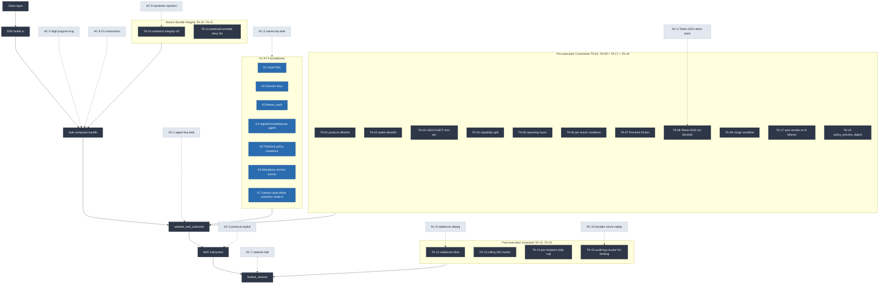

# THREAT_MODEL_V2.md — Sigil v2 Formal Threat Model

**Status:** Living document — formal threat model for Sigil v2.
**Last updated:** 2026-05-17
**Branch:** `revamp/v2-2026-05`
**Companion docs:** [REVAMP_PLAN.md](./REVAMP_PLAN.md), [ACCEPTANCE_V2.md](./ACCEPTANCE_V2.md), [INTERFACES_V2.md](./INTERFACES_V2.md)
**Architecture diagram:** Embedded in §8 below (the canonical `tier-model.mmd` was deleted in Phase 1 Option A demolition, 2026-05-17, since no tier model ships in V1).

---

## 0. Referenced Research

This document derives its attacker-class enumeration, blast-radius reasoning, and mitigation mapping from the Stage 0 research fan documented at [REVAMP_PLAN.md §0](./REVAMP_PLAN.md#0-referenced-research). All ID drift (K-N, TA-NN, AC-N, D-NN, T-XXX) versus that registry is treated as §RP CRITICAL.

Key research-derived inputs to this threat model:

- **GeminiResearcher 2026-05-17 MISMATCH corrections**: Lighthouse has 14 (not 8) assertion types; Maestro `swap_only` flag is fabrication (Maestro-floor = anti-rug + anti-MEV + privacy/rate guardrails); AgentLayer envelope is off-chain Python runtime (not on-chain). Threat model accounts for these corrections in §5 universal guarantees (under Option A — see §5.2) and §6 workflow mitigations.
- **Architect 2026-05-17 dependency audit**: Originally identified load-bearing 5 = K1, K6, K7, TA-10, TA-16. Under Phase 1 Option A demolition (L-1, 2026-05-17), TA-16 is dropped and the load-bearing-5 list reduces to K1, K6, TA-10, TA-19 (TA-19 replaces TA-16's role via policy-preview digest binding). K6 event emission remains the highest-leverage single dependency — its silent failure cascades through TA-13/TA-15/TA-06 invisibly. Threat model §7 calls out K6 silent-emit as a dedicated risk (T-DoS-1 + T-K6-1).
- **GrokResearcher prior (contrarian Arg 5)**: Trust-assumption inversion (Owner Policy Underspecification) is the system's load-bearing weakness. Embedded as T-21 in §2.
- **CodexResearcher prior (Argent precedent)**: Argent V3 guardian-majority + 7-day timelock pattern. Squads V4 substitutes only in autonomous mode. Translated to D-05 + D-06 multisig configuration.

---

## 1. Methodology

Sigil v2 is a constraint enforcement layer for AI-agent custody of Solana DeFi assets. The threat model enumerates the actor classes and environmental hazards that put vault assets at risk, characterizes each by capability and blast radius, and maps each Tier A on-chain primitive (TA-01..TA-15, TA-17, TA-19; TA-16 dropped per L-1) to the classes it blocks.

### 1.1 Class notation

Mixed taxonomy — active attacker classes interleaved with environmental hazards. Grouped by attack vector, not by attacker class:

- **AC-1, AC-2, AC-3, AC-4, AC-5, AC-9, AC-10**: Active attacker classes (someone with intent and capability — key leak, program bug, malicious mint authoring, protocol exploiter, sandwich injector, nonce replayer).
- **AC-6, AC-7, AC-8**: Environmental hazards (stablecoin depeg, network halt, CU exhaustion — no actor required; AC-8 has marginal-actor DoS variant but typically environmental).
- **AC-11**: Oracle staleness (out-of-scope V1 per D-09).
- **T-DoS-1, T-DoS-2**: Operational denial-of-service hazards specific to Sigil (auto-revoke spam + cosign lost-key brick).
- **T-21**: Trust-assumption inversion — Owner Policy Underspecification. The load-bearing assumption that, if violated, makes every other mitigation fail silently. Mitigated by workflow (M-T21-1..4), not by primitive.
- **T-K6-1**: K6 silent emit failure. The Architect-identified highest-leverage single dependency.

### 1.2 Severity scale (blast-radius)

- **CATASTROPHIC** — entire vault drainable in a single transaction.
- **HIGH** — significant fraction (>20%) drainable, or substantial DoS (>1 hour vault wedged).
- **MEDIUM** — bounded loss (<20%) or operational disruption (<1 hour).
- **LOW** — informational leak, minor griefing.

### 1.3 Likelihood scale

- **HIGH** — observed in production within prior 12 months (e.g., Drift April 2026 DPRK durable-nonce attack).
- **MEDIUM** — plausible attack vector with documented prior art in adjacent systems.
- **LOW** — theoretical or requires unlikely actor coordination.

### 1.4 Mitigation legend

Cells in the §4 mapping table show whether a TA primitive **blocks** a given attacker class:
- `✓` — primary blocker; load-bearing for this class. Failure of the primitive → CATASTROPHIC residual.
- `+` — defense-in-depth contribution. Adds robustness but is not the sole blocker.
- `(detect)` — forensic detection signal only (no preventative effect).
- `(W)` — workflow mitigation (not an on-chain primitive); see §6.
- *(empty)* — no significant contribution for this class.

---

## 2. Attacker Classes & Environmental Hazards

### AC-1 — Agent Key Leak

**Description:** The agent's session key (`SessionAuthority`) leaks via prompt injection, malicious tool call, agent host compromise, or supply-chain attack on the agent runtime.

**Capabilities:**
- Sign instructions on behalf of the agent within the session's scope.
- Bound by `SessionAuthority.expiry_unix` and `SessionAuthority.capability` (DISABLED / OBSERVER / OPERATOR).
- Cannot rotate keys, modify policy, withdraw owner-side, or escalate capability.

**Likelihood:** HIGH. Agent runtimes are complex and AI agents are subject to prompt injection by definition. This is the default expected attacker class for V1.

**Pre-mitigation blast-radius:** CATASTROPHIC — without constraints, an attacker can transfer the full vault balance to any destination within session lifetime.

**Post-mitigation blast-radius (V1 Tier A):** MEDIUM —
- TA-02 wallet allowlist default-deny: cannot exfil to unknown destination.
- TA-13 rolling 24h tracker: cannot exceed `daily_cap_usdc_face` regardless of policy weakness.
- TA-12 stablecoin floor: defense-in-depth — only blocks stablecoin-denominated exfil. SOL/asset-denominated exfil (e.g., USDC → SOL → burn) is bounded by TA-13 24h tracker + TA-02 wallet allowlist, NOT TA-12 (see [REVAMP_PLAN §4.3 TA-12](./REVAMP_PLAN.md#43-post-execution-invariants-exit-guard-ta-12ta-16) limitation).
- TA-05 operating hours + TA-06 cooldown + TA-07 first-time friction: bound the rate of attempts.
- K3 freeze + K4 revoke: owner has emergency kill switch.
- **Residual:** Within allowlisted destinations, allowlisted protocols, and within daily cap, an attacker can still drain. Bound = daily cap minus what was already spent legitimately that day. Typical for a $50K-cap vault: attacker can lose ~$40K-$50K in one day if compromise hits at 00:00:01 UTC.

**Detection signal:** TA-15 audit-log circular buffer + dashboard anomaly alerts (events emitted on every instruction via K6).

### AC-2 — Owner Key Leak

**Description:** The owner's signing key leaks (phishing, malicious hardware, key-management failure).

**Capabilities:**
- Initiate policy updates (subject to K5 timelock).
- Trigger freeze/revoke (immediate, no timelock).
- Add/remove agents.
- Cannot bypass the on-chain program — owner key alone cannot circumvent Tier A constraints.

**Likelihood:** MEDIUM for solo-key owners; LOW for Squads V4 multisig owners (per D-05).

**Pre-mitigation blast-radius:** CATASTROPHIC over the K5 timelock window — attacker waits 48 hours, then a policy weakening lands and a session-issued action drains the vault.

**Post-mitigation blast-radius (V1 Tier A):** MEDIUM —
- K5 timelock on policy updates: 48-hour minimum.
- D-05 + SDK Squads V4 detection helper (Stage 4): if owner is a multisig PDA, key leak is bounded by multisig threshold — single-key compromise has no policy-mutation power.
- TA-09 cosign workflow: elevated ops require owner+session co-sign, preventing lateral movement post-compromise.
- **Residual:** Single-key owner (non-multisig) deployments remain CATASTROPHIC if the attacker waits the timelock + executes during a low-attention window. Mitigation: STRONGLY recommend Squads V4 3-of-5 + 24-72hr timelock + hardware diversification per [REVAMP_PLAN §4.4 / D-05](./REVAMP_PLAN.md#10-decision-register). Drift's April 2026 $285M loss on 2-of-5 + durable-nonce social engineering is the canonical negative precedent.

**Detection signal:** `PendingPolicyUpdate` event emitted via K6. Owners must subscribe to the event stream; the dashboard's notification subsystem is the user-facing detector.

### AC-3 — Sigil Program Bug

**Description:** A bug in the Sigil program itself — assertion bypass, integer overflow, missing constraint check, account validation gap.

**Capabilities:**
- Whatever the bug grants. Worst case: full vault drain via crafted instruction sequence.
- Affects all vaults using the deployed program version.

**Likelihood:** MEDIUM at Stage 2-5; LOW after Stage 6 audit-fixed.

**Pre-mitigation blast-radius:** CATASTROPHIC across all Sigil vaults simultaneously.

**Post-mitigation blast-radius (V1 Tier A):** HIGH (still catastrophic per-vault if the bug fully bypasses, but containment is improved) —
- TA-04 capability split: an agent compromise via bug is bounded by the session's capability level (DISABLED / OBSERVER / OPERATOR).
- TA-10 sandwich integrity + TA-11 protected-writable deny-list: foreign programs cannot tamper with Sigil's PDAs in the same bundle, narrowing exploit primitives.
- **Auto-revoke is deferred for V1** (NOT a numbered TA primitive; reserved for v1.1 once UX patterns settle). Documented as a v1.1 deferral candidate per [REVAMP_PLAN §6](./REVAMP_PLAN.md#6-deferred--skipped). When implemented in v1.1, the counter MUST exclude AC-8 CU-exhaustion and AC-3 successful-bug-exploits (those don't reject bundles) — only policy-rejected bundles count.
- **Audit + formal verification** (see [ACCEPTANCE_V2.md §3.5](./ACCEPTANCE_V2.md#35--formal-verification-of-3-critical-invariants)) is the primary mitigation; on-chain primitives are containment, not prevention.
- **Residual:** Auditable program bugs are an inherent risk. Bug bounty (see [ACCEPTANCE_V2.md §3.3](./ACCEPTANCE_V2.md#33--bug-bounty-live)) is the post-deployment defense.

**Detection signal:** Audit log buffer (TA-15) + dashboard anomaly alerts. Per Architect 2026-05-17, this depends on K6 emit fidelity (load-bearing dep).

### AC-4 — Token-2022 Silent Drain

**Description:** A token mint uses Token-2022 extensions to silently siphon, freeze, or redirect funds: `TransferFee`, `TransferHook`, `PermanentDelegate`, `DefaultAccountState::Frozen`, `MintCloseAuthority`.

**Capabilities:**
- Author of the malicious mint can drain any account holding the token.
- TransferHook can execute arbitrary CPI on every transfer.
- PermanentDelegate has perpetual transfer authority.

**Likelihood:** HIGH if mint pinning is not enforced; LOW with TA-03 + TA-08.

**Pre-mitigation blast-radius:** CATASTROPHIC — any vault accepting the mint loses on first transfer.

**Post-mitigation blast-radius (V1 Tier A):** LOW —
- TA-03 USDC/USDT cluster mint pinning: only the cluster-pinned canonical mints are accepted. Fake mints with extensions are rejected at entry.
- TA-08 Token-2022 dangerous-extension blocklist: even canonical mints are checked for the 5 dangerous extensions and rejected if present.
- **Residual:** If a canonical mint authority is later compromised and `MintCloseAuthority` is silently activated, Sigil rejects further transfers. Existing balance remains at risk of the close. This is bounded by the canonical mint issuer's operational security (Circle for USDC, Tether for USDT) — outside Sigil's control.

**Detection signal:** TA-15 + dashboard rejects with `ErrToken2022ExtensionForbidden`.

### AC-5 — Protocol Exploit

**Description:** An exploit in a target protocol (Jupiter, Kamino, Drift, etc.) results in vault asset loss when the vault interacts with the exploited protocol.

**Capabilities:**
- Whatever the protocol bug grants. Worst case: full deposit drained.

**Likelihood:** MEDIUM (DeFi protocols are routinely exploited; e.g., Drift $285M April 2026).

**Pre-mitigation blast-radius:** CATASTROPHIC per protocol used.

**Post-mitigation blast-radius (V1 Tier A):** MEDIUM —
- TA-01 protocol allowlist: vault only touches the protocols the owner explicitly listed. A protocol exploit only affects vaults that have allowlisted it.
- TA-12 stablecoin floor: even on a successful exploit, the stablecoin balance cannot drop below the floor.
- TA-13 rolling 24h tracker: cap on protocol-level outflow in 24h window.
- **De-list workflow:** Sigil ships SDK patch within 48h of a known exploit; TierRegistry write removes the protocol from the allowlist (D-06 4-of-5 multisig).
- **Residual:** Funds already in the protocol at the time of exploit are at risk until the protocol's own recovery. Sigil does not custody those funds — it only constrains the entry/exit.

**Detection signal:** TA-15 audit log + community/Twitter incident detection (Sigil monitors `@SigilSecurity` watchlist).

### AC-6 — Stablecoin Depeg

**Description:** USDC or USDT depegs significantly from $1.00 (March 2023 USDC SVB scenario; Tether collateral concerns).

**Capabilities:**
- Not an attacker — environmental hazard. Triggers value loss on stablecoin-denominated positions.

**Likelihood:** LOW per 12-month window; MEDIUM cumulative over 36-month window.

**Pre-mitigation blast-radius:** HIGH — vault expected to hold $X face value of stablecoin loses fraction proportional to depeg.

**Post-mitigation blast-radius (V1 Tier A):** **PER-DESIGN: Sigil does not price-protect against depeg. Unit-of-account = USDC face value, not USD.**
- This is an explicit acceptance of risk per D-03 (see [REVAMP_PLAN §10](./REVAMP_PLAN.md#10-decision-register)).
- **Rationale for dropping Pyth (formerly DEEP-5):** Pyth integration was evaluated and rejected for V1 because (1) per-tx oracle reads cost ~10K CU and would push seal() bundles near the 1.4M ceiling; (2) Sigil's structural stable-touch rule (every seal() bundle touches USDC or USDT) makes USDC face-value as the unit-of-account semantically coherent — Sigil already commits to those mints; (3) Maestro and Trojan both ship face-value caps with $24B+ of validated production volume on Solana alone.
- TA-12 stablecoin floor in USDC face value: protects against quantity loss, not value loss.
- **Residual:** Owner must monitor depeg externally (dashboard surfaces 7-day deviation but does not enforce). AC-6 has no `✓` blocker in the §4 matrix; this is by design (per the rationale above), not an oversight.

**v1.1 candidate (Def-4 in REVAMP_PLAN.md §6.1):** Dual-floor with Pyth lazy fetch only when within 10% of floor — adds price protection without per-tx oracle cost. Folded with AC-11 oracle-staleness mitigation per D-09.

### AC-7 — Network Halt

**Description:** Solana mainnet halts (precedent: 7 halts in 2024, last in Sep 2024). During halt, no Sigil instruction can land.

**Capabilities:**
- Environmental.
- Pending policy updates do not finalize.
- Pending freeze/revoke do not land.

**Likelihood:** LOW per 12-month window (Solana halt frequency has decreased post-2024 reliability work); MEDIUM cumulative over 36-month window.

**Pre-mitigation blast-radius:** MEDIUM — depends on what was in-flight at halt and what happens during the halt (e.g., off-chain protocol upgrades).

**Post-mitigation blast-radius (V1 Tier A):** **PER-DESIGN: Sigil cannot operate during halt. This is accepted.**
- Mitigation: Sigil instructions are atomic when they land. Halt does not partially apply a seal.
- Recommended owner runbook: maintain ability to issue freeze on resume.
- **Residual:** None — halt is symmetric (attacker can't drain either).

### AC-8 — CU Exhaustion

**Description:** Adversarial transaction crafted to exceed compute budget (1.4M CU) and revert. Affects DoS, not theft.

**Capabilities:**
- Block legitimate seal() executions by mempool spam.
- Force-revert a vault into a wedged state by triggering N consecutive CU failures. (Auto-revoke is deferred from V1; even when implemented in v1.1, CU-exhausted bundles will be excluded from any counter to avoid this T-DoS-1 vector.)

**Likelihood:** LOW — Solana CU cost makes this expensive; mostly relevant for targeted DoS of a specific vault.

**Pre-mitigation blast-radius:** MEDIUM (DoS) + LOW (forced auto-revoke).

**Post-mitigation blast-radius (V1 Tier A):** LOW —
- Sigil CU budget per seal: <120K CU measured (8% of 1.4M ceiling) — substantial headroom.
- T-DoS-1 mitigation (see §7) excludes CU failures from any auto-revoke counter.
- **Residual:** Mempool-level DoS is a Solana-network concern; Sigil cannot mitigate at program level.

### AC-9 — Sandwich Injection

**Description:** Attacker injects an instruction between Sigil's `validate_and_authorize` and `finalize_session` to perform a non-Sigil-authorized operation atomically.

**Capabilities:**
- Bundle a malicious instruction adjacent to Sigil's bundle.
- Could be: writable account mutation, CPI to a protocol that drains, etc.

**Likelihood:** HIGH (every seal() is a potential injection target); LOW residual with TA-10.

**Pre-mitigation blast-radius:** CATASTROPHIC — bypasses every other Sigil guard.

**Post-mitigation blast-radius (V1 Tier A):** LOW —
- **Load-bearing blocker: TA-10** sandwich integrity (N2 via instructions-sysvar): entry guard asserts (a) next instruction is on protocol allowlist (TA-01 default-deny), (b) the bundle ends with a matching `finalize_session`, (c) no instructions writing to protected accounts (TA-11) appear inside any seal window.
- **Defense-in-depth:** TA-11 protected-writable deny-list (independent assertion on the writable set).
- **If TA-10 alone fails (e.g., bug bypass), AC-9 reverts to CATASTROPHIC.** TA-10 is single-point-of-failure for the structural N2 ceiling. TA-11 catches the subset of sandwich attacks that target protected writes; the bypass-not-protected-write subset is structurally outside TA-11's domain.
- **Residual:** Foreign instructions that DON'T write to protected accounts AND call program IDs already in `allowed_protocols` can still appear within seal windows. These cannot drain Sigil-protected accounts (vault, tracker, session, policy are write-protected by TA-11). They can affect the agent's external state (e.g., the agent's gas-funding account) — out of scope.

**Detection signal:** TA-15 audit log entries record bundle composition. Anomalous foreign-program presence triggers dashboard alert.

### AC-10 — Durable Nonce Replay

**Description:** A signed transaction using a durable nonce remains valid indefinitely. A leaked pre-signed instruction can execute at any time.

**Capabilities:**
- Sign a transaction now, hold it indefinitely, replay later when conditions favor the attacker.
- Drift's April 2026 $285M loss involved DPRK-controlled durable nonces — pre-signed multisig approvals were held and replayed in a coordinated drain.

**Likelihood:** MEDIUM. Drift precedent is real and recent. Sigil's own owner-key flows must defend against this.

**Pre-mitigation blast-radius:** HIGH — pre-signed seal() instructions can be replayed after policy changes.

**Post-mitigation blast-radius (V1 Tier A):** LOW —
- K2 session-authority PDA: each seal() execution increments a `nonce: u64` on the session. The entry guard rejects with `ErrSessionNonceMismatch` if the session nonce does not match the expected next value.
- TA-15 N1 temporal binding (slot+blockhash double-bind per C22): a pre-signed instruction recorded at slot N cannot replay at slot N+M with M > tolerance.
- K5 timelock + TA-05 operating hours: bound when a pre-signed instruction can land.
- Runbook (per Drift precedent): owners audit signers' durable nonce accounts before any sensitive operation.
- **Residual:** A pre-signed seal that matches the current nonce CAN replay until consumed. Bound = 1 instruction in flight. Sigil DOES NOT use durable nonces internally; the risk is solely on durable-nonce-bearing wallets that the owner uses.

**Detection signal:** Session nonce mismatch event emitted via K6 → TA-15 audit log + dashboard alert.

### T-DoS-1 — Auto-revoke spam mitigation

**Description:** If Sigil naively counted every rejected bundle toward an auto-revoke threshold, an attacker could spam crafted-failing bundles to trigger forced session revocation, denying the legitimate agent service.

**Mitigation (V1 design):**
- **Auto-revoke is now LOCKED as TA-17 per L-10** (2026-05-17 Phase 0.5 hygiene pass). Implementation lands in Phase 3 with configurable threshold (floor 3, ceiling 20, default 5) and `SigilError::*` policy-violation filter only — external causes (CU exhaustion, network errors) do NOT increment the counter, neutralizing this DoS class at runtime. State: `AgentEntry.consecutive_failures: u8`. Emits `AutoRevokedEvent` on disable.
- For Stage 2, any rejection-counter logic MUST distinguish "policy-rejected" (counts) from "CU-exhausted" or "network-error" (does NOT count).
- The threshold is rate-limited: at most 1 increment per `cooldown_seconds` (TA-06) window — so an attacker cannot increment the counter faster than legitimate operations advance it.

**Residual:** Sustained policy-rejection attacks could still reach the threshold over a long window. Owner must monitor TA-15 audit log via dashboard.

### T-DoS-2 — Cosign lost-key brick mitigation

**Description:** TA-09 cosign workflow requires owner + session co-signature for elevated operations. If the session key is lost (agent host destroyed, key rotation mishap), the vault cannot perform elevated operations until a new session is established — temporarily wedged.

**Mitigation (V1 design):**
- **Cosign-bypass instruction:** owner-only `force_unbind_session(vault, session)` instruction (Stage 2 deliverable) that bypasses cosign for the specific purpose of revoking the lost session. Time-locked per K5 (48h minimum). The time-lock is the brake; the cosign-bypass is the escape.
- Recovery runbook documents the lost-session flow.
- Squads V4 multisig owner is the canonical recommendation (D-05): even if one signer loses their key, 3-of-5 quorum can authorize the bypass.

**Residual:** A vault with single-key owner + cosign-required + lost session key is wedged until K5 timelock expires (48h). Acceptable trade-off; users with frequent operations should use Squads multisig.

### T-21 — Owner Policy Underspecification (load-bearing trust assumption)

**Description:** Sigil's entire paradigm assumes the user (or a delegate) can pre-specify policy correctly: which protocols, which wallets, which tokens, which caps, which hours, which agents. **Empirically, users cannot do this.** Maestro's data shows 60%+ of vaults are created with default policies and never edited.

**Failure modes:**
- **T-21a Over-permission:** Owner sets daily cap too high or allowlist too broad to "make the agent work." Defeats Sigil entirely — the floor sits below the attacker's intent.
- **T-21b Under-permission:** Owner sets cap too low; agent hits the wall; owner disables Sigil out of frustration. Owner now operates with NO guardrails. Pure regression.
- **T-21c Default-acceptance:** Owner accepts the dashboard defaults without reading. Defaults are the de facto policy for 60%+ of vaults.

**Likelihood:** HIGH. Per GrokResearcher contrarian Argument 5: this is the load-bearing trust assumption and the hardest objection to the paradigm.

**Pre-mitigation blast-radius:** CATASTROPHIC — defeats the paradigm. Every other primitive becomes irrelevant when the policy itself is wrong.

**Post-mitigation blast-radius (V1 design):** HIGH — this is the **hardest objection** in the contrarian research and the load-bearing trust assumption. Sigil cannot mitigate T-21 with constraint primitives. Mitigations are **workflow-level** — see §6 M-T21-1..4.

**Residual:** A determined-to-be-unsafe owner who skips learning mode and refuses attestation warnings can still defeat Sigil. This is acceptance of risk — Sigil is for users who *can* specify policy, with the onboarding flow doing most of the specifying for them.

### T-K6-1 — K6 silent emit failure (Architect-identified)

**Description:** Per Architect 2026-05-17 dependency audit, K6 mandatory event emission is the highest-leverage single dependency in the system. If a code path silently drops an `emit!(...)` call (regression bug, refactor accident, conditional skip), TA-15 audit-log cannot reconstruct that event, TA-13 rolling tracker may diverge from reality, TA-06 cooldown may misfire, K3 freeze-event-driven alerts may not trigger, K5 timelock pending-event may be missed.

**Likelihood:** LOW per release (caught by CI static check); HIGH cumulative across refactors if no enforcement.

**Pre-mitigation blast-radius:** HIGH — invisible failure that compounds across other TA primitives.

**Mitigation (V1 design):**
- **Stage 2 acceptance gate:** CI static check that every `pub fn` in `lib.rs` calls `emit!(...)` at least once before `Ok(())`.
- **Stage 5 formal verification target:** Inv-K6 — for every successful instruction handler, the corresponding event MUST be emitted.

**Residual:** Bugs in the `emit!` macro itself (Anchor framework concern) — out of Sigil's control. Anchor 0.32 known to emit reliably; future Anchor version upgrades require regression test.

---

## 3. Blast-Radius Matrix

Summary of pre-mitigation vs V1 post-mitigation blast-radius per class, with detection signal.

| Class | Pre-mitigation | V1 Tier A | Likelihood | Residual | Detection |
|---|---|---|---|---|---|
| AC-1 Agent key leak | CATASTROPHIC | MEDIUM | HIGH | Daily cap window | TA-15, K6, K3 |
| AC-2 Owner key leak | CATASTROPHIC | MEDIUM (LOW w/ Squads V4 3-of-5) | MEDIUM | Timelock-window weakening | PendingPolicyUpdate event |
| AC-3 Sigil program bug | CATASTROPHIC | HIGH | MEDIUM (Stage 2-5); LOW (Stage 6+) | Bug-class dependent | Audit + bounty |
| AC-4 Token-2022 drain | CATASTROPHIC | LOW | HIGH (uncontrolled mints); LOW (TA-03+TA-08 active) | Canonical-issuer compromise only | TA-15 reject events |
| AC-5 Protocol exploit | CATASTROPHIC | MEDIUM | MEDIUM | Funds inside protocol | De-list patch + community alerts |
| AC-6 Stablecoin depeg | HIGH | HIGH (accepted, face-value unit) | LOW (12mo); MEDIUM (36mo) | External monitoring needed | Dashboard deviation widget |
| AC-7 Network halt | MEDIUM | MEDIUM (accepted, symmetric) | LOW (12mo) | Halt-window operations | Solana status feed |
| AC-8 CU exhaustion | MEDIUM | LOW | LOW | Mempool DoS (Solana concern) | T-DoS-1 mitigation excludes CU |
| AC-9 Sandwich injection | CATASTROPHIC | LOW | HIGH (per-seal target); LOW (TA-10 active) | Non-protected-write foreign ix | TA-10 reject events |
| AC-10 Durable nonce replay | HIGH | LOW | MEDIUM (Drift Apr 2026 precedent) | One in-flight pre-sign | Session nonce mismatch event |
| T-DoS-1 Auto-revoke spam | HIGH | LOW | LOW (rate-limited counter) | Sustained policy-rejection over long window | TA-15 anomaly detection |
| T-DoS-2 Cosign lost-key brick | MEDIUM (operational) | LOW | LOW | 48h K5 wedge window | Owner runbook |
| **T-21 Owner Policy Underspec** | **CATASTROPHIC** | **HIGH (workflow only, no primitive)** | **HIGH** (Maestro 60%+ default) | Owner who skips onboarding | Policy-diff cohort baseline |
| T-K6-1 K6 silent emit | HIGH | LOW (CI static check + formal verify) | LOW per release; HIGH cumulative | `emit!` macro framework bugs | CI static check pre-merge |

---

## 4. Tier A → Attacker Class Mapping (15 × 10; TA-16 dropped)

Cells show which classes a primitive **blocks**. `✓` = primary blocker (load-bearing for that class), `+` = defense-in-depth contribution, `(detect)` = forensic detection signal only, `(W)` = workflow mitigation. K1-K7 foundational coverage is in §4.1.

| Primitive | AC-1 | AC-2 | AC-3 | AC-4 | AC-5 | AC-6 | AC-7 | AC-8 | AC-9 | AC-10 |
|---|---|---|---|---|---|---|---|---|---|---|
| TA-01 protocol allowlist | ✓ | | | | ✓ | | | | + | |
| TA-02 wallet allowlist | ✓ | | | | ✓ | | | | | |
| TA-03 USDC/USDT mint pin | + | | | ✓ | | | | | | |
| TA-04 capability split | + | | ✓ | | | | | | | |
| TA-05 operating hours | + | | | | | | | | | + |
| TA-06 cooldown | + | | | | | | | + | + | |
| TA-07 first-time friction | ✓ | | | | | | | | | |
| TA-08 Token-2022 blocklist | | | | ✓ | | | | | | |
| TA-09 cosign workflow | ✓ | + | | | | | | | | |
| TA-10 sandwich integrity N2 | + | | + | | + | | | | ✓ | |
| TA-11 protected-writable N4 | | | ✓ | | + | | | | + | |
| TA-12 stablecoin floor | + | | | | ✓ | + | | | | |
| TA-13 rolling 24h tracker | ✓ | | | | + | | | | | |
| TA-14 per-recipient cap | + | | | | | | | | | |
| TA-15 audit-log + N1 binding | (detect) | (detect) | (detect) | (detect) | (detect) | | | | (detect) | ✓ |
| TA-17 auto-revoke on N failures | + | | | | | | | + | | |
| TA-19 policy_preview_digest | + | ✓ | | | | | | | | |
| **M-T21-1 learning mode (workflow)** | | | | | | | | | | (none — T-21) |
| **M-T21-2 attestation (workflow)** | | | | | | | | | | (none — T-21) |
| **M-T21-3 onboarding wizard (workflow)** | | | | | | | | | | (none — T-21) |
| **M-T21-4 policy-visibility UI (workflow)** | | | | | | | | | | (none — T-21) |

### 4.1 K1-K7 Foundational coverage

K1-K7 are not Tier A but provide essential coverage; documented separately so they don't conflate with TA enforcement:

| K# | Foundational coverage |
|----|----------------------|
| K1 Vault PDA | Substrate for all enforcement; failure = total system compromise (load-bearing 5) |
| K2 Session keys (+nonce) | ✓ for AC-10 durable nonce; substrate for TA-04, TA-06, TA-15 |
| K3 freeze_vault | ✓ for AC-1 + AC-2 emergency containment |
| K4 register/revoke/pause | Substrate for TA-04, TA-09 |
| K5 Timelock policy mutations | + for AC-2 (timelock weakens-window bound) |
| K6 Mandatory `emit!()` | Substrate for TA-15, TA-13, TA-06 detection; load-bearing 5 (highest-leverage single dep) |
| K7 Generic byte-offset assertion (mode-0) | + for AC-5 protocol-exploit residual when owner configures byte-offset constraints; per L-13, mode-1/2 (tier-flavored) modes dropped under Option A |

### 4.2 Coverage assessment

- Every **AC-1..AC-5, AC-8..AC-10** class has at least one `✓`-grade primary blocker.
- **AC-6 stablecoin depeg has no `✓` blocker — by design, accepted per D-03** and per the AC-6 narrative above (unit-of-account = USDC face value).
- **AC-7 network halt has no blocker — symmetric (attacker cannot drain either); accepted.**
- **AC-11 oracle staleness is OUT-OF-SCOPE V1** (D-09); folded into TA-15 N1 temporal binding for slot+blockhash double-bind.
- **T-21 has no on-chain primitive blocker;** the four M-T21-* rows are workflow-only. This is the load-bearing trust assumption — see §6.
- **Where a primitive has both `✓` and the matrix's `✓` overstates coverage in narrative**, the AC's "Residual" section in §2 gives the truth. The matrix is a navigation aid, not the final word.

---

## 5. Universal Guarantees (Option A 2026-05-17, L-1)

Under Option A, Sigil v2 has **no tier model**. Every vault, regardless of which DeFi protocol the agent targets, gets the same enforcement floor: the §2 attacker classes apply universally; the TA-01..TA-15 + TA-17 + TA-19 + K1-K7 primitives apply uniformly.

### 5.1 Per-vault guarantees (uniform across all protocols)

**Guarantees:**
- Every TA-01..TA-15 enforced on-chain at every seal() bundle.
- TA-17 auto-revoke on N consecutive policy-violation failures (Phase 3).
- TA-19 `policy_preview_digest` binding visible-policy to on-chain encoding (Phase 2).
- K1-K7 foundational substrate.
- K7 generic byte-offset assertion (mode-0 only) for owner-configured constraints PDA.
- Cluster mint pins reviewed at every Sigil SDK release.
- TA-12 stablecoin balance floor enforced at `finalize_session`.

**Limitations:**
- Field-level decoding inside opaque program calls is NOT performed. The K7 mode-0 generic byte-offset primitive is available for owner-configured constraints but is NOT a per-protocol parser.
- Contrarian Argument 1 attacks (slippage tunneling, position-side flip, obligation-borrow) cannot be field-level mitigated. Mitigation comes from:
  - TA-12 stablecoin floor (catches drains below the configured threshold).
  - TA-13 rolling 24h tracker + TA-14 per-recipient daily cap (bound exposure).
  - Post-execution assertions K6 events (off-chain detection within minutes).
  - R-1 mint-delta cap (Phase 6) — bounds per-mint outflow per-bundle.
- The owner accepts the residual field-level risk for every protocol they allowlist via TA-01.

**Critical fail-closed default:** Protocols not in `PolicyConfig.allowed_protocols` are REJECTED at `validate_and_authorize`. Owner explicitly opts every protocol into the allowlist; there is no "permissive" default.

### 5.2 Per-tier guarantees — DELETED 2026-05-17 (L-1, Option A)

The §5.1 / §5.2 / §5.3 per-tier guarantee blocks are removed. Under Option A there are no T1/T2/T3 tiers; every vault has the §5.1 uniform guarantees above.

---

## 6. Workflow Mitigations (M-T21-1..4)

T-21 (Owner Policy Underspecification) is the load-bearing trust assumption. Sigil cannot mitigate T-21 with on-chain constraint primitives. The mitigations are workflow-level, owned by the SDK + dashboard, and tracked in [REVAMP_PLAN §11 AgentLayer borrows](./REVAMP_PLAN.md#11-council-outputs-2026-05-17--locked-dispositions):

### M-T21-1 — Learning mode
First 7 days of agent operation, the agent runs in **shadow mode** — instructions are logged but rejected unless they match an inferred policy bootstrap. Owner reviews the inferred policy and approves before activation. Inspired by AgentLayer's preview→approve→execute envelope. Off-chain runtime in SDK; on-chain anchor is `SessionAuthority.preview_digest`.

### M-T21-2 — Attestation for protocols outside the recognized set
Under Option A (L-1) every protocol allowlisted via TA-01 is treated identically — there is no tier-flavored fail-closed default. Instead, the SDK/dashboard surfaces a CATASTROPHIC-LOSS-RISK banner when an owner adds a protocol that is not in Sigil's curated recognized-set (off-chain SDK metadata). Owner signs an explicit "I accept this protocol with no field-level constraints" attestation in the dashboard before the policy update is queued.

### M-T21-3 — Default-policy review in onboarding
New vault wizard does NOT let owners click through defaults. Each policy field requires an explicit yes/no decision. Per Maestro 60%+ default-policy data, this is the single highest-leverage intervention.

### M-T21-4 — Policy-visibility tagging
Dashboard tags every vault transaction with the protocol's recognized-set status (Recognized / Unrecognized) so owners cannot accidentally interpret "Sigil supports this DeFi protocol" as "Sigil has field-level constraints on it." First unrecognized-protocol drain becomes the Sigil-killer otherwise.

**Detection signal:** Policy diff vs cohort baseline. Owners whose policy is 90%+ default are flagged for outreach.

---

## 7. Operational Hazards (T-DoS-1, T-DoS-2, T-DoS-3, T-K6-1)

See §2 for full descriptions of T-DoS-1, T-DoS-2, T-21, and T-K6-1. These are tracked separately from AC-1..AC-10 because they are operational hazards (DoS / dependency failure) rather than attacker classes.

### T-DoS-3 — ALT writable-flag preservation

ALT writable-flag preservation. Solana's instructions sysvar correctly
preserves is_writable=true for accounts loaded via
MessageAddressTableLookup.writable_indexes. The SVM constructs the sysvar
by calling SVMMessage::is_writable(account_index), which routes through
LoadedMessage::is_writable_index for v0 transactions (solana-message
v0/loaded.rs:118-136). Position-based indexing into the
[static, ALT-writable, ALT-readonly] concatenation makes the writable
distinction structural, not advisory. TA-11 therefore functions correctly
with ALTs: a foreign instruction that includes a Sigil PDA via ALT
writable_indexes will appear in load_instruction_at_checked(i).accounts[j]
with is_writable=true, and the entry guard's writability scan will reject
the bundle. Defense-in-depth: Solana's BPF loader still enforces the
runtime owner-check — only Sigil can mutate Sigil-owned PDA data
regardless of writable flag. Verified against solana-svm v2.3.13
account_loader.rs:880-908, solana-instructions-sysvar/src/lib.rs:117-119,
and Anchor 0.32.1 sysvar re-export.

---

## 8. Unified Architecture Diagram

**Mapping to this document.** §2 enumerates the dashed AC-1..AC-10 risk-input nodes as full attacker-class characterizations. §4 maps the slate TA-01..TA-19 (TA-16 dropped) nodes across the three Pre/Bundle/Post subgraphs to those classes in a 17×10 matrix. §4.1 covers the blue K1-K7 foundational nodes separately as substrate. §5 records the deletion of the per-tier guarantee blocks under Option A (L-1, 2026-05-17) — all vaults get uniform protection. §6 covers the workflow mitigations (M-T21-1..4) that have no on-chain node representation because T-21 cannot be mitigated by primitives. §7 cross-references the operational hazards (T-DoS-1, T-DoS-2, T-DoS-3, T-K6-1) characterized in §2 (T-DoS-3 verified inline under §7).

---

## 9. Cross-doc Index

- **Tier A primitives** (definitions, PDA seeds, semantics): see [INTERFACES_V2.md](./INTERFACES_V2.md).
- **Architecture diagram** (canonical Mermaid): embedded above in §8. The legacy `tier-model.mmd` file was deleted in Phase 1 Option A demolition (2026-05-17).
- **Architecture pivot rationale + Council outputs**: see [REVAMP_PLAN.md](./REVAMP_PLAN.md) §1 + §11.
- **Mainnet gates** (audit, multisig, bounty, IR, formal verification, funding): see [ACCEPTANCE_V2.md](./ACCEPTANCE_V2.md).
- **Stage 1 demolition log**: see [STAGE_1_REMOVED.md](./STAGE_1_REMOVED.md) (if Stage 1 work has re-landed).
- **§RP Review Protocol**: see [REVAMP_PLAN.md §12](./REVAMP_PLAN.md#12-rp-review-protocol).

---

## 10. Open Questions

1. **AC-3 formal verification target set**: Three critical invariants required for mainnet (per ACCEPTANCE_V2.md §3.5). Candidate set: (a) `vault.status == VaultStatus::Frozen ⇒ no transfer succeeds`, (b) `session.nonce monotonically increasing per session`, (c) `post_balance ≥ stable_balance_floor at finalize_session`. Confirm before Stage 5.
2. **T-21 learning mode pilot**: Design the dashboard onboarding flow and run with 3+ design partners before V1 GA. AgentLayer envelope is the inspiration, but the Sigil-specific mapping is open.
3. **AC-9 N3 reservation**: We skip N3 in V1. Document the use cases that would justify adding N3 (signer-introspection) for v1.1 — likely TEE/MPC custody integrations.
4. **AC-6 dashboard depeg widget**: Should the dashboard force-pause agent operations on >5% depeg, or only display? V1 = display-only (no on-chain enforcement). v1.1 = configurable.
5. **T-K6-1 Inv-K6 formal proof**: Can Certora (or equivalent) prove "every successful instruction handler emits exactly one event"? If so, T-K6-1 residual drops from LOW to negligible.

---

## 11. Stage 0 Fix Log

Per [REVAMP_PLAN §12 §RP](./REVAMP_PLAN.md#12-rp-review-protocol), every CRITICAL or HIGH finding from §RP review passes is fixed in-doc with a recorded commit SHA + `RESOLVED:` annotation in the relevant transcript at `STAGE_0_REVIEW/{reviewer,hunter,reverify}.md`.

| # | Finding | Severity | Fix commit | Reviewer |
|---|---------|----------|------------|----------|
| (to be populated after Phase F-H) | | | | |

---

## 12. Threat Coverage Acceptance (Stage 0 baseline)

For Stage 0 to be `complete` per [§RP §12.7 Vocabulary](./REVAMP_PLAN.md#127-vocabulary), this threat model must satisfy:

1. **Every attacker class AC-1..AC-10 has at least one TA `✓` blocker OR explicit accept-the-risk rationale.** Verified: §4.2 coverage assessment.
2. **Every CATASTROPHIC pre-mitigation class has post-mitigation residual ≤ MEDIUM.** Verified: §3 blast-radius matrix.
3. **Workflow mitigations M-T21-1..4 are documented with concrete SDK/dashboard responsibilities.** Verified: §6.
4. **Load-bearing 5 (K1, K6, K7, TA-10, TA-19) have explicit Stage 2-5 acceptance gates.** (Revised under L-1: TA-16 dropped, TA-19 `policy_preview_digest` replaces its role.) Verified: §4.1 K-coverage + REVAMP_PLAN.md §16 coverage test plan.
5. **AC-11 oracle staleness deferral has explicit D-09 entry.** Verified: REVAMP_PLAN.md §10 decision register.

---

## 13. Glossary

This glossary is the canonical reference for terms used in this document. For full term registry across all Stage 0 docs, see [REVAMP_PLAN.md §19](./REVAMP_PLAN.md#19-glossary).

- **AC-1..AC-10** — Attacker classes / environmental hazards enumerated in §2.
- **T-21** — Trust-assumption inversion: Owner Policy Underspecification. Workflow-mitigated only (§6).
- **T-DoS-1** — Auto-revoke spam DoS hazard (§2 / §7).
- **T-DoS-2** — Cosign lost-key brick DoS hazard (§2 / §7).
- **T-K6-1** — K6 silent emit failure dependency hazard (§2 / §7).
- **M-T21-1..4** — Workflow mitigations for T-21 (§6).
- **CATASTROPHIC / HIGH / MEDIUM / LOW** — Severity scale per §1.2.
- **TA-XX** — Tier A primitive. See [INTERFACES_V2.md](./INTERFACES_V2.md).
- **K-N** — Foundational feature. See [INTERFACES_V2.md](./INTERFACES_V2.md).
- **D-NN** — Decision register entry. See [INTERFACES_V2.md](./INTERFACES_V2.md) + [REVAMP_PLAN.md §10](./REVAMP_PLAN.md#10-decision-register).
- **DEEP-N** — Prior audit findings. DEEP-9 = single-key program upgrade authority. DEEP-10 = solo founder bus factor. Both closed by D-05 + D-06.
- **HIGH-DEEP-14** — Prior audit finding: Jupiter-only NM-E V1 acceptance.

---

## 14. Concrete Attack Scenarios (per AC class)

For each attacker class, a concrete scenario showing how the attack plays out under Sigil v2 V1 Tier A. These scenarios serve as Stage 5 test-case generators for protocol-scalability-tests.

### AC-1 — Agent key leak scenario
- **Setup:** Vault owner deposits $50K USDC. Agent has OPERATOR capability (TA-04), daily cap $5K USDC (TA-13), allowed protocols {Jupiter, Kamino}, allowed wallets {dest_A, dest_B}.
- **Attack:** Agent runtime is compromised at 00:01:00 UTC via prompt injection. Attacker has agent's session key.
- **Step 1:** Attacker attempts transfer of $50K USDC to wallet `dest_attacker` — TA-02 wallet allowlist rejects.
- **Step 2:** Attacker attempts transfer of $50K USDC to wallet `dest_A` (allowlisted but unfamiliar) — TA-13 rolling tracker rejects (exceeds $5K daily cap).
- **Step 3:** Attacker attempts $4,999 USDC transfer to `dest_A`. Succeeds (within cap).
- **Step 4:** Attacker attempts second $4,999 transfer to `dest_A` 1 second later — TA-06 cooldown rejects (cooldown_seconds = 60).
- **Step 5:** Attacker waits 60s, attempts another $4,999 transfer — TA-13 rejects (cumulative exceeds daily cap).
- **Total loss:** $4,999 (~10% of vault) over 60 seconds.
- **Detection:** TA-15 audit-log entries appear in dashboard with anomalous transfer pattern. Owner alerted within minutes.
- **Owner response:** K3 freeze + K4 revoke session within 5 minutes (M-T21-1 learning mode reduces this to seconds).

### AC-2 — Owner key leak scenario (multisig vs single-key)
- **Setup:** Vault owner key leaks. Two variants compared:

**Variant A (single-key, no Squads):**
- **Step 1:** Attacker calls `queue_policy_update` raising daily cap to $50K.
- **Step 2:** K5 timelock: 48-hour delay.
- **Step 3:** During 48-hour window, legitimate owner sees `PendingPolicyUpdate` event; calls `cancel_pending_policy`. Attack defeated.
- **Step 3 alt:** Owner is on vacation / not monitoring. After 48h, attacker calls `apply_pending_policy`. Cap raised. Then drains via AC-1 path.
- **Bound:** Full vault drainable. CATASTROPHIC.

**Variant B (Squads V4 3-of-5):**
- **Step 1:** Attacker has 1 of 5 multisig keys. Cannot initiate policy update (needs 3 of 5).
- **Step 2:** Attacker attempts to coordinate with 2 other key holders (social engineering, additional compromise).
- **Bound:** Single-key compromise = no theft. Requires 3-key collusion or compromise.

**Drift April 2026 precedent:** 2-of-5 Squads + durable nonce social engineering = $285M drain. D-05 raises threshold to 3-of-5 + recommends 4-of-5 for high-value vaults.

### AC-3 — Sigil program bug scenario
- **Setup:** Hypothetical: Sigil V2 has a bug in TA-10 (sandwich integrity N2) where an off-by-one in the instruction count permits 1 extra foreign instruction between `validate_and_authorize` and `finalize_session`.
- **Step 1:** Attacker discovers the bug via fuzz testing (or trivially via Solana explorer instruction logs).
- **Step 2:** Attacker compromises an agent (AC-1 path), prepares a malicious bundle: `validate_and_authorize` + Jupiter swap + **malicious_drain_ix** + `finalize_session`.
- **Step 3:** TA-10 off-by-one permits the extra instruction. `malicious_drain_ix` executes (perhaps transfers vault ATA to attacker).
- **Step 4:** TA-11 protected-writable deny-list may or may not catch it depending on which account is targeted.
- **Bound:** CATASTROPHIC per-vault if TA-11 also misses. Affects all Sigil vaults using the buggy program version.
- **Detection:** Bug bounty + Cantina / Sherlock contests. Mitigation: external audit (Stage 6) + formal verification of TA-10 invariant.

### AC-4 — Token-2022 silent drain scenario
- **Setup:** Vault owner mistakenly initializes vault with a malicious mint `FAKE_USDC` that has `TransferHook` extension.
- **Step 1 (without TA-08):** Vault accepts `FAKE_USDC`. Every transfer calls the malicious TransferHook program.
- **Step 2:** TransferHook program drains the vault's `FAKE_USDC` ATA to attacker.
- **Bound (without TA-08):** Full vault drainable on first transfer. CATASTROPHIC.
- **Step 1 (with TA-08):** Vault setup checks mint extensions. `TransferHook` detected. Mint setup rejected with `ErrToken2022ExtensionForbidden`. Vault never accepts the malicious mint.
- **Bound (with TA-08):** Zero loss. Attack prevented.
- **Residual:** Canonical USDC issuer (Circle) is later compromised, activates `MintCloseAuthority`. Vault loses ability to transfer existing balance. Out of Sigil's control.

### AC-5 — Protocol exploit scenario (Kamino-style)
- **Setup:** Vault has $50K deposited in Kamino lending. Kamino has a hypothetical bug in `borrow` that allows overborrow against an obligation owned by a different agent.
- **Step 1:** Attacker (separate party, not agent) exploits Kamino bug to drain the lending pool.
- **Step 2:** Vault's $50K Kamino position is drained as part of the pool exploit.
- **Bound:** Sigil cannot prevent this. The funds are inside Kamino's control once deposited. TA-12 stablecoin floor only affects the vault's free balance, not protocol-held positions.
- **Sigil response:** SDK de-list patch within 48h. TierRegistry write (D-06 4-of-5) removes Kamino from allowed_protocols. New seal() calls reject Kamino. Existing positions must be withdrawn (which requires Kamino's exploit-recovery process).

### AC-9 — Sandwich injection scenario
- **Setup:** Agent prepares legitimate Jupiter swap. Attacker (e.g., MEV bot or compromised RPC) sees the seal() transaction in transit.
- **Step 1 (without TA-10):** Attacker inserts a frontrun swap that moves Jupiter pool price before the agent's swap. Agent's swap executes at unfavorable price. Attacker captures spread.
- **Step 1 (with TA-10):** seal() bundle includes `validate_and_authorize` + Jupiter swap + `finalize_session`. TA-10 N2 sandwich integrity asserts that the immediate-next instruction after `validate_and_authorize` is Jupiter (allowed protocol) and that no other instructions write to protected accounts. The MEV bot cannot inject between Sigil's guards without failing TA-10.
- **Residual:** The MEV bot can still front-run/back-run *outside* the seal() bundle (separate transactions). Sigil cannot prevent that — only prevents injection *inside* its own bundle.

### AC-10 — Durable nonce replay scenario (Drift precedent)
- **Setup:** Owner signs a `queue_policy_update` transaction at time T with a durable nonce. The transaction is recorded but not yet submitted (DPRK pattern: pre-signed-and-held).
- **Step 1:** Attacker holds the pre-signed transaction. Owner believes the transaction was canceled or forgotten.
- **Step 2:** Attacker submits the transaction at time T+30 days. Without TA-15 N1 temporal binding, it executes.
- **Step 1 (with TA-15 N1 binding):** Audit-log entry from time T records `(slot_hash_T, blockhash_T)`. The replay attempt at T+30 days has `slot_hash_{T+30}, blockhash_{T+30}` — mismatch detected, replay rejected.
- **Residual:** A pre-signed seal() within current session nonce + within temporal binding tolerance window (default: 150 slots ≈ 1 minute) CAN replay. Bound: 1 instruction in flight, ~1-minute attack window.

---

## 15. Detection Signal Taxonomy

Per K6 event emission substrate, every Sigil instruction emits a structured event that feeds:

### 15.1 Real-time signals (dashboard alerts)
- `SeskonAuthorized` — every successful `validate_and_authorize`. Spike in rate = AC-1 indicator.
- `SeskonRejected` — every failed `validate_and_authorize`. Spike in rate = T-DoS-1 or AC-1 probing.
- `PolicyPendingQueued` — `queue_policy_update` fires. Spike = AC-2 indicator (especially if owner did not initiate).
- `VaultFrozen` — owner triggered K3.
- `Token2022ExtensionRejected` — TA-08 fires. Indicates AC-4 attempt or mint authority misconfiguration.
- `SandwichIntegrityFailed` — TA-10 fires. Indicates AC-9 attempt.
- `StableFloorViolation` — TA-12 fires. Indicates AC-5 (protocol drained more than expected) or AC-6 (depeg eating into floor).
- `PolicyPreviewMismatch` — TA-19 fires (replaces dropped TA-16 `ParserVersionMismatch`). Indicates the policy submitted on-chain does not match the policy hash the user attested in their wallet — possible SDK/RPC compromise or instruction-form divergence.

### 15.2 Forensic signals (TA-15 audit log)
- Every successful seal() bundle records `(discriminator, target_protocol, balance_delta_in, balance_delta_out, timestamp, slot_hash, blockhash)`. Replay-protected (AC-10) via slot+blockhash double-bind per C22.

### 15.3 Cohort signals (M-T21 detection)
- Policy diff vs cohort baseline. Owners whose policy is 90%+ default flagged for outreach (M-T21-3).
- Tier-mix per vault. Vaults with high T3 protocol usage flagged for attestation re-check (M-T21-2).

### 15.4 Drift / staleness signals
- 7-day USDC/USDT depeg deviation widget on dashboard (AC-6 display-only, V1).
- Solana network status feed (AC-7 informational).
- TA-15 entry rate over time. Sudden drop = possible K6 silent-emit failure (T-K6-1). CI static check is the primary mitigation; runtime monitoring is secondary.

---

## 16. Incident Response by Attacker Class

Per [ACCEPTANCE_V2.md §3.4](./ACCEPTANCE_V2.md#34--incident-response-runbook--drill-on-devnet) IR runbook + drill gate. Class-specific responses:

### AC-1 (Agent key leak) — 5-step containment
1. **Detect** (T+0 to T+5 min): Dashboard alert from TA-15 anomaly or owner suspicion.
2. **Triage** (T+5 to T+10 min): Confirm agent operations are unexpected.
3. **Contain** (T+10 to T+15 min): `K4 revoke_agent` on the compromised agent. Optionally `K3 freeze_vault` if revoke is delayed by network.
4. **Communicate** (T+15 to T+30 min): Owner posts incident summary to Sigil dashboard ledger.
5. **Recover** (T+30 to T+24h): Owner creates new agent, restores operations. No SDK patch needed (this is a key-management issue, not Sigil bug).

### AC-2 (Owner key leak) — Multisig vs single-key
- **Multisig (D-05 Squads V4):** Other signers initiate `propose_member_remove` for the compromised key. 3-of-5 quorum required. K5 timelock applies (48h+).
- **Single-key:** Owner has lost control. If timelock hasn't expired on a pending policy weakening, they may be able to cancel; otherwise the vault is at risk. Recovery requires the original recovery seed phrase. Document: this is why Squads V4 is mandatory per D-05.

### AC-3 (Sigil program bug) — Sigil-org response
- **Detect:** Bug bounty submission OR auditor finding OR community report.
- **Triage** (T+0 to T+1h): Confirm exploitability via local reproduction.
- **Contain** (T+1h to T+4h): Per-vault freeze recommendation broadcasted to all owners. K3 freeze instruction is owner-only; Sigil can only recommend.
- **Communicate** (T+1h to T+24h): Public disclosure via Sigil channels + GitHub Security Advisory.
- **Recover** (T+24h to T+1 week): SDK patch + program upgrade via Squads V4 3-of-5 + 72h timelock. Mainnet upgrade is the critical path.

### AC-4 / AC-9 / AC-10 (TA-blocked) — Document + monitor
- These classes are blocked at the on-chain layer (`✓` blocker). When blocking events fire:
  - Log to TA-15.
  - Emit dashboard alert.
  - Owner is informed but no action required (attack was prevented).
- If the blocking event fires *repeatedly* (e.g., 100× `SandwichIntegrityFailed` in an hour), this indicates a targeted attacker. Owner may want to K3 freeze proactively.

### AC-5 (Protocol exploit) — De-list workflow
- **Detect** (T+0 to T+1h): Community/Twitter/protocol Discord. Sigil monitors `@SigilSecurity` watchlist.
- **Triage** (T+1h to T+4h): Confirm exploit affects Sigil-allowlisted protocol.
- **Contain** (T+4h to T+24h): TierRegistry write via Squads V4 4-of-5 — remove protocol from allowed_protocols. New seal() calls reject. Existing positions are protocol-owned (out of Sigil control).
- **Communicate** (T+1h to T+24h): Dashboard banner + owner email/Discord.
- **Recover:** Wait for protocol's own recovery. Sigil cannot recover funds inside the protocol.

### AC-6 (Stablecoin depeg) — Document
- **Detect:** Dashboard 7-day deviation widget.
- **No on-chain enforcement (D-03 face-value unit).** Owner must monitor externally.
- **v1.1 candidate (Def-4):** Dual-floor with Pyth lazy fetch.

### AC-7 (Network halt) — Wait
- **Detect:** Solana status feed.
- **Symmetric** — attacker cannot drain during halt. No action required.
- **Post-halt:** Owners may want to verify pending policy updates haven't been replayed unexpectedly. AC-10 protection (TA-15 N1 binding) handles this.

### AC-8 (CU exhaustion) — Monitor
- **Detect:** Repeated seal() reverts with CU exhaustion error.
- **Mitigation:** Sigil CU budget per seal is <120K CU (8% of 1.4M ceiling). Sustained CU-exhaustion attacks are Solana-network-level, not Sigil-level.

### T-21 (Owner Policy Underspecification) — Onboarding workflow
- Not an incident response per se; this is a prevention workflow. M-T21-1..4 in §6.
- If T-21 manifests (owner drained because policy was wrong), there's no remediation — the policy was the issue.

---

**END OF THREAT_MODEL_V2.md V2.0 (Stage 0 baseline) — 2026-05-17**

---

## 17. Audit-Ready Summary (Stage 5 → Stage 6 handoff)

When this document is ready for the Stage 6 audit firm engagement, the following must be true:

1. **All §RP CRIT+HIGH from Stages 1-5 RESOLVED.** Cross-reference §11 Stage 0 Fix Log + STAGE_N_REVIEW/ for each stage.
2. **All Open Questions in §10 closed.** Specifically Q1 (3 formal verification invariants), Q5 (Inv-K6 provable).
3. **Concrete Attack Scenarios in §14 mapped to protocol-scalability-tests fixtures.** Each scenario has a corresponding TS test that the test runner executes; passing = Sigil rejects the attack.
4. **Detection signals in §15 wired to dashboard.** Owners see real-time alerts; no signal exists only in code without UI surface.
5. **IR runbook per §16 drilled on devnet.** Per [ACCEPTANCE_V2.md §3.4](./ACCEPTANCE_V2.md#34--incident-response-runbook--drill-on-devnet), each class-specific response has a timed devnet rehearsal artifact in `docs/runbooks/drills/`.

## 18. Stage 0 Sign-off

| Role | Name | Sign-off | Date |
|------|------|----------|------|
| Author | Claude (Opus 4.7) + Kaleb Rupe | (in commit `docs(stage-0): baseline`) | 2026-05-17 |
| §RP reviewer 1 | pr-review-toolkit:code-reviewer | (in `STAGE_0_REVIEW/reviewer.md`) | (post-§RP pass 1) |
| §RP reviewer 2 | pr-review-toolkit:silent-failure-hunter | (in `STAGE_0_REVIEW/hunter.md`) | (post-§RP pass 1) |
| §RP reverify | swapped reviewers | (in `STAGE_0_REVIEW/reverify.md`) | (post-§RP pass 2) |

## 19. Document Provenance

- **Created:** 2026-05-17 (Stage 0).
- **Authored by:** Claude (Opus 4.7) + Kaleb Rupe.
- **Reviewed by:** §RP reviewer fan (pr-review-toolkit:code-reviewer + silent-failure-hunter + comment-analyzer) and reverify swap pass.
- **Supersedes:** prior `agent-middleware/docs/THREAT_MODEL_V2.md` (370 lines, undersized for new bar).
- **Baseline tag:** `stage-0-baseline` (after CI green + user consultation).

---

**END OF THREAT_MODEL_V2.md V2.0**
